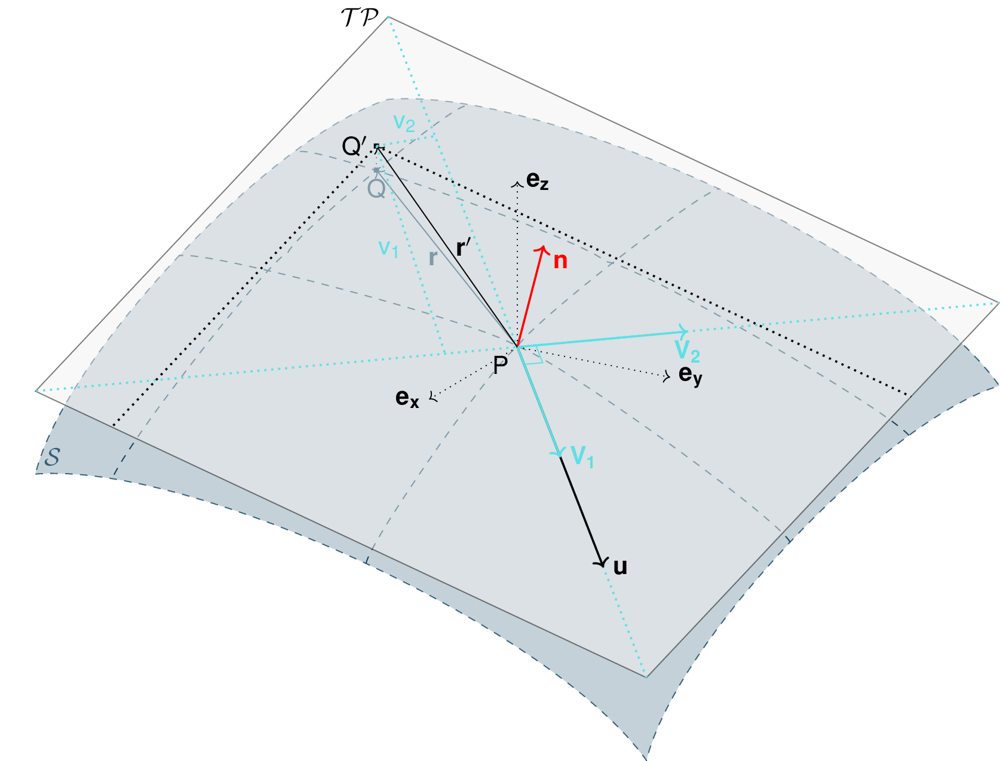

2.5D SPH method
=================

SPH method can be used to solve thickness integrated equations where a 2D
(respectively 3D) equation is reduced to a 1D (respectively 2D) one.
This is used in ocean engineering to solve shallow water equations (SWE)
in open or closed channels for example. In all these applications,
whether it is 1D or 2D SPH, the fluid is most of the time,
assumed to move on a horizontal plane (bed elevation is set to a constant).
In the case of avalanche flow, the "bed" is sloped and irregular.
The aim is to adapt the SPH method to apply it to thickness integrated equations
on a 2D surface living in a 3D world.

Method
------
The SPH method is used to express a quantity (the flow thickness in our case) and
its gradient at a certain particle location as a weighted sum of its neighbors
properties. The principle of the method is well described in :cite:`LiLi2010`.
In the case of thickness integrated equations (for example SWE), a scalar function
:math:`f` and its gradient can be expressed as following:

.. math::
    f_{i} &= \sum\limits_{j}f_{j}A_{j}\,W_{ij}\\
    \mathbf{\nabla}f_{i} &= -\sum\limits_{j}f_{j}A_{j}\,\mathbf{\nabla}W_{ij}
    :label: sph formulation

Which gives for the flow thickness:

.. math::
    \overline{h}_{i} &= \frac{1}{\rho_0}\,\sum\limits_{j}{m_{j}}\,W_{ij}\\
    \mathbf{\nabla}\overline{h}_{i} &= -\frac{1}{\rho_0}\,\sum\limits_{j}{m_{j}}\,\mathbf{\nabla}W_{ij}
    :label: sph formulation for fd

Where :math:`W` represents the SPH-Kernel function.

The computation of its gradient depends on the coordinate system used.

.. _standard-method:

Standard method
~~~~~~~~~~~~~~~~~

Let us start with the computation of the gradient of a scalar function
:math:`f \colon \mathbb{R}^2 \to \mathbb{R}` on a horizontal plane.
Let :math:`P_i=\mathbf{x}_i=(x_{i,1},x_{i,2})` and :math:`Q_j=\mathbf{x}_j=(x_{j,1},x_{j,2})` be two points in :math:`\mathbb{R}^2` defined by
their coordinates in the Cartesian coordinate system :math:`(P_i,\mathbf{e_1},\mathbf{e_2})`. :math:`\mathbf{r}_{ij}=\mathbf{x}_i-\mathbf{x}_j` is the vector going from
:math:`Q_j` to :math:`P_i` and :math:`r_{ij} = \left\Vert \mathbf{r}_{ij}\right\Vert` the length of this vector.
Now consider the kernel function :math:`W`:

.. math::
  \left.
  \begin{aligned}
  W \colon \mathbb{R}^2 \times \mathbb{R}^2 \times \mathbb{R} &\to \mathbb{R}\\
  (P_i, Q_j, r_0) &\mapsto W(P_i, Q_j, r_0)
  \end{aligned}
  \right.\quad, r_0\in\mathbb{R} \mbox{ is the smoothing kernel length}

In the case of the spiky kernel, :math:`W` reads (2D case):

.. math::
   \begin{aligned}
   W_{ij} = &W(\mathbf{x_i},\mathbf{x_j},r_0) = W(\mathbf{x_i}-\mathbf{x_j},r_0) = W(\mathbf{r_{ij}},r_0)\\
   =&\frac{10}{\pi r_0^5}\left\{
   \begin{aligned}
   & (r_0 - \left\Vert \mathbf{r_{ij}}\right\Vert)^3, \quad &0\leq \left\Vert \mathbf{r_{lj}}\right\Vert \leq  r_0\\
   & 0 , & r_0 <\left\Vert \mathbf{r_{ij}}\right\Vert
   \end{aligned}
   \right.
   \end{aligned}
   :label: kernel function

:math:`\left\Vert \mathbf{r_{ij}}\right\Vert= \left\Vert \mathbf{x_{i}}-\mathbf{x_{j}}\right\Vert`
represents the distance between particle :math:`i` and :math:`j` and
:math:`r_0` the smoothing length.

Using the chain rule to express the gradient of :math:`W` in the Cartesian
coordinate system :math:`(x_1,x_2)` leads to:

.. math::
   \mathbf{\nabla}W_{ij} = \frac{\partial W}{\partial r}.\mathbf{\nabla}r,
   \quad r = \left\Vert \mathbf{r} \right\Vert = \sqrt{(x_{i,1}-x_{j,1})^2 + (x_{i,2}-x_{j,2})^2}
   :label: kernel function gradient 1

with,

.. math::
  \frac{\partial W}{\partial r} = -3\frac{10}{\pi r_0^5}\left\{
  \begin{aligned}
  & (r_0 - \left\Vert \mathbf{r_{ij}}\right\Vert)^2, \quad &0\leq \left\Vert \mathbf{r_{lj}}\right\Vert \leq  r_0\\
  & 0 , & r_0 <\left\Vert \mathbf{r_{ij}}\right\Vert
  \end{aligned}
  \right.

and

.. math::
  \frac{\partial r}{\partial w_{i,k}} = \frac{(x_{i,k}-x_{j,k})}{\sqrt{(x_{i,1}-x_{j,1})^2 + (x_{i,2}-x_{j,2})^2}},
  \quad k=\{1,2\}
which leads to the following expression for the gradient:

.. math::
   \mathbf{\nabla}W_{ij} = -3\frac{10}{\pi r_0^5}\left\{
   \begin{aligned}
   & (r_0 - \left\Vert \mathbf{r_{ij}}\right\Vert)^2\frac{\mathbf{r_{ij}}}{r_{ij}}, \quad &0\leq \left\Vert \mathbf{r_{lj}}\right\Vert \leq  r_0\\
   & 0 , & r_0 <\left\Vert \mathbf{r_{ij}}\right\Vert
   \end{aligned}
   \right.
   :label: kernel function gradient

The gradient of :math:`f` is then simply:

.. math::
    \mathbf{\nabla}f_{i} = -\sum\limits_{j}f_{j}A_{j}\,\mathbf{\nabla}W_{ij}
    :label: sph dradient

2.5D SPH method
~~~~~~~~~~~~~~~~~
We now want to express a function :math:`f` and its gradient on a potentially
curved surface and express this gradient in the 3 dimensional Cartesian
coordinate system :math:`(P_i,\mathbf{e_1},\mathbf{e_2},\mathbf{e_3})`.

Let us consider a smooth surface :math:`\mathcal{S}` and two points
:math:`P_i=\mathbf{x}_i=(x_{i,1},x_{i,2},x_{i,3})` and :math:`Q_j=\mathbf{x}_j=(x_{j,1},x_{j,2},x_{j,3})`
on :math:`\mathcal{S}`. We can define :math:`\mathcal{TP}` the tangent plane
to :math:`\mathcal{S}` in :math:`P_i`. If :math:`\mathbf{u}_i` is the (none zero)
velocity of the particle at :math:`P_i`, it is possible to define the local
orthonormal coordinate system :math:`(P_i,\mathbf{V_1},\mathbf{V_2},\mathbf{V_3}=\mathbf{n})`
with :math:`\mathbf{V_1}=\frac{\mathbf{u}_j}{\left\Vert \mathbf{u}_j\right\Vert}`
and :math:`\mathbf{n}` the normal to :math:`\mathcal{S}` at :math:`P_i`.
Locally, :math:`\mathcal{S}` can be assimilated to :math:`\mathcal{TP}` and
:math:`Q_j` to its projection :math:`Q'_j` on :math:`\mathcal{TP}`.
The vector :math:`\mathbf{r'}_{ij}=\mathbf{x}_i-\mathbf{x'}_j` going from
:math:`Q'_j` to :math:`P_i` lies in :math:`\mathcal{TP}` and can be express
in the plane local basis:

.. math::
  \mathbf{r'}_{ij}=\mathbf{x}_i-\mathbf{x'}_j = v_{ij,1}\mathbf{V_1} + v_{ij,2}\mathbf{V_2}

It is important to define :math:`f` properly:

.. math::
  \left.
  \begin{aligned}
  f \colon \mathcal{TP}\subset\mathbb{R}^3 &\to \mathbb{R}\\
  (x_1,x_2,x_3) &\mapsto f(x_1,x_2,x_3) = \hat{f}(x_1(v_1,v_2),x_2(v_1,v_2))
  \end{aligned}
  \right.
Indeed, since :math:`(x_1,x_2,x_3)` lies in :math:`\mathcal{TP}`, :math:`x_3`
is not independent of :math:`(x_1,x_2)`:

.. math::
   x_3 = \frac{-x_1(\mathbf{e_1}.\mathbf{V_3})-x_2(\mathbf{e_2}.\mathbf{V_3})}{\mathbf{e_3}.\mathbf{V_3}}

.. math::
  \left.
  \begin{aligned}
  \tilde{f} \colon \mathcal{TP}\subset\mathbb{R}^2 &\to \mathbb{R}\\
  (v_1,v_2) &\mapsto \tilde{f}(v_1,v_2) = \tilde{f}(v_1(x_1,x_2),v_2(x_1,x_2))
  \end{aligned}
  \right.

It is then easy to apply the :ref:`standard-method`
to compute the gradient in the tangent plane :math:`\mathcal{TP}`.
Let us call this gradient :math:`\mathbf{\nabla}_\mathcal{TP}`:

.. math::
   \mathbf{\nabla}_\mathcal{TP}W_{ij} = \frac{\partial W}{\partial r}.\mathbf{\nabla}_\mathcal{TP}r,
   \quad r = \left\Vert \mathbf{r} \right\Vert = \sqrt{v_{ij,1}^2 + v_{ij,2}^2}
   :label: kernel function gradient TP 1

Which leads to:

.. math::
  \mathbf{\nabla}_\mathcal{TP}W_{ij} = -3\frac{10}{\pi r_0^5}\frac{(r_0 - \left\Vert \mathbf{r_{ij}}\right\Vert)^2}{r_{ij}}\left\{
  \begin{aligned}
  & v_{ij,1}\mathbf{V_1} + v_{ij,2}\mathbf{V_2}, \quad &0\leq \left\Vert \mathbf{r_{ij}}\right\Vert \leq  r_0\\
  & 0 , & r_0 <\left\Vert \mathbf{r_{ij}}\right\Vert
  \end{aligned}
  \right.
  :label: kernel function gradient TP 2

.. _2_5DSPH:

        Tangent plane and local coordinate system used to apply the SPH method
