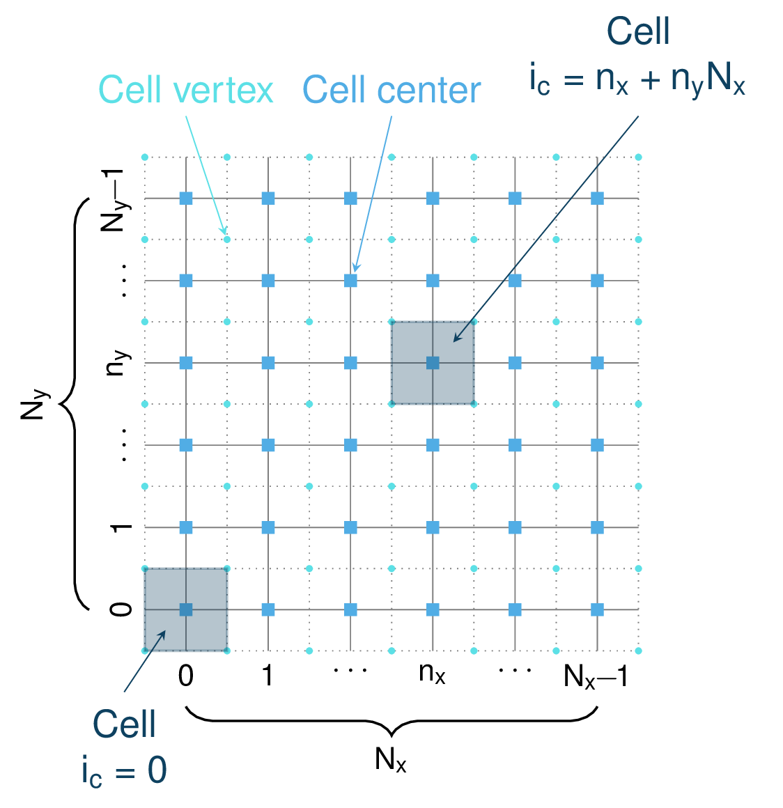
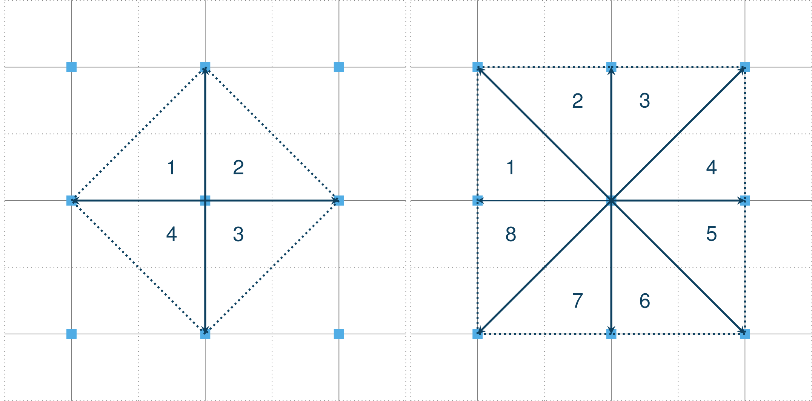

com1DFA DFA-Kernel numerics
============================

.. warning::

   This theory has not been fully reviewed yet.

The numerical method used in com1DFA mixes particle methods and
mesh methods. Mass and momentum are tracked using particles but flow
depth is tracked using the mesh. The mesh is also used to access topographic information
(surface elevation, normal vector) as well as for displaying results.

Mass :eq:`mass-balance3` and momentum :eq:`momentum-balance6` balance
equations as well as basal normal stress :eq:`sigmab` are computed numerically using a SPH method
(**S**\ moothed **P**\ article **H**\ ydrodynamis) (:cite:`Mo1992`) for the three variables
:math:`\overline{\mathbf{u}}=(\overline{u}_1, \overline{u}_2)` and
:math:`\overline{h}` by discretization of the released avalanche volume
in a large number of mass elements. SPH in general, is a mesh-less
numerical method for solving partial differential equations. The SPH
algorithm discretizes the numerical problem within a domain using
particles (:cite:`Sa2007,SaGr2009`), which interact
with each-other in a defined zone of influence. Some of the advantages
of the SPH method are that free surface flows, material boundaries and
moving boundary conditions are considered implicitly. In addition, large
deformations can be modeled due to the fact that the method is not based
on a mesh. From a numerical point of view, the SPH method itself is
relatively robust.

Discretization
----------------

Space discretization
~~~~~~~~~~~~~~~~~~~~~~

The domain is discretized in particles. Each particle :math:`p_k` is affected with the following properties:
a mass :math:`m_{p_k}`, a depth :math:`{h}_{p_k}`, a density :math:`\rho_{p_k}=\rho_0` and
a velocity :math:`\mathbf{{u}}_{p_k}=({u}_{p_k,1}, {u}_{p_k,2})` (**those
quantities are depth averaged, note that we dropped the overline from** :eq:`hmean-umean` **for simplicity reasons**).
In the following paragraphs, :math:`i` and :math:`j` indexes refer to the different directions in the NCS,
whereas  :math:`k` and :math:`l` indexes refer to particles

A fixed mesh also caries the velocity, mass and flow depth properties. It is possible to navigate
from particle property to mesh property using the interpolation methods described in :ref:`Mesh and interpolation`

Time discretization
~~~~~~~~~~~~~~~~~~~~~~

Two time discretization methods are available, a fixed time step one and a variable one.

Mesh and interpolation
-----------------------
Here is a description of the mesh and the interpolation method used to
switch from particle to mesh values and the other way around.

Mesh
~~~~~~

For practical reasons, a 2D rectilinear mesh (grid) is used. Indeed the topographic
input information is read from 2D raster files (with :math:`N_{y}` and :math:`N_{x}`
rows and columns) which corresponds exactly to a
2D rectilinear mesh. Moreover, as we will see in the following sections,
2D rectilinear meshes are very convenient for interpolations as well as for
particle tracking. The 2D rectilinear mesh is composed of :math:`N_{y}-1` and
:math:`N_{x}-1` rows and columns of square cells (of side length :math:`csz`)
and :math:`N_{y}` and :math:`N_{x}` rows and columns of vertices
as described in :numref:`rasterGrid`. Each cell has a center and four vertices.
The data read from the raster file is affected to the vertices.

.. _rasterGrid:

        Rectangular grid

Cell normals
""""""""""""""
There are many different methods available for computing normal vectors
on a 2D rectilinear mesh. Several options are available in com1DFA.

The first one consists in computing the cross product of the diagonal vectors
between four vertices. This defines the normal vector at the cell center. It is
then possible to interpolate the normal vector at the vertices from the ones
at the cell centers.

The other methods use the plane defined by the different adjacent triangles to
a vertex. Each triangle has a normal and the vertices normal is the average
of the triangles normal vectors.

.. _meshNormal:

        Grid normal computation

Cell area
"""""""""""
The cell area can be deduced from the grid cellsize and the cell normal.
A cell is a plane (:math:`z = ax+by+c`) of same normal as the cell center:

.. math::
   \mathbf{n} = \frac{1}{\sqrt{1+a^2+b^2}}
   \left|\begin{aligned}
   &-a\\
   &-b\\
   &1
   \end{aligned}
   \right.

Surface integration over the cell extend leads to the area of the cell:

.. math::
   A_{cell} = \iint_{S} \mathrm{d}{S} = \int\limits_{0}^{csz}\int\limits_{0}^{csz}
   \sqrt{1+\frac{\partial z}{\partial x}^2+\frac{\partial z}{\partial y}^2}
   \mathrm{d}{x}\,\mathrm{d}{y} =
   csz^2 \sqrt{1+\frac{\partial z}{\partial x}^2+\frac{\partial z}{\partial y}^2} = \frac{csz^2}{n_z}

The same method is used to get the area of a vertex (this does not make any sense...).

Interpolation
~~~~~~~~~~~~~~
In the DFA kernel, mass, flow depths, velocity fields can be defined at particle
location or on the mesh. We need a method to be able to go from particle property
to mesh field values and from mesh values to particle property.

Mesh to particle
""""""""""""""""""

On a 2D rectilinear mesh, scalar and vector fields defined on mesh vertex and center
can be evaluated anywhere within the mesh using a bilinear interpolation
between mesh vertices. Evaluating a vector field simply consists in evaluating
the three components as scalar fields.

The bilinear interpolation consists in successive linear interpolations
in both :math:`x` and :math:`y` using the four nearest grid points,
two linear interpolations in the first direction (in our case in the
:math:`y` direction in order to evaluated :math:`f_{0v}` and :math:`f_{1v}`)
followed by a second linear interpolation in the second direction
(:math:`x` in our case to finally evaluate :math:`f_{uv}`) as shown on :numref:`BilinearInterp`:

.. math::
    \begin{aligned}
    f_{0v} = & (1-v)f_{00} + vf_{01}\\
    f_{1v} = & (1-v)f_{10} + vf_{11}
    \end{aligned}

and

.. math::
    \begin{aligned}
    f_{uv} = & (1-u)f_{0v} + uf_{1v}\\
           = & (1-u)(1-v)f_{00} + (1-u)vf_{01} + u(1-v)f_{10} + uvf_{11}\\
                  = & w_{00}f_{00} + w_{01}f_{01} + w_{10}f_{10} + w_{11}f_{11}
    \end{aligned}

the :math:`w` are the bilinear weights. The example given here is for a unit cell.
For no unit cells, the :math:`u` and :math:`v` simply have to be normalized by the
cell size.

.. _BilinearInterp:

.. figure:: _static/BilinearInterp.png
        :width: 90%

        Bilinear interpolation in a unit cell.

Particles to mesh
"""""""""""""""""""
Going from particle property to mesh value is also based on bilinear interpolation and
weights but requires a bit more care in order to conserve mass and momentum balance.
Flow depth and velocity fields are determined on the mesh using, as intermediate step
mass and momentum fields. First, mass and momentum mesh fields can be evaluated by
summing particles mass and momentum. This can be donne using the bilinear
weights :math:`w` defined in the previous paragraph (here :math:`f` represents
the mass or momentum and :math:`f_{uv}` is the particle value. :math:`f_{nm}`
, :math:`{n, m} \in \{0, 1\} \times \{0, 1\}`, are the vertex values):

.. math::
    \begin{aligned}
    f_{00} = & w_{00}f_{uv}\\
    f_{01} = & w_{01}f_{uv}\\
    f_{10} = & w_{10}f_{uv}\\
    f_{11} = & w_{11}f_{uv}
    \end{aligned}

The contribution of each particle to the different mesh points is summed up to
finally give the mesh value. This method ensures that the total mass and
momentum of the particles is preserved (the mass and momentum on the mesh will
sum up to the same total). Flow depth and velocity grid fields can then be deduced
from the mass and momentum fields and the cell area (real area of each grid cell).

Neighbor search
------------------

The lateral pressure forces are computed via the SPH flow depth gradient.
This method is based on neighborhood particle interactions, meaning that it
is necessary to keep track of all the particles within the neighborhood of each particle.
Computing the gradient of the flow depth at a particle location, requires to
find all the particles in its surrounding. Considering the number of particles and
their density, computing the gradient ends up in computing a lot of
interactions and represents the most computationally expensive part of the dense
flow avalanche simulation. It is therefore important that the neighbor search is fast and efficient.
:cite:`IhOrSoKoTe2014` describe different rectilinear mesh neighbor search
methods. In com1DFA, the simplest method is used. The idea is to locate each
particle in a cell, this way, it is possible to keep track of the particles
in each cell. To find the neighbors of a particle, one only needs to read the
cell in which the particle is located (dark blue cell in :numref:`neighborSearch`)
, find the direct adjacent cells in all directions (light blue cells) and
simply read all particles within those cells. This is very easily achieved
on rectilinear meshes because locating a particle in a cell is straightforward and
finding the adjacent cells is also immediate.

.. _neighborSearch:

.. figure:: _static/neighborSearch.png
        :width: 90%

        Support mesh for neighbor search:
        if the cell side is bigger than the kernel length :math:`r_{kernel}` (red circle in the picture),
        the neighbors for any particle in any given cell (dark blue square)
        can be found in the direct neighborhood of the cell itself (light blue squares)

.. _partInCell:

.. figure:: _static/partInCell.png
        :width: 90%

        The particles are located in the cells using
        tow arrays. indPartInCell of size number of cells + 1
        which keeps track of the number of particles in each cell
        and partInCell of size number of particles + 1 which lists
        the particles contained in the cells.

SPH gradient
--------------
SPH method can be used to solve depth integrated equations where a 2D
(respectively 3D) equation is reduced to a 1D (respectively 2D) one.
This is used in ocean engineering to solve shallow water equations (SWE)
in open or closed channels for example. In all these applications,
whether it is 1D or 2D SPH, the fluid is most of the time,
assumed to move on a horizontal plane (bed elevation is set to a constant).
In the case of avalanche flow, the "bed" is sloped and irregular.
The aim is to adapt the SPH method to apply it to depth integrated equations
on a 2D surface living in a 3D world.

Method
~~~~~~~
The SPH method is used to express a quantity (the flow depth in our case) and
its gradient at a certain particle location as a weighted sum of its neighbors
properties. The principle of the method is well described in :cite:`LiLi2010`.
In the case a depth integrated equations (for example SWE), a scalar function
:math:`f` and its gradient can be expressed as following:

.. math::
    f_{k} &= \sum\limits_{l}f_{l}A_{l}\,W_{kl}\\
    \mathbf{\nabla}f_{k} &= -\sum\limits_{l}f_{l}A_{l}\,\mathbf{\nabla}W_{kl}
    :label: sph formulation

Which gives for the flow depth:

.. math::
    \overline{h}_{k} &= \frac{1}{\rho_0}\,\sum\limits_{l}{m_{l}}\,W_{kl}\\
    \mathbf{\nabla}\overline{h}_{k} &= -\frac{1}{\rho_0}\,\sum\limits_{l}{m_{l}}\,\mathbf{\nabla}W_{kl}
    :label: sph formulation for fd

Where :math:`W` represents the SPH-Kernel function.

The computation of its gradient depends on the coordinate system used.

.. _standard-method:

Standard method
""""""""""""""""

Let us start with the computation of the gradient of a scalar function
:math:`f \colon \mathbb{R}^2 \to \mathbb{R}` on a horizontal plane.
Let :math:`P_k=\mathbf{x}_k=(x_{k,1},x_{k,2})` and :math:`Q_l=\mathbf{x}_l=(x_{l,1},x_{l,2})` be two points in :math:`\mathbb{R}^2` defined by
their coordinates in the Cartesian coordinate system :math:`(P_k,\mathbf{e_1},\mathbf{e_2})`. :math:`\mathbf{r}_{kl}=\mathbf{x}_k-\mathbf{x}_l` is the vector going from
:math:`Q_l` to :math:`P_k` and :math:`r_{kl} = \left\Vert \mathbf{r}_{kl}\right\Vert` the length of this vector.
Now consider the kernel function :math:`W`:

.. math::
  \left.
  \begin{aligned}
  W \colon \mathbb{R}^2 \times \mathbb{R}^2 \times \mathbb{R} &\to \mathbb{R}\\
  (P_k, Q_l, r_0) &\mapsto W(P_k, Q_l, r_0)
  \end{aligned}
  \right.\quad, r_0\in\mathbb{R} \mbox{ is the smoothing kernel length}

In the case of the spiky kernel, :math:`W` reads (2D case):

.. math::
   \begin{aligned}
   W_{kl} = &W(\mathbf{x_k},\mathbf{x_l},r_0) = W(\mathbf{x_k}-\mathbf{x_l},r_0) = W(\mathbf{r_{kl}},r_0)\\
   =&\frac{10}{\pi r_0^5}\left\{
   \begin{aligned}
   & (r_0 - \left\Vert \mathbf{r_{kl}}\right\Vert)^3, \quad &0\leq \left\Vert \mathbf{r_{kl}}\right\Vert \leq  r_0\\
   & 0 , & r_0 <\left\Vert \mathbf{r_{kl}}\right\Vert
   \end{aligned}
   \right.
   \end{aligned}
   :label: kernel function

:math:`\left\Vert \mathbf{r_{kl}}\right\Vert= \left\Vert \mathbf{x_{k}}-\mathbf{x_{l}}\right\Vert`
represents the distance between particle :math:`k` and :math:`l` and
:math:`r_0` the smoothing length.

Using the chain rule to express the gradient of :math:`W` in the Cartesian
coordinate system :math:`(x_1,x_2)` leads to:

.. math::
   \mathbf{\nabla}W_{kl} = \frac{\partial W}{\partial r}.\mathbf{\nabla}r,
   \quad r = \left\Vert \mathbf{r} \right\Vert = \sqrt{(x_{k,1}-x_{l,1})^2 + (x_{k,2}-x_{l,2})^2}
   :label: kernel function gradient 1

with,

.. math::
  \frac{\partial W}{\partial r} = -3\frac{10}{\pi r_0^5}\left\{
  \begin{aligned}
  & (r_0 - \left\Vert \mathbf{r_{kl}}\right\Vert)^2, \quad &0\leq \left\Vert \mathbf{r_{kl}}\right\Vert \leq  r_0\\
  & 0 , & r_0 <\left\Vert \mathbf{r_{kl}}\right\Vert
  \end{aligned}
  \right.

and

.. math::
  \frac{\partial r}{\partial x_{k,i}} = \frac{(x_{k,i}-x_{l,i})}{\sqrt{(x_{k,1}-x_{l,1})^2 + (x_{k,2}-x_{l,2})^2}},
  \quad i=\{1,2\}
which leads to the following expression for the gradient:

.. math::
   \mathbf{\nabla}W_{ij} = -3\frac{10}{\pi r_0^5}\left\{
   \begin{aligned}
   & (r_0 - \left\Vert \mathbf{r_{ij}}\right\Vert)^2\frac{\mathbf{r_{ij}}}{r_{ij}}, \quad &0\leq \left\Vert \mathbf{r_{lj}}\right\Vert \leq  r_0\\
   & 0 , & r_0 <\left\Vert \mathbf{r_{ij}}\right\Vert
   \end{aligned}
   \right.
   :label: kernel function gradient

The gradient of :math:`f` is then simply:

.. math::
    \mathbf{\nabla}f_{k} = -\sum\limits_{l}f_{l}A_{l}\,\mathbf{\nabla}W_{kl}
    :label: sph gradient

2.5D SPH method
""""""""""""""""
We now want to express a function :math:`f` and its gradient on a potentially
curved surface and express this gradient in the 3 dimensional Cartesian
coordinate system :math:`(P_k,\mathbf{e_1},\mathbf{e_2},\mathbf{e_3})`.

Let us consider a smooth surface :math:`\mathcal{S}` and two points
:math:`P_k=\mathbf{x}_k=(x_{k,1},x_{k,2},x_{k,3})` and :math:`Q_l=\mathbf{x}_l=(x_{l,1},x_{l,2},x_{l,3})`
on :math:`\mathcal{S}`. We can define :math:`\mathcal{TP}` the tangent plane
to :math:`\mathcal{S}` in :math:`P_k`. If :math:`\mathbf{u}_k` is the (none zero)
velocity of the particle at :math:`P_k`, it is possible to define the local
orthonormal coordinate system :math:`(P_k,\mathbf{V_1},\mathbf{V_2},\mathbf{V_3}=\mathbf{n})`
with :math:`\mathbf{V_1}=\frac{\mathbf{u}_k}{\left\Vert \mathbf{u}_k\right\Vert}`
and :math:`\mathbf{n}` the normal to :math:`\mathcal{S}` at :math:`P_k`.
Locally, :math:`\mathcal{S}` can be assimilated to :math:`\mathcal{TP}` and
:math:`Q_l` to its projection :math:`Q'_l` on :math:`\mathcal{TP}`.
The vector :math:`\mathbf{r'}_{kl}=\mathbf{x}_k-\mathbf{x'}_l` going from
:math:`Q'_l` to :math:`P_k` lies in :math:`\mathcal{TP}` and can be express
in the plane local basis:

.. math::
  \mathbf{r'}_{kl}=\mathbf{x}_k-\mathbf{x'}_l = v_{kl,1}\mathbf{V_1} + v_{kl,2}\mathbf{V_2}

It is important to define :math:`f` properly and the gradient that will be calculated:

.. math::
  \left.
  \begin{aligned}
  f \colon \mathcal{TP}\subset\mathbb{R}^3 &\to \mathbb{R}\\
  (x_1,x_2,x_3) &\mapsto f(x_1,x_2,x_3) = f(x_1(v_1,v_2),x_2(v_1,v_2)) = \tilde{f}(v_1,v_2)
  \end{aligned}
  \right.
Indeed, since :math:`(x_1,x_2,x_3)` lies in :math:`\mathcal{TP}`, :math:`x_3`
is not independent of :math:`(x_1,x_2)`:

..  .. math::
..   x_3 = \frac{-x_1(\mathbf{e_1}.\mathbf{V_3})-x_2(\mathbf{e_2}.\mathbf{V_3})}{\mathbf{e_3}.\mathbf{V_3}} */

.. math::
  \left.
  \begin{aligned}
  \tilde{f} \colon \mathcal{TP}\subset\mathbb{R}^2 &\to \mathbb{R}\\
  (v_1,v_2) &\mapsto \tilde{f}(v_1,v_2) = \tilde{f}(v_1(x_1,x_2),v_2(x_1,x_2)) = f(x_1,x_2,x_3)
  \end{aligned}
  \right.

The target is the gradient of :math:`\tilde{f}` in terms of the :math:`\mathcal{TP}` variables
:math:`(v_1,v_2)`. Let us call this gradient :math:`\mathbf{\nabla}_\mathcal{TP}`.
It is then possible to apply the :ref:`standard-method` to compute this gradient:

.. math::
   \mathbf{\nabla}_\mathcal{TP}W_{kl} = \frac{\partial W}{\partial r}.\mathbf{\nabla}_\mathcal{TP}r,
   \quad r = \left\Vert \mathbf{r} \right\Vert = \sqrt{v_{kl,1}^2 + v_{kl,2}^2}
   :label: kernel function gradient TP 1

Which leads to:

.. math::
  \mathbf{\nabla}_\mathcal{TP}W_{kl} = -3\frac{10}{\pi r_0^5}\frac{(r_0 - \left\Vert \mathbf{r_{kl}'}\right\Vert)^2}{r_{kl}'}\left\{
  \begin{aligned}
  & v_{kl,1}\mathbf{V_1} + v_{kl,2}\mathbf{V_2}, \quad &0\leq \left\Vert \mathbf{r_{kl}'}\right\Vert \leq  r_0\\
  & 0 , & r_0 <\left\Vert \mathbf{r_{kl}'}\right\Vert
  \end{aligned}
  \right.
  :label: kernel function gradient TP 2

.. math::
  \mathbf{\nabla}_\mathcal{TP}\tilde{f_{k}} = -\sum\limits_{l}\tilde{f_{l}}A_{l}\,\mathbf{\nabla}W_{kl}
  :label: sph gradient

This gradient can now be expressed in the Cartesian coordinate system.
It is clear that the change of coordinate system was not needed:

.. math::
  \mathbf{\nabla}_\mathcal{TP}W_{kl} = -3\frac{10}{\pi r_0^5}\frac{(r_0 - \left\Vert \mathbf{r_{kl}'}\right\Vert)^2}{r_{kl}'}\left\{
  \begin{aligned}
  & r_{kl,1}\mathbf{e_1} + r_{kl,2}\mathbf{e_2} + r_{kl,3}\mathbf{e_3}, \quad &0\leq \left\Vert \mathbf{r_{kl}'}\right\Vert \leq  r_0\\
  & 0 , & r_0 <\left\Vert \mathbf{r_{kl}'}\right\Vert
  \end{aligned}
  \right.

The advantage of computing the gradient in the local coordinate system is if
the components (in flow direction or in cross flow direction) need to be treated
differently.

.. _2_5DSPH:

.. figure:: _static/2_5DSPH.png
        :width: 90%

        Tangent plane and local coordinate system used to apply the SPH method

Artificial viscosity
---------------------

In :ref:`theoryCom1DFA:Governing Equations for the Dense Flow Avalanche`, the governing
equations for the DFA were derived and all first order or smaller terms where neglected.
Among those terms is the lateral shear stress. This term leads toward
the homogenization of the velocity field. It means that two neighbor elements
of fluid should have similar velocities. The aim behind adding artificial viscosity is to
take this phenomena into account. The following viscosity force is added:

.. math::
    \begin{aligned}
    \mathbf{F_{viscosity}} = &- \frac{1}{2}\rho C_{Lat}\|\mathbf{du}\|^2 A_{Lat}
    \frac{\mathbf{du}}{\|\mathbf{du}\|}\\
    = & - \frac{1}{2}\rho C_{Lat}\|\mathbf{du}\| A_{Lat} \mathbf{du}
    \end{aligned}

Where the velocity difference reads :math:`\mathbf{du} = \mathbf{u} - \mathbf{\bar{u}}`
(:math:`\mathbf{\bar{u}}` is the mesh velocity interpolated at the particle position).
:math:`C_{Lat}` is a coefficient that rules the viscous force. It would be the
equivalent of :math:`C_{Drag}` in the case of the drag force. The :math:`C_{Lat}`
is a numerical parameter that depends on the mesh size. Its value is set to 100
and should be discussed and further tested.

Adding the viscous force
~~~~~~~~~~~~~~~~~~~~~~

The viscous force is added implicitly:

.. math::
  \begin{aligned}
  \mathbf{F_{viscosity}} = &-\frac{1}{2}\rho C_{Lat}\|\mathbf{du}^{old}\| A_{Lat}
  \mathbf{du}^{new}\\
  = &  -\frac{1}{2}\rho C_{Lat}\|\mathbf{u}^{old} - \mathbf{\bar{u}}^{old}\| A_{Lat}
  (\mathbf{u}^{new} - \mathbf{\bar{u}}^{old})
  \end{aligned}

Updating the velocity is done in two steps. First adding the explcit term related to the
mean mesh velocity and then the implicit term which leads to:

.. math::
  \mathbf{u}^{new} = \frac{\mathbf{u}^{old} - C_{vis}\mathbf{\bar{u}}^{old}}{1 + C_{vis}}

With :math:`C_{vis} = \frac{1}{2}\rho C_{Lat}\|\mathbf{du}^{old}\| A_{Lat}\frac{dt}{m}`

Forces discretization
----------------------

Lateral force
~~~~~~~~~~~~~~

The SPH method is introduced when expressing the flow depth gradient for each
particle as a weighted sum of its neighbors
(:cite:`LiLi2010,Sa2007`). The :math:`p` in :math:`p_k` is dropped
(same applies for :math:`p_k`):

The lateral pressure forces on each particle are calculated from the compression
forces on the boundary of the particle.
The boundary is approximated as a square with the base side length
:math:`\Delta s = \sqrt{A_p}` and the respective flow height. This leads to
(subscript :math:`|_{.,i}` stands for the component in the :math:`i^{th}`
direction, :math:`i = {1,2}`):

.. math::
    F_{k,i}^{\text{lat}} = K_{(i)}\oint\limits_{\partial{A_{k}}}\left(\int\limits_{b}^{s}\sigma_{33}\,n_i\,\mathrm{d}x_3\right)\mathrm{d}l

From equation :eq:`momentum-balance6`

.. math::
    F_{k,i}^{\text{lat}} = K_{(i)}\,\frac{\Delta{s}}{2}\left((\overline{h}\,\overline{\sigma}^{(b)}_{33})_{x_{i}-
    \frac{\Delta{s}}{2}}-(\overline{h}\,\overline{\sigma}^{(b)}_{33})_{x_{i}+\frac{\Delta{s}}{2}}\right)
    = K_{(i)}\frac{\Delta{s}^2}{2}\,\left.\frac{d\,\overline{h}\,\overline{\sigma}^{(b)}}{d\,x_i}\right\rvert_{k}

The product of the average flow depth :math:`\overline{h}` and the basal normal pressure :math:`\overline{\sigma}^{(b)}_{33}`
reads (using equation :eq:`sigmab` and dropping the curvature acceleration term):

.. math::
   \overline{h}\,\overline{\sigma}^{(b)} = \overline{h}^2\,\rho_0\,\left(g_3-\overline{u_1}^2\,\frac{\partial^2{b}}{\partial{x_1^2}}\right)
   \approx \overline{h}^2\,\rho_0\,g_3

Which leads to, using the relation :eq:`sph formulation`:

.. math::
    F_{k,i}^{\text{lat}} = K_{(i)}\,\rho_0\,g_3\,A_{k}\,\overline{h}_{k}\,.\,\left.\frac{d\,\overline{h}}{d\,x_i}\right\rvert_{k}
    = -K_{(i)}\,m_{i}\,g_3\,.\,\frac{1}{\rho_0}\,\sum\limits_{l}{m_{l}}\,\left.\frac{d\,W_{kl}}{d\,x_i}\right\rvert_{l}
    :label: lateral force

Bottom friction force
~~~~~~~~~~~~~~~~~~~~~~~
The bottom friction forces on each particle depend on the chose friction model and reads for the SamosAT friction model
(using equation :eq:`sigmab` for the expression of :math:`\sigma^{(b)}_{k}`):

.. math::
    F_{k,i}^{\text{bot}} = -\delta_{k1}\,A_{k}\,\tau^{(b)}_{k}
    = -\delta_{k1}\,A_{k}\,\left(\tau_0 + \tan{\delta}\,\left(1+\frac{R_s^0}{R_s^0+R_s}\right)\,\sigma^{(b)}_{k}
     + \frac{\rho_0\,\mathbf{\overline{u}}_{k}^2}{\left(\frac{1}{\kappa}\,\ln\frac{\overline{h}}{R} + B\right)^2}\right)
    :label: bottom force

Added resistance force
~~~~~~~~~~~~~~~~~~~~~~~
The resistance force on each particle reads (where :math:`h^{\text{eff}}_{k}`
is a function of the average flow depth :math:`\overline{h}_{k}`):

.. math::
    F_{k,i}^{\text{res}}
    = - \rho_0\,A_{k}\,h^{\text{eff}}_{k}\,C_{\text{res}}\,\|\overline{\mathbf{u}}_{k}\|\,\overline{u}_{k,i}
    :label: resistance force

Entrainment force
~~~~~~~~~~~~~~~~~~~~~~~
The term :math:`- \overline{u_i}\,\rho_0\,\frac{\mathrm{d}(A\,\overline{h})}{\mathrm{d}t}`
related to the entrained mass in :eq:`momentum-balance3` now reads:

.. math::
    - \overline{u}_{k,i}\,\rho_0\,\frac{\mathrm{d}}{\mathrm{d}t}\,\left(A_{k}\,\overline{h}_{k}\right)
    = - \overline{u}_{k,i}\,A^{\text{ent}}_{k}\,q^{\text{ent}}_{k}

The mass of entrained snow for each particle depends on the type of entrainment involved
(plowing or erosion) and reads:

.. math::
    \rho_0\,\frac{\mathrm{d}}{\mathrm{d}t}\,\left(A_{k}\,\overline{h}_{k}\right)
    = \frac{\mathrm{d}\,m_{k}}{\mathrm{d}t}
    = A_{k}^\text{ent}\,q_{k}^{\text{ent}}

with

.. math::
    \begin{aligned}
    A_{k}^{\text{plo}} &= w_f\,h_{k}^{\text{ent}}= \sqrt{\frac{m_{k}}{\rho_0\,\overline{h}_{k}}}\,h_{k}^{\text{ent}}
    \quad &\mbox{and} \quad &q_{k}^{\text{plo}} = \rho_{\text{ent}}\,\left\Vert \overline{\mathbf{u}}_{k}\right\Vert
    \quad &\mbox{for plowing}\\
    A_{k}^{\text{ero}} &= A_{k} = \frac{m_{k}}{\rho_0\,\overline{h}_{k}}
    \quad &\mbox{and} \quad &q_{k}^{\text{ero}} = \frac{\tau_{k}^{(b)}}{e_b}\,\left\Vert \overline{\mathbf{u}}_{k}\right\Vert
    \quad &\mbox{for erosion}\end{aligned}

Finaly, the entrainment force reads:

.. math::
    F_{k,i}^{\text{ent}} = -w_f\,(e_s+\,q_{k}^{\text{ent}}\,e_d)
