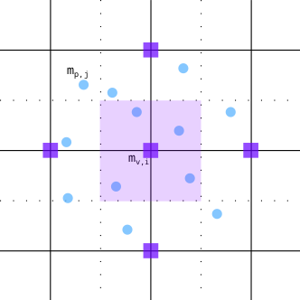
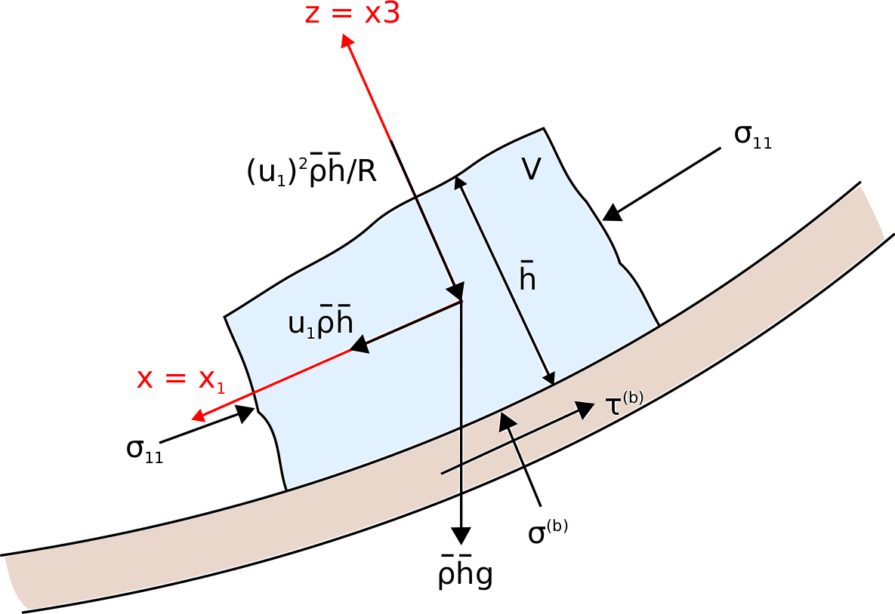

com1DFA DFA-Kernel theory
============================

.. warning::

   This appendix has not been fully reviewed yet. Read its content with hindsight and keep a critical mind.

Governing Equations for the Dense Flow Avalanche
------------------------------------------------------

The governing equations of the dense flow avalanche are derived from the
incompressible mass and momentum balance on a Lagrange control volume (:cite:`Zw2000,ZwKlSa2003`).

Mass balance:
~~~~~~~~~~~~~~~

.. math::
    \frac{d}{dt} \int\limits_{V(t)} \rho_0 \,\mathrm{d}V = \rho_0 \frac{dV(t)}{dt} =
    \oint\limits_{\partial V(t)} q^{\text{ent}} \,\mathrm{d}A
    :label: mass-balance1

Where :math:`q^{\text{ent}}` represents the snow entrainment rate.

Momentum balance:
~~~~~~~~~~~~~~~~~~~

.. math::
    \rho_0 \frac{d}{dt} \int\limits_{V(t)} u_i \,\mathrm{d}V = \oint\limits_{\partial V(t)}
    \sigma^{\text{tot}}_{ij}n_j \,\mathrm{d}A + \rho_0 \int\limits_{V(t)} g_i \,\mathrm{d}V, \quad i=(1,2,3)
    :label: momentum-balance1

We introduce the volume average of a quantity :math:`P(\mathbf{x},t)`:

.. math::
    \overline{P}(\mathbf{x},t) =  \frac{1}{V(t)} \int\limits_{V(t)} P(\mathbf{x},t) \,\mathrm{d}V
..    :label: volume-average

and split the area integral into :

.. math::
   \oint\limits_{\partial V(t)} \sigma^{\text{tot}}_{ij}n_j \,\mathrm{d}A =
   \oint\limits_{\partial V(t)} \sigma_{ij}n_j \,\mathrm{d}A + F_i^{\text{ent}} + F_i^{\text{res}}, \quad i=(1,2,3)
..   :label: area-integral

:math:`F_i^{\text{ent}}` represents the force required to break the
entrained snow from the ground and to compress it (since the dense-flow
bulk density is usually larger than the density of the entrained snow,
i.e. :math:`\rho_{\text{ent}}<\rho`) and :math:`F_i^{\text{res}}`
represents the resistance force due to obstacles (for example trees).
Which leads to in :eq:`momentum-balance1`:

.. math::
   \rho_0 \frac{dV(t) \overline{u}_i}{dt} = \rho_0 V \frac{d\overline{u}_i}{dt} +
   \rho_0 \overline{u}_i \frac{dV}{dt} = \oint\limits_{\partial V(t)} \sigma_{ij}n_j
   \,\mathrm{d}A + \rho_0 V g_i + F_i^{\text{ent}} + F_i^{\text{res}}, \quad i=(1,2,3)
..   :label: momentum-balance2

Using the mass balance equation :eq:`mass-balance1`, we get:

.. math::
   \rho_0 V \frac{d\overline{u}_i}{dt} = \oint\limits_{\partial V(t)} \sigma_{ij}n_j \,\mathrm{d}A
   + \rho_0 V g_i  + F_i^{\text{ent}} + F_i^{\text{res}} - \overline{u}_i \oint\limits_{\partial V(t)} q^{\text{ent}} \,\mathrm{d}A, \quad i=(1,2,3)
   :label: momentum-balance3

Boundary conditions:
~~~~~~~~~~~~~~~~~~~~~~~~~~~~~~

The free surface is defined by :

    .. math:: F_s(\mathbf{x},t) = z-s(x,y,t)=0

The bottom surface is defined by :

    .. math:: F_b(\mathbf{x}) = z-b(x,y)=0

The boundary conditions at the free surface and bottom of the flow read:

.. math::
   \left\{\begin{aligned}
   &\frac{dF_s}{dt} = \frac{\partial F_s}{\partial t} +  u_i\frac{\partial F_s}{\partial x_i} =0 \quad & \mbox{at  }F_s(\mathbf{x},t) =0 \quad & \mbox{Kinematic BC (Material boundary)}\\
   &\sigma_{ij}n_j = 0 \quad & \mbox{at  }F_s(\mathbf{x},t) =0 \quad & \mbox{Dynamic BC (Traction free surface)}\\
   &u_in_i = 0 \quad & \mbox{at  }F_b(\mathbf{x},t) =0 \quad & \mbox{Kinematic BC (No detachment)}\\
   &\tau^{(b)}_i = f(\sigma^{(b)},\overline{u},\overline{h},\rho_0,t,\mathbf{x})\quad & \mbox{at  }F_b(\mathbf{x},t) =0\quad & \mbox{Dynamic BC (Chosen friction law)}
   \end{aligned}
   \right.
   :label: boundary-conditions

:math:`\sigma^{(b)}_i = (\sigma_{kl}n_ln_k)n_i` represents the normal stress at the bottom and
:math:`\tau^{(b)}_i = \sigma_{ij}n_j - \sigma^{(b)}_i` represents the shear stress at the bottom surface.
:math:`f` describes the chosen friction model and are described in `[sec:friction model] <#sec:friction model>`__.
The normals at the free surface (:math:`n_i^{(s)}`) and bottom surface (:math:`n_i^{(b)}`) are:

.. math::
   n_i^{(s,b)} = \frac{\partial F_{s,b}}{\partial x_i}\left(\frac{\partial F_{s,b}}{\partial x_j}
   \frac{\partial F_{s,b}}{\partial x_j}\right)^{-1/2}
..   :label: surface-normals

Choice of the coordinate system:
~~~~~~~~~~~~~~~~~~~~~~~~~~~~~~~~~~~~~~~~~~~~~

The previous equations will be developed in the orthonormal coordinate
system :math:`(B,\mathbf{e_1},\mathbf{e_2},\mathbf{e_3})`, further
referenced as Natural Coordinate System (NCS). In this NCS,
:math:`\mathbf{e_1}` is aligned with the velocity vector at the bottom
and :math:`\mathbf{e_3}` with the normal to the slope, i.e.:

.. math::
   \mathbf{e_1} = \frac{\mathbf{u}}{\left\Vert \mathbf{u}\right\Vert},\quad \mathbf{e_2} = \mathbf{e_3}\wedge\mathbf{e_1},
   \quad \mathbf{e_3} = \mathbf{n^{(b)}}
..   :label: natural-coordinate-system

The origin :math:`B` of the NCS is attached to the slope. This choice
leads to:

.. math::
   n^{(b)}_i = \delta_{i3}, \quad \left.\frac{\partial b}{\partial x_i}\right\rvert_{\mathbf{0}} = 0\quad
   \mbox{for} \quad i=(1,2),\quad \mbox{and} \quad u^{(b)}_2 = u^{(b)}_3 = 0
..   :label: NCS-consequence

In this NCS and considering a prism-like Control volume, the volume
content :math:`V(t) = A_b(t)\overline{h}` is obtained by multiplication
of the basal area of the prism, :math:`A_b`, with the averaged value of
the flow-depth,

.. math::
    \overline{h} = \frac{1}{A_b(t)}\int\limits_{A_b(t)} [s(\mathbf{x})-b(\mathbf{x})]\,\mathrm{d}A = \frac{1}{A_b(t)}\int\limits_{A_b(t)} h(\mathbf{x})\,\mathrm{d}A,\qquad
    \overline{u}_i = \frac{1}{V(t)}\int\limits_{V(t)} u_i(\mathbf{x})\,\mathrm{d}V
    :label: hmean-umean

The snow entrainment is either due to plowing at the front of the avalanche or to erosion
at the bottom. The entrainment rate at the front :math:`q^{\text{plo}}` can be expressed function of the
properties of the entrained snow (density :math:`\rho_{\text{ent}}` and
snow depth :math:`h_{\text{ent}}`), the velocity of the avalanche at the
front :math:`\overline{\mathbf{u}}` and length :math:`w_f` of the front cell (measured perpendicularly
to the flow velocity :math:`\overline{\mathbf{u}}`). It obviously only happens on the front cells of
the avalanche (meaning that :math:`w_f` is zero for inner parts of the avalanche):

.. math::
   \oint\limits_{\partial V(t)} q^{\text{plo}}\,\mathrm{d}A = \int\limits_{l_{\text{front}}}\int_b^s q^{\text{plo}}\,
   \mathrm{d}{l}\,\mathrm{d}{z} =  \rho_{\text{ent}}\,w_f\,h_{\text{ent}}\,\left\Vert \overline{\mathbf{u}}\right\Vert
   :label: ploughing

The entrainment rate at the bottom :math:`q^{\text{ero}}` can be expressed function of the
bottom area :math:`A_b` of the control volume, the velocity of the avalanche :math:`\overline{\mathbf{u}}`,
the bottom shear stress :math:`\tau^{(b)}` and the specific erosion energy :math:`e_b`):

.. math::
    \oint\limits_{\partial V(t)} q^{\text{ero}}\,\mathrm{d}A = \int\limits_{A_b} q^{\text{ero}}\,
    \mathrm{d}A = A_b\,\frac{\tau^{(b)}}{e_b}\,\left\Vert \overline{\mathbf{u}}\right\Vert
    :label: erosion

This leads in the mass balance :eq:`mass-balance1` to :

.. math::
   \frac{\mathrm{d}V(t)}{\mathrm{d}t} = \frac{\mathrm{d}(A_b\overline{h})}{\mathrm{d}t}
   = \frac{\rho_{\text{ent}}}{\rho_0}\,w_f\,h_{\text{ent}}\,\left\Vert \overline{\mathbf{u}}\right\Vert +
   A_b\,\frac{\tau^{(b)}}{e_b}\,\left\Vert \overline{\mathbf{u}}\right\Vert
   :label: mass-balance2

The force :math:`F_i^{\text{ent}}` required to break the entrained snow
from the ground and to compress it is expressed function of the required
breaking energy per fracture surface unit :math:`e_s`
(:math:`J.m^{-2}`), the deformation energy per entrained mass element
:math:`e_d` (:math:`J.kg^{-1}`) and the entrained snow depth
(:cite:`Sa2007,SaFeFr2008,FiFrGaSo2013`):

.. math:: F_i^{\text{ent}} = -w_f\,(e_s+\,q^{\text{ent}}\,e_d)

The force :math:`F_i^{\text{res}}` due to obstacles is expressed
function of the characteristic diameter :math:`\overline{d}` and height
:math:`h_{\text{res}}` of the obstacles, the spacing
:math:`s_{\text{res}}` between the obstacles and an empirical
coefficient :math:`c_w` (see :numref:`f-res`). The effective height :math:`h^{\text{eff}}`
is defined as :math:`\min\left\lbrace\begin{array}{l} \overline{h}\\h_{res}\end{array}\right\rbrace`:

.. math::
   F_i^{\text{res}} = -(\frac{1}{2}\,\overline{d}\,c_w/s^2_{\text{res}})\,\rho_0\,A\,
    h^{\text{eff}}\,\overline{u}^2\,
    \frac{\overline{u}_i}{\|\overline{u}\|}

.. _f-res:

.. figure:: _static/f_res.png
        :width: 90%

        Resistance force due to obstacles (from [FiKo2013]_)

The surface integral is split in three terms, an integral over
:math:`A_b` the bottom :math:`x_3 = b(x_1,x_2)`, :math:`A_s` the top
:math:`x_3 = s(x_1,x_2,t)` and :math:`A_h` the lateral surface.
Introducing the boundary conditions :eq:`boundary-conditions` leads to:

.. math::
   \begin{aligned}
   \oint\limits_{\partial{V(t)}}\sigma_{ij}n_j\,\mathrm{d}A & =
   \int\limits_{A_b}\underbrace{\sigma_{ij}\,n_j^{(b)}}_{-\sigma_{i3}}\,\mathrm{d}A +  \int\limits_{A_s}\underbrace{\sigma_{ij}\,n_j^{(s)}}_{0}\,\mathrm{d}A + \int\limits_{A_h}\sigma_{ij}\,n_j\,\mathrm{d}A\\
   &= -A_b\overline{\sigma}_{i3}^{(b)} + \oint\limits_{\partial A_b}\left(\int_b^s\sigma_{ij}\,n_j\,\mathrm{d}x_3\right)\,\mathrm{d}l
   \end{aligned}
..   :label: surface forces

Which simplifies the momentum balance :eq:`momentum-balance3` to:

.. math::
   \rho_0 V \frac{d\overline{u}_i}{dt} = \oint\limits_{\partial A_b}\left(\int_b^s\sigma_{ij}\,n_j\,
   \mathrm{d}x_3\right)\,\mathrm{d}l -A_b\overline{\sigma}_{i3}^{(b)} + \rho_0 V g_i  + F_i^{\text{ent}} +
   F_i^{\text{res}} - \overline{u}_i \oint\limits_{\partial V(t)} q^{\text{ent}} \,\mathrm{d}A, \quad i=(1,2,3)
   :label: momentum-balance5

The momentum balance in direction :math:`x_3` (normal to the slope) is
used to obtain a relation for the vertical distribution of the stress
tensor (:cite:`Sa2007`). Due to the choice of
coordinate system and because of the kinematic boundary condition at the
bottom, the left side of :eq:`momentum-balance5` can be
expressed function of the velocity :math:`\overline{u}_1` in direction
:math:`x_1` and the curvature of the terrain in this same direction
:math:`\frac{\partial^2{b}}{\partial{x_1^2}}` (:cite:`Zw2000`):

.. math::
   \rho\,A_b\,\overline{h}\,\frac{\,\mathrm{d}\overline{u}_3}{\,\mathrm{d}t} =
   \rho\,A_b\,\overline{h}\,\frac{\partial^2{b}}{\partial{x_1^2}}\,\overline{u}_1^2,

rearranging the terms in the momentum equation leads to:

.. math::
  \overline{\sigma}_{33}(x_3) = \rho_0\,(s-x_3)\left(g_3-\frac{\partial^2{b}}{\partial{x_1^2}}\,\overline{u}_1^2\right)+ \frac{1}{A_b}
  \oint\limits_{\partial A_b}\left(\int_{x_3}^s\sigma_{3j}\,n_j\,\mathrm{d}x_3\right)\,\mathrm{d}l
  :label: sigma33

Non-dimensional Equations
~~~~~~~~~~~~~~~~~~~~~~~~~~~~~~

.. _fig-characteristic_size:

.. figure:: _static/characteristic_size.png
        :width: 90%

        Characteristic size of the avalanche along its path (from [Zw2000]_, modified)

The previous equations :eq:`momentum-balance5` and :eq:`sigma33` are can be further simplified by
introducing a scaling based on the characteristic values of the physical
quantities describing the avalanche. The characteristic length L, the
thickness H, the acceleration due to gravity g and the characteristic
radius of curvature of the terrain R are the chosen quantities. From
those values, it is possible to form two non dimensional parameters that
describe the flow:

-  Aspect ratio: :math:`\qquad\qquad\varepsilon = H / L\qquad`

-  Curvature:  :math:`\qquad\lambda = L / R\qquad`

The different properties involved are then expressed in terms of
characteristic quantities :math:`L`, :math:`H`, :math:`g`, :math:`\rho_0` and :math:`R`
(see :numref:`fig-characteristic_size`):

.. math::
   \begin{aligned}
    x_i &= L\, x_i^*\\
    (dx_3,h,\overline{h}) &= H\,(dx_3^*,h^*,\overline{h}^*)\\
    A_b &= L^2\, A_b^*\\
    t &= \sqrt{L/\text{g}}\, t^*\\
    \overline{u_i} &= \sqrt{\text{g}L}\,\overline{u_i}^*\\
    \text{g}_i &= \text{g} \, \text{g}_i^*\\
    \frac{\partial^2{b}}{\partial{x_1}^2} &= \frac{1}{R}\,\frac{\partial^2{b^*}}{\partial{x_1}^{*2}}\end{aligned}

The normal part of the stress tensor is directly related to the
hydro-static pressure:

.. math:: \sigma_{ii} = \rho_0\,\text{g}\,H\,\sigma_{ii}^*

The dimensionless properties are indicated by a superscripted asterisk.
Introducing those properties in :eq:`sigma33`, leads to
:

.. math::
   \overline{\sigma^*}_{33} = \left(g^*_3-\lambda\frac{\partial^2{b^*}}{\partial{x_1^{*2}}}\,\overline{u}_1^{*2}\right)
   (s^*-x^*_3) + \underbrace{\varepsilon\oint\limits_{\partial A_b^*}\left(\int\limits_{x^*_3}^{s^*}\sigma^*_{31}\,\mathrm{d}x^*_3\right)\,\mathrm{d}l^*}_{O(\varepsilon)}.
..   :label: sigma33star

The height, H of dense flow avalanches is assumed to me small compared
to its length, L. Meaning that the equations are examined in the limit
:math:`\varepsilon \ll 1`. It is then possible to neglect the last term
in :eq:`sigma33star` which leads to (after reinserting
the dimensions):

.. math::
    \overline{\sigma}_{33}(x_3) = \rho_0\,\underbrace{\left(g_3-\overline{u_1}^2\,\frac{\partial^2{b}}{\partial{x_1^2}}\right)}_{g_\text{eff}}
    \left[\overline{h}-x_3\right]
    :label: sigma33dim

And at the bottom of the avalanche, with :math:`x_3 = 0`, the normal
stress can be expressed as:

.. math::
     \overline{\sigma}^{(b)}_{33} = \rho_0\,\left(g_3-\overline{u_1}^2\,\frac{\partial^2{b}}{\partial{x_1^2}}\right)\,\overline{h}
     :label: sigmab

Calculating the surface integral in equation :eq:`momentum-balance5` requires to
express the other components of the stress tensor. Here again a
magnitude consideration between the shear stresses :math:`\sigma_{12} = \sigma_{21}` and :math:`\sigma_{13}`.
The shear stresses are based on a generalized Newtonian law of materials,
which controls the influence of normal stresse and the rate of deformation through the viscosity.

.. math::
    \tau_{ij} = \eta\left(\frac{\partial{u_i}}{\partial{x_j}}+\frac{\partial{u_j}}{\partial{x_i}}\right), ~ i\neq j

Because :math:`\partial x_1` and :math:`\partial x_2` are of the order of :math:`L`, whereas :math:`\partial x_3`
is of the order of :math:`H`, it follows that:

.. math::
    O\left(\frac{\sigma_{12}}{\sigma_{13}}\right) = \frac{H}{L} = \varepsilon \ll 1

and thus :math:`\sigma_{12} = \sigma_{21}` is negligible compared to :math:`\sigma_{13}`.
:math:`\sigma_{13}` is exressed using the bottom friction law
:math:`\tau^{(b)}_i = f(\sigma^{(b)},\overline{u},\overline{h},\rho_0,t,\mathbf{x})`
introduced in :eq:`boundary-conditions`.

In addition, a relation linking the horizontal normal stresses,
:math:`\sigma_{ii}`, :math:`i = (1,2)`, to the vertical pressure distribution given
by :eq:`sigmab` is introduced. In complete analogy to the arguments used by
Savage and Hutter (:cite:`SaHu1989`) the horizontal normal stresses are given as:

.. math::
    \sigma_{ii} = K_{(i)}\,\sigma_{33}

Where :math:`K_{(i)}` are the earth pressure coefficients (cf. :cite:`ZwKlSa2003,Sa2004`):

.. math::
    \sigma_{11} &= K_{x~akt/pass}\,\sigma_{33}\\
    \sigma_{22} &= K_{y~akt/pass}^{(x~akt/pass)}\,\sigma_{33}

With the above specifications, the integral of the stresses over the
flow height is simplified in equation :eq:`momentum-balance5` to:

.. math::
   \int\limits_b^s\sigma_{ij}\,\mathrm{d}x_3 = \int\limits_b^s K_{(i)}\,\sigma_{33}\,\mathrm{d}x_3 =
    K_{(i)}\,\frac{\overline{h}\,\sigma^{(b)}}{2}

and the momentum balance can be written:

.. math::
    \rho_0\,A\,\overline{h}\,\frac{\,\mathrm{d}\overline{u}_i}{\,\mathrm{d}t} =
    \rho_0\,A\,\overline{h}\,g_i + \underbrace{K_{(i)}\,\oint\limits_{\partial{A}}\left(\frac{\overline{h}\,\sigma^{(b)}}{2}\right)n_i\,\mathrm{d}l}_{F_i^{\text{lat}}}
    \underbrace{-\delta_{i1}\,A\,\tau^{(b)}}_{F_i^{\text{bot}}}
    \underbrace{- \rho_0\,A\,h_{\text{eff}}\,C_{\text{res}}\,\overline{\mathbf{u}}^2\,\frac{\overline{u_i}}{\|\overline{\mathbf{u}}\|}}_{F_i^{\text{res}}}
    - \overline{u_i}\,\rho_0\,\frac{\mathrm{d}\left(A\,\overline{h}\right)}{\mathrm{d}t}
    + F_i^{\text{ent}}
    :label: momentum-balance6

with

.. math:: C_{\text{res}} = \frac{1}{2}\,\overline{d}\,\frac{c_w}{s_{\text{res}}^2}.

The mass balance :eq:`mass-balance2`
remains unchanged:

.. math::
   \frac{\mathrm{d}V(t)}{\mathrm{d}t} = \frac{\mathrm{d}\left(A_b\overline{h}\right)}{\mathrm{d}t}
   = \frac{\rho_{\text{ent}}}{\rho_0}\,w_f\,h_{\text{ent}}\,\left\Vert \overline{\mathbf{u}}\right\Vert
   + A_b\,\frac{\tau^{(b)}}{e_b}\,\left\Vert \overline{\mathbf{u}}\right\Vert
   :label: mass-balance3

The unknown :math:`\overline{u}_1`, :math:`\overline{u}_2` and
:math:`\overline{h}` satisfy :eq:`sigmab`,
:eq:`momentum-balance6` and
:eq:`mass-balance3`. In equation
:eq:`momentum-balance6` the ground shear
stress :math:`\tau^{(b)}` remains unknown, and and a constitutive equation
has to be introduced in order to completely solve the equations.

Friction Model
~~~~~~~~~~~~~~~~~

The problem can be solved by introducing a constitutive equation which
describes the basal shear stress tensor :math:`\tau^{(b)}` as a function
of the flow state of the avalanche.

.. math::
    \tau^{(b)}_i = f(\sigma^{(b)},\overline{u},\overline{h},\rho_0,t,\mathbf{x})
    :label: samosAT friction model

With

.. math::
   \begin{aligned}
   &\sigma^{(b)} \qquad &\text{normal component of the stress tensor}\\
   &\overline{u} \qquad &\text{average velocity}\\
   &\overline{h} \qquad &\text{average flow depth}\\
   &\rho_0 \qquad &\text{density}\\
   &t \qquad &\text{time}\\
   &\mathbf{x} \qquad &\text{position vector}\end{aligned}

Several friction models already implemented in the simulation tool are
described here.

SamosAT Model
~~~~~~~~~~~~~

SamosAT friction model is a modification of some more clasical models
such as Voellmy model. The basal shear stress tensor :math:`\tau^{(b)}`
is expressed as (:cite:`Sa2007`):

.. math::
   \tau^{(b)} = \tau_0 + \tan{\delta}\,\left(1+\frac{R_s^0}{R_s^0+R_s}\right)\,\sigma^{(b)}
    + \frac{\rho_0\,\overline{u}^2}{\left(\frac{1}{\kappa}\,\ln\frac{\overline{h}}{R} + B\right)^2}

With

.. math::
   \begin{aligned}
   &\tau_0 \qquad &\text{minimum shear stress}\\
   &R_s \qquad &\text{relation between friction and normal pressure (fluidization factor)}\\
   &R \qquad &\text{empirical  constant}\\
   &R_s^0 \qquad &\text{empirical  constant}\\
   &B \qquad &\text{empirical  constant}\\
   &\kappa \qquad &\text{empirical  constant}\end{aligned}

The minimum shear stress :math:`\tau_0` defines a lower limit below
which no flow takes place with the condition
:math:`\rho_0\,\overline{h}\,g\,\sin{\alpha} > \tau_0`. :math:`\alpha`
being the slope. :math:`\tau_0` is independent of the flow depth, which
leeds to a strong avalanche deceleration, especially for avalanches with
low flow heights. :math:`R_s` is expressed as
:math:`R_s = \frac{\rho_0\,\overline{u}^2}{\sigma^{(b)}}`. Together
with the empirical parameter :math:`R_s^0` the term
:math:`\frac{R_s^0}{R_s^0+R_s}` defines the Coulomb basal friction.
Therefore lower avalanche speeds lead to a higher bed friction, making
avalanche flow stop already at steeper slopes :math:`\alpha`, than
without this effect. This effect is intended to avoid lateral creep of
the avalanche mass (:cite:`SaGr2009`)

Numerics
---------

Principle
~~~~~~~~~~~

Mass :eq:`mass-balance3` and momentum
:eq:`momentum-balance6` balance
equations as well as basal normal stress :eq:`sigmab`
are solved numerically using a SPH method (**S**\ moothed **P**\ article
**H**\ ydrodynamis) (:cite:`Mo1992`) for the three variables
:math:`\overline{\mathbf{u}}=(\overline{u}_1, \overline{u}_2)` and
:math:`\overline{h}` by discretization of the released avalanche volume
in a large number of mass elements. SPH in general, is a mesh-less
numerical method for solving partial differential equations. The SPH
algorithm discretizes the numerical problem within a domain using
particles (:cite:`Sa2007,SaGr2009`), which interact
with each-other in a defined zone of influence. Some of the advantages
of the SPH method are that free surface flows, material boundaries and
moving boundary conditions are considered implicitly. In addition, large
deformations can be modeled due to the fact that the method is not based
on a mesh. From a numerical point of view, the SPH method itself is
relatively robust.

Method and discretization
~~~~~~~~~~~~~~~~~~~~~~~~~~~

Space discretization
"""""""""""""""""""""""

The domain is discretized in particles. Each particle :math:`p_j` is affected with the following properties:
a mass :math:`m_{p_j}`, a depth :math:`\overline{h}_{p_j}`, a density :math:`\rho_{p_j}=\rho_0` and
a velocity :math:`\mathbf{\overline{u}_{p_j}}=(\overline{u}_{p_j,1}, \overline{u}_{p_j,2})`. Those
particles are also projected on a regular grid (raster) and the mass distributed on each
node of the raster (see :numref:`raster`). This leads to the
following expression for the mass :math:`m_{v_i}` of each node on the
raster grid :math:`m_{v_i} = \sum\limits_{p_j}{m_{p_j}}`.

.. _raster:

        Particles in raster grid (from [FiKo2013]_)

Each grid node is also affected with a velocity
:math:`\overline{\mathbf{u}}_{v_i}` expressed as the sum of the momentum
of each raster cell divided by the mass of the same cell:

.. math::
    \overline{\mathbf{u}}_{v_i} = \frac{\sum\limits_{p_j}{m_{p_j}}\overline{\mathbf{u}_j}}{\sum\limits_j{m_{p_j}}}

The flow depth :math:`\overline{h}_{v_i}` can be deduced from the mass
and area of the raster cell:

.. math::
    \overline{h}_{v_i} = \frac{m_{v_i}}{\rho_0\,A_{v_i}}

Back to the particles properties, the bottom area paired to each particle is related to the mass and flow
depth of this one:

.. math::
    A_{p_i} = \frac{m_{p_i}}{\rho_0\,\overline{h}_{p_i}}

Method
"""""""

The SPH method is introduced when expressing the flow depth and its gradient for each
particle as a weighted sum of its neighbours
(:cite:`LiLi2010,Sa2007`):

.. math::
    \overline{h}_{p_j} &= \frac{1}{\rho_0}\,\sum\limits_{p_l}{m_{p_l}}\,W_{p_jp_l}\\
    \mathbf{\nabla}\overline{h}_{p_j} &= -\frac{1}{\rho_0}\,\sum\limits_{p_l}{m_{p_l}}\,\mathbf{\nabla}W_{p_jp_l}
    :label: sph formulation

Where :math:`W` represents the SPH-Kernel function and reads:

.. math::
   W_{p_jp_l} = W(\mathbf{r_{p_jp_l}},r_0) = \frac{10}{\pi h^5}\left\{
   \begin{aligned}
   & (r_0 - \left\Vert \mathbf{r_{p_jp_l}}\right\Vert)^3, \quad &0\leq \left\Vert \mathbf{r_{p_jp_l}}\right\Vert \leq  r_0\\
   & 0 , & r_0 <\left\Vert \mathbf{r_{p_jp_l}}\right\Vert
   \end{aligned}
   \right.
   :label: kernel function

:math:`\left\Vert \mathbf{r_{p_jp_l}}\right\Vert= \left\Vert \mathbf{x_{p_l}}-\mathbf{x_{p_j}}\right\Vert`
represents the distance between particle :math:`j` and :math:`l` and
:math:`r_0` the smoothing length.

The lateral pressure forces on each particle are calculated from the compression
forces on the boundary of the particle.
The boundary is approximated as a square with the base side length
:math:`\Delta s = \sqrt{A_p}` and the respective flow height. This leads to:

.. math::
    F_{p_j,i}^{\text{lat}} = K_{(i)}\oint\limits_{\partial{A_{p_j}}}\left(\int\limits_{b}^{s}\sigma_{33}\,n_i\,\mathrm{d}x_3\right)\mathrm{d}l

From equation :eq:`momentum-balance6`

.. math::
    F_{p_j,i}^{\text{lat}} = K_{(i)}\,\frac{\Delta{s}}{2}\left((\overline{h}\,\overline{\sigma}^{(b)}_{33})_{x_{p_i}-
    \frac{\Delta{s}}{2}}-(\overline{h}\,\overline{\sigma}^{(b)}_{33})_{x_{p_i}+\frac{\Delta{s}}{2}}\right)
    = \frac{K_{(i)}}{2}\,\left.\frac{d\,\overline{h}\,\overline{\sigma}^{(b)}}{d\,x_i}\right\rvert_{p_j}

The product of the average flow depth :math:`\overline{h}` and the basal normal pressure :math:`\overline{\sigma}^{(b)}_{33}`
reads (using equation :eq:`sigmab` and dropping the curvature acceleration term):

.. math::
   \overline{h}\,\overline{\sigma}^{(b)} = \overline{h}^2\,\rho_0\,\left(g_3-\overline{u_1}^2\,\frac{\partial^2{b}}{\partial{x_1^2}}\right)
   \approx \overline{h}^2\,\rho_0\,g_3

Which leads to, using the relation :eq:`sph formulation`:

.. math::
    F_{p_j,i}^{\text{lat}} = K_{(i)}\,\rho_0\,g_3\,\overline{h}_{p_j}\,.\,\left.\frac{d\,\overline{h}}{d\,x_i}\right\rvert_{p_j}
    = -K_{(i)}\,\frac{m_{p_j}}{A_{p_j}}\,g_3\,.\,\frac{1}{\rho_0}\,\sum\limits_{p_l}{m_{p_l}}\,\left.\frac{d\,W_{p_jp_l}}{d\,x_i}\right\rvert_{p_l}
    :label: lateral force

The bottom friction forces on each particle depend on the chose friction model and reads for the SamosAT friction model
(using equation :eq:`sigmab` for the expression of :math:`\sigma^{(b)}_{p_j}`):

.. math::
    F_{p_j,i}^{\text{bot}} = -\delta_{i1}\,A_{p_j}\,\tau^{(b)}_{p_j}
    = -\delta_{i1}\,A_{p_j}\,\left(\tau_0 + \tan{\delta}\,\left(1+\frac{R_s^0}{R_s^0+R_s}\right)\,\sigma^{(b)}_{p_j}
     + \frac{\rho_0\,\mathbf{\overline{u}}_{p_j}^2}{\left(\frac{1}{\kappa}\,\ln\frac{\overline{h}}{R} + B\right)^2}\right)
    :label: bottom force

The resistance force on each particle reads (where :math:`h^{\text{eff}}_{p_j}`
is a function of the average flow depth :math:`\overline{h}_{p_j}`):

.. math::
    F_{p_j,i}^{\text{res}}
    = - \rho_0\,A_{p_j}\,h^{\text{eff}}_{p_j}\,C_{\text{res}}\,\|\overline{\mathbf{u}}_{p_j}\|\,\overline{u}_{p_j,i}
    :label: resistance force

The term related to the entrained mass and mass balance
:math:`- \overline{u_i}\,\rho_0\,\frac{\mathrm{d}(A\,\overline{h})}{\mathrm{d}t}`
now reads:

.. math::
    - \overline{u}_{p_j,i}\,\rho_0\,\frac{\mathrm{d}}{\mathrm{d}t}\,\left(A_{p_j}\,\overline{h}_{p_j}\right)
    = - \overline{u}_{p_j,i}\,A^{\text{ent}}_{p_j}\,q^{\text{ent}}_{p_j}

The mass of entrained snow for each particle :math:`p` depends on the type of entrainment involved
(ploughing or erosion) and reads:

.. math::
    \rho_0\,\frac{\mathrm{d}}{\mathrm{d}t}\,\left(A_{p_j}\,\overline{h}_{p_j}\right)
    = \frac{\mathrm{d}\,m_{p_j}}{\mathrm{d}t}
    = A_{p_j}^\text{ent}\,q_{p_j}^{\text{ent}}

with

.. math::
    \begin{aligned}
    A_{p_j}^{\text{plo}} &= w_f\,h_{p_j}^{\text{ent}}= \sqrt{\frac{m_{p_j}}{\rho_0\,\overline{h}_{p_j}}}\,h_{p_j}^{\text{ent}}
    \quad &\mbox{and} \quad &q_{p_j}^{\text{plo}} = \rho_{\text{ent}}\,\left\Vert \overline{\mathbf{u}}_{p_j}\right\Vert
    \quad &\mbox{for ploughing}\\
    A_{p_j}^{\text{ero}} &= A_{p_j} = \frac{m_{p_j}}{\rho_0\,\overline{h}_{p_j}}
    \quad &\mbox{and} \quad &q_{p_j}^{\text{ero}} = \frac{\tau_{p_j}^{(b)}}{e_b}\,\left\Vert \overline{\mathbf{u}}_{p_j}\right\Vert
    \quad &\mbox{for erosion}\end{aligned}

Finaly, the entrainment force reads:

.. math::
    F_{p_j,i}^{\text{ent}} = -w_f\,(e_s+\,q_{p_j}^{\text{ent}}\,e_d)

Time discretization
"""""""""""""""""""""""

The different particle properties are also discretized in time (using a constant time step :math:`\Delta \,t`).
The supscript :math:`k` decribes which time step is considered (for the quantity :math:`a`, :math:`a(t_k)=a(k\Delta \,t)`
is refered as :math:`a^k`). This leads, for the velocity, flow depth and mass to :

.. math::
    :nowrap:

    \begin{align}
    &\overline{u}_{p_j,i}(t_k) = \overline{u}_{p_j,i}^k \quad &\text{current time step,}\\
    &\overline{u}_{p_j,i}(t_{k+1}) = \overline{u}_{p_j,i}^{k+1} \quad &\text{next time step,} \\
    &\overline{h}_{p_j}(t_k) = \overline{h}_{p_j}^k = \overline{h}_{p_j} \quad &\text{current time step (supscript dropped for simplicity),}\\
    &m_{p_j}(t_k) = m_{p_j}^k = m_{p_j} \quad &\text{current time step (supscript dropped for simplicity),}\\
    &m_{p_j}(t_{k+1}) = m_{p_j}^{k+1} = m_{p_j} + \Delta m_{p_j} \quad &\text{next time step.}
    \end{align}

Descretizing the momentum balance
:eq:`momentum-balance6` in time enables
to write the the velocity of the particle at the next time step:

.. math::
   u_i^{k+1} = \frac{u_i^k + \Delta{t}\,\left(g_i+\frac{F_i+F_i^\text{ent}}{m_p}\right)}
    {1 + \Delta{t}\left(\frac{\tau^{(b)}}{\rho_0\,\overline{h}\,\|\overline{u}\|^k}+C_\text{res}\,\|\overline{u}\|^k\right)}
    -u_i^k\,\frac{m_p}{m_p+\Delta{m}_p}

With

.. math::
   \begin{aligned}
   k \qquad &\text{current time step,}\\
   k+1 \qquad &\text{next time step,}\\
   \Delta{t} \qquad &\text{time step size.}
   \end{aligned}

The new position of the particle (in the next time step :math:`k+1` using "central" velocity)
reads:

.. math::
    X_i^{k+1} = X_i^k + \frac{\Delta{t}}{2}(u_i^k + u_i^{k+1})

.. _fig-infinitesimales_element:

        Infinitesimal volume element and acting forces on it (from [FiKo2013]_)
