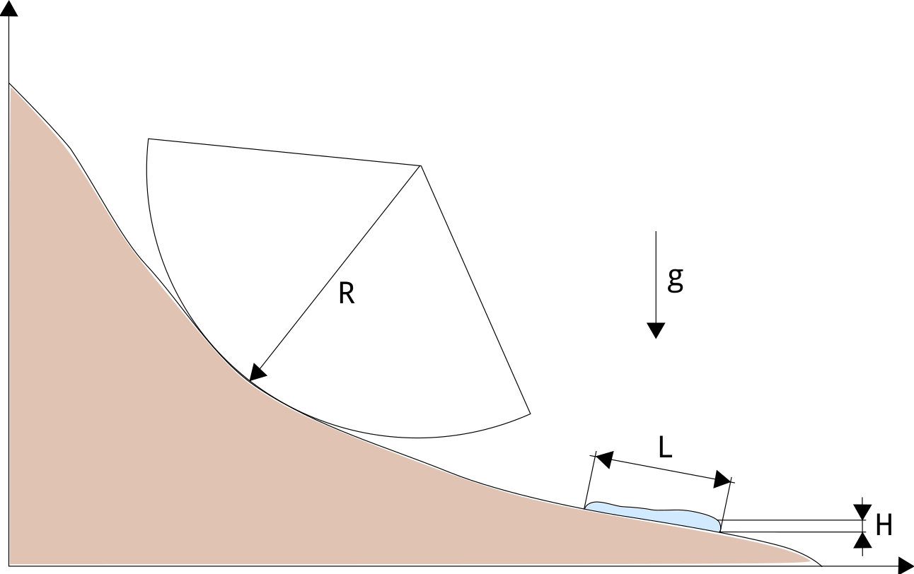

Appendix: Module DFA-Kernel
============================

Governing Equations for the Dense Flow Avalanche
------------------------------------------------------

The governing equations of the dense flow avalanche are derived from the
incompressible mass and momentum balance on a Lagrange control volume
([Zw2000]_ [ZwKlSa2003]_).

Mass balance:
~~~~~~~~~~~~~~~

.. math::
    \frac{d}{dt} \int\limits_{V(t)} \rho_0 \,\mathrm{d}V = \rho_0 \frac{dV(t)}{dt} =
    \oint\limits_{\partial V(t)} q_{\text{ent}} \,\mathrm{d}A
    :label: mass-balance1

Where :math:`q_{\text{ent}}` represents the snow entrainment rate.

Momentum balance:
~~~~~~~~~~~~~~~~~~~~~~~~~~~~~~

.. math::
    \rho_0 \frac{d}{dt} \int\limits_{V(t)} u_i \,\mathrm{d}V = \oint\limits_{\partial V(t)}
    \sigma^{\text{tot}}_{ij}n_j \,\mathrm{d}A + \rho_0 \int\limits_{V(t)} g_i \,\mathrm{d}V, \quad i=(1,2,3)
    :label: momentum-balance1

We introduce the volume average of a quantity :math:`P(\mathbf{x},t)`:

.. math::
    \overline{P}(\mathbf{x},t) =  \frac{1}{V(t)} \int\limits_{V(t)} P(\mathbf{x},t) \,\mathrm{d}V
    :label: volume-average

and split the area integral into :

.. math::
   \oint\limits_{\partial V(t)} \sigma^{\text{tot}}_{ij}n_j \,\mathrm{d}A =
   \oint\limits_{\partial V(t)} \sigma_{ij}n_j \,\mathrm{d}A + F_i^{\text{ent}} + F_i^{\text{res}}, \quad i=(1,2,3)
   :label: area-integral

:math:`F_i^{\text{ent}}` represents the force required to break the
entrained snow from the ground and to compress it (since the dense-flow
bulk density is usually larger than the density of the entrained snow,
i.e. :math:`\rho_{\text{ent}}<\rho`) and :math:`F_i^{\text{res}}`
represents the resistance force due to obstacles (for example trees).
Which leads to in :eq:`momentum-balance1`:

.. math::
   \rho_0 \frac{dV(t) \overline{u}_i}{dt} = \rho_0 V \frac{d\overline{u}_i}{dt} +
   \rho_0 \overline{u}_i \frac{dV}{dt} = \oint\limits_{\partial V(t)} \sigma_{ij}n_j
   \,\mathrm{d}A + \rho_0 V g_i + F_i^{\text{ent}} + F_i^{\text{res}}, \quad i=(1,2,3)
   :label: momentum-balance2

Using the mass balance equation :eq:`mass-balance1`, we get:

.. math::
   \rho_0 V \frac{d\overline{u}_i}{dt} = \oint\limits_{\partial V(t)} \sigma_{ij}n_j \,\mathrm{d}A
   + \rho_0 V g_i  + F_i^{\text{ent}} + F_i^{\text{res}} - \overline{u}_i \oint\limits_{\partial V(t)} q_{\text{ent}} \,\mathrm{d}A, \quad i=(1,2,3)
   :label: momentum-balance3

Boundary conditions:
~~~~~~~~~~~~~~~~~~~~~~~~~~~~~~

The free surface is defined by :

    .. math:: F_s(\mathbf{x},t) = z-s(x,y,t)=0

The bottom surface is defined by :

    .. math:: F_b(\mathbf{x}) = z-b(x,y)=0

The boundary conditions at the free surface and bottom of the flow read:

.. math::
   \left\{\begin{aligned}
   &\frac{dF_s}{dt} = \frac{\partial F_s}{\partial t} +  u_i\frac{\partial F_s}{\partial x_i} =0 \quad & \mbox{at  }F_s(\mathbf{x},t) =0 \quad & \mbox{Kinematic BC (Material boundary)}\\
   &\sigma_{ij}n_j = 0 \quad & \mbox{at  }F_s(\mathbf{x},t) =0 \quad & \mbox{Dynamic BC (Traction free surface)}\\
   &u_in_i = 0 \quad & \mbox{at  }F_b(\mathbf{x},t) =0 \quad & \mbox{Kinematic BC (No detachment)}\\
   &\tau^{(b)}_i = f(\sigma^{(b)},\overline{u},\overline{h},\overline{\rho},t,\mathbf{x})\quad & \mbox{at  }F_b(\mathbf{x},t) =0\quad & \mbox{Dynamic BC (Chosen friction law)}
   \end{aligned}
   \right.
   :label: boundary-conditions

:math:`\sigma^{(b)}_i = (\sigma_{kl}n_ln_k)n_i` represents the normal stress at the bottom and
:math:`\tau^{(b)}_i = \sigma_{ij}n_j - \sigma^{(b)}_i` represents the shear stress at the bottom surface.
:math:`f` describes the chosen friction model and are described in `[sec:friction model] <#sec:friction model>`__.
The normals at the free surface (:math:`n_i^{(s)}`) and bottom surface (:math:`n_i^{(b)}`) are:

.. math::
   n_i^{(s,b)} = \frac{\partial F_{s,b}}{\partial x_i}\left(\frac{\partial F_{s,b}}{\partial x_j}
   \frac{\partial F_{s,b}}{\partial x_j}\right)^{-1/2}
   :label: surface-normals

Choice of the coordinate system:
~~~~~~~~~~~~~~~~~~~~~~~~~~~~~~~~~~~~~~~~~~~~~

The previous equations will be developed in the orthonormal coordinate
system :math:`(B,\mathbf{e_1},\mathbf{e_2},\mathbf{e_3})`, further
referenced as Natural Coordinate System (NCS). In this NCS,
:math:`\mathbf{e_1}` is aligned with the velocity vector at the bottom
and :math:`\mathbf{e_3}` with the normal to the slope, i.e.:

.. math::
   \mathbf{e_1} = \frac{\mathbf{u}}{\left\Vert \mathbf{u}\right\Vert},\quad \mathbf{e_2} = \mathbf{e_3}\wedge\mathbf{e_1},
   \quad \mathbf{e_3} = \mathbf{n^{(b)}}
   :label: natural-coordinate-system

The origin :math:`B` of the NCS is attached to the slope. This choice
leads to:

.. math::
   n^{(b)}_i = \delta_{i3}, \quad \left.\frac{\partial b}{\partial x_i}\right\rvert_{\mathbf{0}} = 0\quad
   \mbox{for} \quad i=(1,2),\quad \mbox{and} \quad u^{(b)}_2 = u^{(b)}_3 = 0
   :label: NCS-consequence

In this NCS and considering a prism-like Control volume, the volume
content :math:`V(t) = A_b(t)\overline{h}` is obtained by multiplication
of the basal area of the prism, :math:`A_b`, with the averaged value of
the flow-depth,

.. math::
    \overline{h} = \frac{1}{A_b(t)}\int\limits_{A_b(t)} [s(\mathbf{x})-b(\mathbf{x})]\,\mathrm{d}A = \frac{1}{A_b(t)}\int\limits_{A_b(t)} h(\mathbf{x})\,\mathrm{d}A,\qquad
    \overline{u}_i = \frac{1}{V(t)}\int\limits_{V(t)} u_i(\mathbf{x})\,\mathrm{d}V
    :label: hmean-umean

The snow entrainment rate at the front can be expressed function of the
properties of the entrained snow (density :math:`\rho_{\text{ent}}` and
snow depth :math:`h_{\text{ent}}`), the velocity of the avalanche at the
front and length :math:`w_f` of the front cell (measured perpendicularly
to the flow velocity :math:`\overline{\mathbf{u}}`):

.. math::
   \oint\limits_{\partial V(t)} q_{\text{ent}}\,\mathrm{d}A = \int\limits_{l_{\text{front}}}\int_b^s q_{\text{ent}}\,
   \mathrm{d}{l}\,\mathrm{d}{z} =\rho_{\text{ent}}\,w_f\,h_{\text{ent}}\,\left\Vert \overline{\mathbf{u}}\right\Vert
   :label: entrained-mass

This leads in the mass balance :eq:`mass-balance1` to :

.. math::
   \frac{\mathrm{d}V(t)}{\mathrm{d}t} = \frac{\mathrm{d}(A_b\overline{h})}{\mathrm{d}t}
   = \frac{\rho_{\text{ent}}}{\rho_0}\,w_f\,h_{\text{ent}}\,\left\Vert \overline{\mathbf{u}}\right\Vert
   :label: mass-balance2

The force :math:`F_i^{\text{ent}}` required to break the entrained snow
from the ground and to compress it is expressed function of the required
breaking energy per fracture surface unit :math:`e_s`
(:math:`J.m^{-2}`), the deformation energy per entrained mass element
:math:`e_d` (:math:`J.kg^{-1}`) and the entrained snow depth
[Sa2007]_ [SaFeFr2008]_ [FiFrGaSo2013]_:

.. math:: F_i^{\text{ent}} = -w_f\,(e_s+\rho_{\text{ent}}\,h_{\text{ent}}\,e_d)

The force :math:`F_i^{\text{res}}` due to obstacles is expressed
function of the characteristic diameter :math:`\overline{d}` and height
:math:`h_{\text{res}}` of the obstacles, the spacing
:math:`s_{\text{res}}` between the obstacles and an empirical
coefficient :math:`c_w` (see :numref:`f-res`):

.. math::
   F_i^{\text{res}} = -(\frac{1}{2}\,\overline{d}\,c_w/s^2_{\text{res}})\,\overline{\rho}\,A\,
    \min\left\lbrace\begin{array}{l} \overline{h}\\h_{res}\end{array}\right\rbrace\,\overline{u}^2\,
    \frac{\overline{u}_i}{\|\overline{u}\|}

.. _f-res:

.. figure:: _static/f_res.png

        Resistance force due to obstacles (from [FiKo2013]_)

The momentum equation :eq:`momentum-balance3` now reads:

.. math::
   \rho_0 V \frac{d\overline{u}_i}{dt} = \oint\limits_{\partial V(t)} \sigma_{ij}n_j \,
   \mathrm{d}A + \rho_0 V g_i  + F_i^{\text{ent}} + F_i^{\text{res}} -
   \overline{u}_i\rho_{\text{ent}}\,w_f\,h_{\text{ent}}\,\left\Vert \overline{\mathbf{u}}\right\Vert, \quad i=(1,2,3)
   :label: momentum-balance4

The surface integral is split in three terms, an integral over
:math:`A_b` the bottom :math:`x_3 = b(x_1,x_2)`, :math:`A_s` the top
:math:`x_3 = s(x_1,x_2,t)` and :math:`A_h` the lateral surface.
Introducing the boundary conditions :eq:`boundary-conditions` leads to:

.. _fig-infinitesimales_element:

.. figure:: _static/infinitesimales_element.png

        Infinitesimal volume element and acting forces on it (from [FiKo2013]_)

Which simplifies the momentum balance :eq:`momentum-balance4` to:

.. math::
   \rho_0 V \frac{d\overline{u}_i}{dt} = \oint\limits_{\partial A_b}\left(\int_b^s\sigma_{ij}\,n_j\,
   \mathrm{d}x_3\right)\,\mathrm{d}l -A_b\overline{\sigma}_{i3}^{(b)} + \rho_0 V g_i  + F_i^{\text{ent}} +
   F_i^{\text{res}} - \overline{u}_i\rho_{\text{ent}}\,w_f\,h_{\text{ent}}\,\left\Vert \overline{\mathbf{u}}\right\Vert, \quad i=(1,2,3)
   :label: momentum-balance5

The momentum balance in direction :math:`x_3` (normal to the slope) is
used to obtain a relation for the vertical distribution of the stress
tensor [Sa2007]_. Due to the choice of
coordinate system and because of the kinematic boundary condition at the
bottom, the left side of :eq:`momentum-balance5` can be
expressed function of the velocity :math:`\overline{u}_1` in direction
:math:`x_1` and the curvature of the terrain in this same direction
:math:`\frac{\partial^2{b}}{\partial{x_1^2}}` [Zw2000]_:

.. math::
   \rho\,A_b\,\overline{h}\,\frac{\,\mathrm{d}\overline{u}_3}{\,\mathrm{d}t} =
   \rho\,A_b\,\overline{h}\,\frac{\partial^2{b}}{\partial{x_1^2}}\,\overline{u}_1^2,

rearranging the terms in the momentum equation leads to:

.. math::
  \overline{\sigma}_{33}(x_3) = \rho_0\,(s-x_3)\left(g_3-\frac{\partial^2{b}}{\partial{x_1^2}}\,\overline{u}_1^2\right)+ \frac{1}{A_b}
  \oint\limits_{\partial A_b}\left(\int_{x_3}^s\sigma_{3j}\,n_j\,\mathrm{d}x_3\right)\,\mathrm{d}l
  :label: sigma33

Non-dimensional Equations
~~~~~~~~~~~~~~~~~~~~~~~~~~~~~~

.. _fig-charakterisitsche_groessen:

        Characteristic size of the avalanche along its path (from [Zw2000]_)

The previous equations :eq:`momentum-balance5` and :eq:`sigma33` are can be further simplified by
introducing a scaling based on the characteristic values of the physical
quantities describing the avalanche. The characteristic length L, the
thickness H, the acceleration due to gravity g and the characteristic
radius of curvature of the terrain R are the chosen quantities. From
those values, it is possible to form two non dimensional parameters that
describe the flow:

-  Aspect ratio: :math:`\qquad\qquad\varepsilon = H / L\qquad`

-  Curvature:  :math:`\qquad\lambda = L / R\qquad`

The different properties involved are then expressed in terms of
characteristic quantities :math:`L`, :math:`H`, :math:`g` and :math:`R`
(see :numref:`fig-charakterisitsche_groessen`):

.. math::
   \begin{aligned}
    x_i &= L\, x_i^*\\
    (dx_3,h,\overline{h}) &= H\,(dx_3^*,h^*,\overline{h}^*)\\
    A_b &= L^2\, A_b^*\\
    t &= \sqrt{L/\text{g}}\, t^*\\
    \overline{u_i} &= \sqrt{\text{g}L}\,\overline{u_i}^*\\
    \text{g}_i &= \text{g} \, \text{g}_i^*\\
    \frac{\partial^2{b}}{\partial{x_1}^2} &= \frac{1}{R}\,\frac{\partial^2{b^*}}{\partial{x_1}^{*2}}\end{aligned}

The normal part of the stress tensor is directly related to the
hydro-static pressure:

.. math:: \sigma_{ii} = \rho\,\text{g}\,H\,\sigma_{ii}^*

The dimensionless properties are indicated by a superscripted asterisk.
Introducing those properties in :eq:`sigma33`, leads to
:

.. math::
   \overline{\sigma^*}_{33} = \left(g^*_3-\lambda\frac{\partial^2{b^*}}{\partial{x_1^{*2}}}\,\overline{u}_1^{*2}\right)
   (s^*-x^*_3) + \underbrace{\varepsilon\oint\limits_{\partial A_b^*}\left(\int\limits_{x^*_3}^{s^*}\sigma^*_{31}\,\mathrm{d}x^*_3\right)\,\mathrm{d}l^*}_{O(\varepsilon)}.
   :label: sigma33star

The height, H of dense flow avalanches is assumed to me small compared
to its length, L. Meaning that the equations are examined in the limit
:math:`\varepsilon \ll 1`. It is then possible to neglect the last term
in :eq:`sigma33star` which leads to (after reinserting
the dimensions):

.. math::
    \overline{\sigma}_{33}(x_3) = \rho\,\left(g_3-\overline{u_1}^2\,\frac{\partial^2{b}}{\partial{x_1^2}}\right)
    \left[\overline{h}-x_3\right]
    :label: sigma33dim

And at the bottom of the avalanche, with :math:`x_3 = 0`, the normal
stress can be expressed as:

.. math::
     \overline{\sigma}^{(b)}_{33} = \rho\,\left(g_3-\overline{u_1}^2\,\frac{\partial^2{b}}{\partial{x_1^2}}\right)\,\overline{h}
     :label: sigmab

.. math:: \tau_{ij} = \eta\left(\frac{\partial{u_i}}{\partial{x_j}}+\frac{\partial{u_j}}{\partial{x_i}}\right), ~ i\neq j

.. math:: O\left(\frac{\sigma_{12}}{\sigma_{13}}\right) = \frac{H}{L} \ll 1

.. math:: \sigma_{ii} = K_{(i)}\,\sigma_{33}

[Zw2000]_ [Sa2004]_.

.. math::
   \begin{aligned}
    \sigma_{11} &= K_{x~akt/pass}\,\sigma_{33}\\
    \sigma_{22} &= K_{y~akt/pass}^{(x~akt/pass)}\,\sigma_{33}\end{aligned}

[Sa2004]_ [Zw2000]_.

.. math:: \tau^{(b)} = \tan{\delta}\,\left\Vert \sigma\right\Vert

With the above specifications, the integral of the stresses over the
flow height is simplified in equation :eq:`momentum-balance5` to:

.. math::
   \int\limits_b^s\sigma_{ij}\,\mathrm{d}x_3 = \int\limits_b^s K_{(i)}\,\sigma_{33}\,\mathrm{d}x_3 =
    K_{(i)}\,\frac{\overline{h}\,\sigma^{(b)}}{2}

and the momentum balance can be written:

.. math::
    \frac{\,\mathrm{d}\overline{u}_i}{\,\mathrm{d}t} =
    g_i + \frac{K_{(i)}}{\overline{\rho}\,A\,\overline{h}}\,\oint\limits_{\partial{A}}\left(\frac{\overline{h}\,\sigma^{(b)}}{2}\right)n_i\,\mathrm{d}l
    -\delta_{i1}\frac{\tau^{(b)}}{\overline{\rho}\,\overline{h}} - C_{\text{res}}\,\overline{\mathbf{u}}^2\,\frac{\overline{u_i}}{\|\overline{\mathbf{u}}\|}
    -\frac{\overline{u_i}}{A\,\overline{h}}\frac{\,\mathrm{d}(A\,\overline{h})}{\,\mathrm{d}t} + \frac{F_i^{\text{ent}}}{\overline{\rho}\,A\,\overline{h}}
    :label: momentum-balance6

with

.. math:: C_{\text{res}} = \frac{1}{2}\,\overline{d}\,\frac{c_w}{s_{\text{res}}^2}.

The mass balance :eq:`mass-balance2`
remains unchanged:

.. math::
   \frac{\mathrm{d}V(t)}{\mathrm{d}t} = \frac{\mathrm{d}(A_b\overline{h})}{\mathrm{d}t}
   = \frac{\rho_{\text{ent}}}{\rho_0}\,w_f\,h_{\text{ent}}\,\left\Vert \overline{\mathbf{u}}\right\Vert
   :label: mass-balance3

The unknown :math:`\overline{u}_1`, :math:`\overline{u}_2` and
:math:`\overline{h}` satisfy :eq:`sigmab`,
:eq:`momentum-balance6` and
:eq:`mass-balance3`. In equation
:eq:`momentum-balance6` the ground shear
stress :math:`\tau^{(b)}` remains unknown, and and a closure equation
has to be introduced in order to completely solve the equations.

Numerics
-----------

References
----------

.. [Zw2000] T. Zwinger. (2000).
    Dynamik einer Trockenschneelawine auf beliebig geformten Berghangen, Technischen Universitaet Wien.

.. [ZwKlSa2003] T. Zwinger and A. Kluwick and P. Sampl. (2003).
    Numerical simulation of dry-snow avalanche flow over natural terrain.
    In: Hutter K., Kirchner N. (eds) Dynamic Response of Granular and Porous Materials under Large and Catastrophic Deformations.
    Lecture Notes in Applied and Computational Mechanics, vol 11. Springer, Berlin, Heidelberg.

.. [Sa2007] P. Sampl. (2007).
    SamosAT Modelltheorie und Numerik. AVL List GMBH.

.. [SaFeFr2008] R. Sailer and W. Fellin and R. Fromm and P. J{\"o}rg and L. Rammer and P. Sampl and A. Schaffhauser. (2008).
    Snow avalanche mass-balance calculation and simulation-model verification. Annals of Glaciology. Vol. 48, 183--192.

.. [Sa2004] B. Salm. (2004).
    A short and personal history of snow avalanche dynamics. Cold Regions Science and Technology. Vol. 39. 83--92.

.. [FiFrGaSo2013] J. T. Fischer and R. Fromm and P. Gauer and B. Sovilla. (2013)
  Evaluation of probabilistic snow avalanche simulation ensembles with Doppler radar observations. Cold Regions Science and Technology.

.. [SaZw1999] P. Sampl and T. Zwinger. (1999).
    A simulation model for dry snow avalanches. Proc. XXVIII IAHR Congress. 22--27.

.. [FiKo2013] J. T. Fischer and A. Kofler. (2013)
    SamosAT CoSiCa. Concepts for enhanced Simulation and multivariate Calibration. BFW
