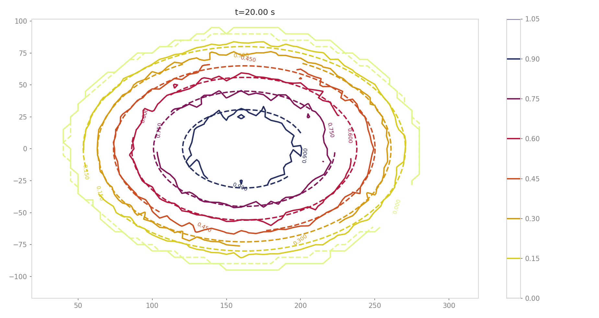

##################################
ana1Tests: Testing
##################################

Dambreak
=========

This function is used to reproduce the exact solution for a dam break problem based on the Savage Hutter model and was described in :cite:`FaMa2012`.
In this test a release mass in suddenly released over an inclined plane.
This function also provides its own plotting routines that can be used to generate plots of the
analytical results and also to compare simulation results to the exact solutions.
An example is given in runDamBreak.py, where the analytical solution is computed and
avalanche simulations are performed and both results are then compared.
The input data for this example can be found in ``data/avaDamBreak``.

The :py:func:`ana1Tests.damBreak.plotResults` function generates profile plots for the flow depth and velocity and
an animation of the flow depth evolution.
With the :py:func:`ana1Tests.damBreak.plotComparison` function, the simulation results are plotted alongside the
analytical solution for the given time step for both, flow depth and velocity.
Details can be found here: :py:mod:`ana1Tests.damBreak`.

To run
------
An example on how to apply this test to :py:mod:`com1DFA` is provided in :py:mod:`runScripts/runDamBreak`.
The required input files are located in ``data/avaDamBreak``, where the model configuration file can
be found (``data/avaDamBreak/Inputs/damBreak_com1DFACfg.ini``). In this configuration file, there
is a specific section ``'DAMBREAK'`` providing the required input parameters to compute the analytical solution.
In order to run the test example:

* in ``AvaFrame/avaframe`` run::

    runScripts/runDamBreak.py

Analytical solution of dam break problem, flow depth and flow velocity at 0.5 s.

.. list-table::
    :widths: 50 50

    * -

        .. figure:: _static/damBreakFlowDepth.png
            :width: 100%

            Flow depth in x direction after 5s

      -

        .. figure:: _static/damBreakFlowVelocity.png
            :width: 100%

            Flow velocity magnitude in x direction after 5s

Similarity solution
====================

The similarity solution is one of the few cases where an semi-analytic solution can be derived for solving the depth integrated equations.
It is therefore a very useful test case for validating simulation results coming from the dense flow avalanche computation module.
This semi-analytic solution can be derived under very strict conditions and making one major assumption on the shape of the solution.
The full development of the conditions and assumptions as well as the derivation of the solution is presented in details in :cite:`HuSiSaNo1993`.
The term semi-analytic is here used because the method enables to transform the PDE (partial differential equation) of the problem
into an ODE using a similarity analysis method. Solving the ODE still requires a numerical integration but this last one is way
more accurate (when conducted properly) and requires less computation power than solving the PDE.

In this problem, we consider an avalanche governed by a dry friction law (Coulomb friction) flowing down an inclined plane.
The released mass is initially distributed in an ellipse with a parabolic depth shape.
This mass is suddenly released at :math:`t=0` and flows down the inclined plane.

The :py:mod:`ana1Tests.simiSol` module provides functions to compute the analytic solution and some plotting routines
to visualize this solution and to compare it to the output from the DFA computational module.

To run
------

A workflow example is given in :py:mod:`runScripts/runSimilaritySol`, where the analytical solution is computed and
avalanche simulations are performed and both results are then compared.
The input data for this example can be found in ``data/avaSimilaritySol`` with the
configuration settings of com1DFA including a section 'SIMISOL' (see ``data/avaSimilaritySol/Inputs/simiSol_com1DFACfg.ini``).

The plotResults function generates profile plots for the flow depth and velocity
in both slope and cross slope directions. The simulation results are plotted alongside the
analytical solution for the given time step.

Comparing the results from the DFA module to the similarity solution leads to the following plots:

.. list-table::
    :widths: 50 50

    * -

        .. figure:: _static/simiSol_x.png
            :width: 100%

            Along slope flow depth and velocity of the DFA solution and similarity solution

      -

        .. figure:: _static/simiSol_y.png
            :width: 100%

            Cross slope flow depth and velocity of the DFA solution and similarity solution

    2D flow depth of the DFA solution (full lines) and similarity solution (dashed lines) in meters

Flat plane test
====================

In this test, the behavior of a conical pile of material placed on a flat plane
and ruled by Coulomb friction is studied. The pile starts at rest and depending
on the steepness of the slope and the friction angle will start flowing. The idea behind this test
is to check the implementation of the bottom shear stress in the DFA module as well as the gradient
computation (SPH method).

The :py:mod:`ana1Tests.FPtest` module provides functions to compute the analytic solution and some plotting routines
to visualize the pile and to compare it to the output from the DFA computational module.

To run
------

An workflow example is given in :py:mod:`runScripts.runTestFP`.
The input data for this example can be found in ``data/avaFPtest`` with the
configuration settings of com1DFA including a section 'FPSOL' (see ``data/avaFPtest/Inputs/FlatPlane_com1DFACfg.ini``).

The :py:func:`ana1Tests.FPtest.plotProfilesFPtest` function generates a profile plot of the flow depth in the radial direction.
The simulation results are plotted alongside the analytical solution for the given time step.

.. list-table::

    * -

        .. figure:: _static/flatPlaneTest.png
            :width: 90%

            Pile at initial time step

      -

        .. figure:: _static/flatPlaneTest20s.png
            :width: 90%

            Pile after 19.8s
