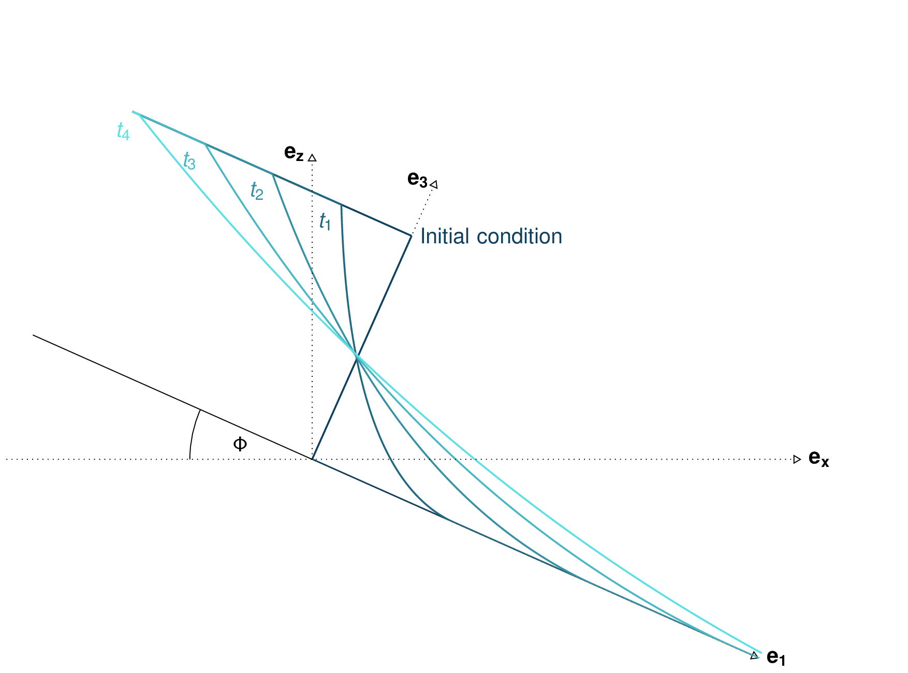
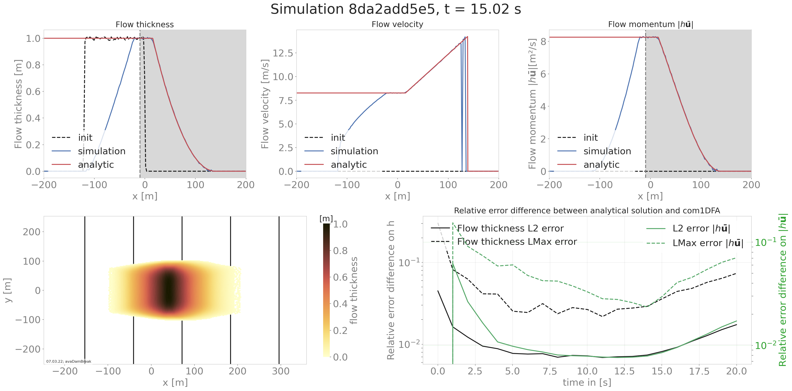
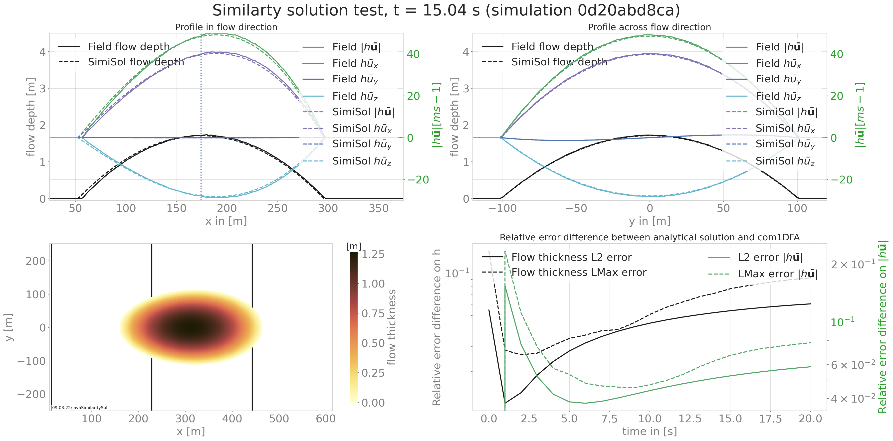
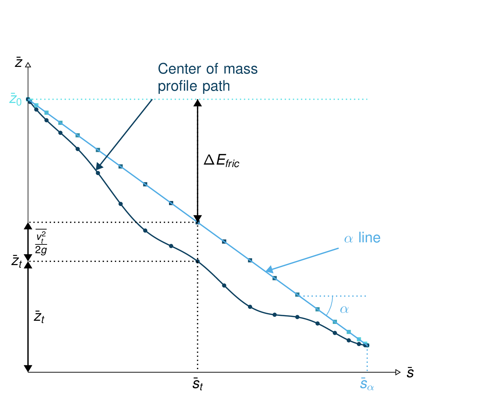
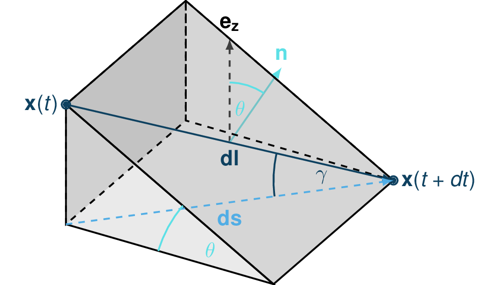
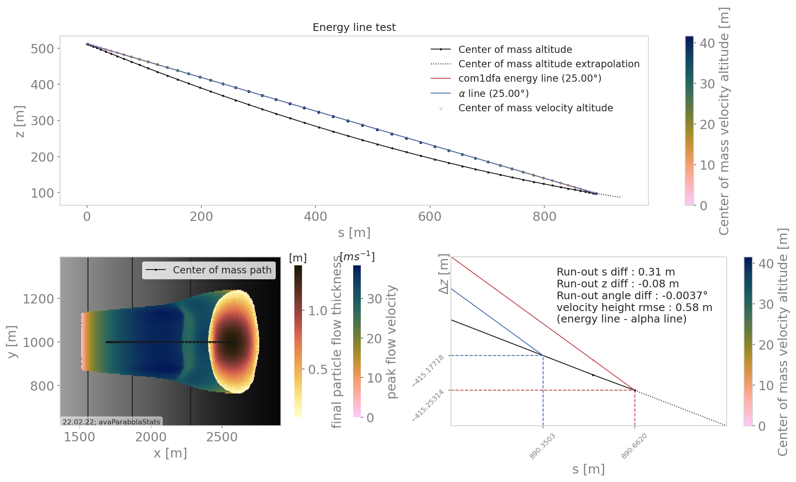

##################################
ana1Tests: Testing
##################################

Deviation/difference/error computation
=======================================

In order to either assess the accuracy of a numerical method or to compare results
it will be necessary to compute errors. The methods used to compute errors are described
in this section.

Two error measurement are used. The first one is based on the :math:`\mathcal{L}_{max}` norm (uniform norm),
the second on the Euclidean norm (:math:`\mathcal{L}_{2}` norm).

Uniform norm
--------------

The :math:`\mathcal{L}_{max}` norm measures the largest absolute value:

.. math::
    \mathcal{L}_{max}(f(x)) = \sup_{x\in \Omega}(\vert f \vert)

This will give an idea of the largest difference between the two solutions.
It can be applied to one or two dimensional results.

It can also be normalized by dividing the uniform norm of the difference
by the uniform norm of the reference.

Euclidean norm
---------------

The :math:`\mathcal{L}_{2}` norm measures :

.. math::
    \mathcal{L}_{2}(f) = \int_{x\in \Omega}\vert\vert f(x) \vert\vert^2\,dx

Dambreak test
===============

The Dambreak test compares the results of the DFA simulation to the analytical solution of the "dam break" problem.
In this test, a granular mass (Coulomb material) is suddenly released from rest on an inclined plane.
In the case of a depth integrated model as derived by Savage and Hutter, an analytical solution exists.
This solution is described in :cite:`FaMa2012` and corresponds to a Riemann problem.

The problem considered has the following initial conditions:

.. math::
    (h, \mathbf{u})(x, t=0) = \left\{
    \begin{aligned}
    (&h_0,\mathbf{0}),\quad &\mbox{if } x \leq 0\\
    (&0\,\,\,,\mathbf{0}),\quad &\mbox{if } x > 0
    \end{aligned}
    \right.

.. _fig-damBreak:

      Dam break theoretical evolution

The functions computing the analytical solution and comparing it to the simulation results are to be
found in :py:mod:`ana1Tests.damBreak` and :py:mod:`ana1Tests.analysisTools`. Plotting routines are
located in :py:mod:`out3Plot.outAna1Plots`. The input data for this example can be found in ``data/avaDamBreak``.

This test produces a summary figure combining a comparison between the analytic and simulation
result (cross cut along the flow direction) as well as a bird view and an error measure plot as
shown in :numref:`fig-damBreak`.

.. _fig-damBreak:

Another optional result are the comparison cross cut figures for all saved time steps
as shown in the following figure.

.. image:: _static/CompareDamBreak8da2add5e5_Animation.gif

To run
------
An example on how to apply this test is provided in :py:mod:`runScripts/runDamBreak` and
:py:mod:`runScripts/runAnalyzeDamBreak`.
The required input files are located in ``data/avaDamBreak``, where the model configuration file can
be found (``data/avaDamBreak/Inputs/damBreak_com1DFACfg.ini``). In this configuration file, there
is a specific section ``'DAMBREAK'`` providing the required input parameters to compute the analytical solution.
In order to run the test example:

* in ``AvaFrame/avaframe`` run::

    python3 runScripts/runDamBreak.py
    python3 runScripts/runAnalyzeDamBreak.py

Similarity solution
====================

The similarity solution is one of the few cases where an semi-analytic solution can be derived for solving the depth integrated equations.
It is therefore a very useful test case for validating simulation results coming from the dense flow avalanche computation module.
This semi-analytic solution can be derived under very strict conditions and making one major assumption on the shape of the solution.
The full development of the conditions and assumptions as well as the derivation of the solution is presented in details in :cite:`HuSiSaNo1993`.
The term semi-analytic is here used because the method enables to transform the PDE (partial differential equation) of the problem
into an ODE using a similarity analysis method. Solving the ODE still requires a numerical integration but this last one is way
more accurate (when conducted properly) and requires less computation power than solving the PDE.

In this problem, we consider an avalanche governed by a dry friction law (Coulomb friction) flowing down an inclined plane.
The released mass is initially distributed in an ellipse with a parabolic depth shape.
This mass is suddenly released at :math:`t=0` and flows down the inclined plane.

The :py:mod:`ana1Tests.simiSol` module provides functions to compute the analytic solution and some plotting routines
to visualize this solution and to compare it to the output from the DFA computational module.

To run
------

A workflow example is given in :py:mod:`runScripts/runSimilaritySol`, where the analytical solution is computed and
avalanche simulations are performed and both results are then compared.
The input data for this example can be found in ``data/avaSimilaritySol`` with the
configuration settings of com1DFA including a section 'SIMISOL' (see ``data/avaSimilaritySol/Inputs/simiSol_com1DFACfg.ini``).

The plotResults function generates profile plots for the flow depth and velocity
in both slope and cross slope directions. The simulation results are plotted alongside the
analytical solution for the given time step.

Comparing the results from the DFA module to the similarity solution leads to the following plots:

.. _fig-simiSol:

.. figure:: _static/SimiSol_0d20abd8ca_xyaxisCutSol_Animation.gif

    Time evolution of the profile in and across flow direction

Flat plane test
====================

In this test, the behavior of a conical pile of material placed on a flat plane
and ruled by Coulomb friction is studied. The pile starts at rest and depending
on the steepness of the slope and the value of the bed friction angle will start to flow. The idea behind this test
is to check the implementation of the bottom shear stress in the DFA module as well as the gradient
computation (SPH method).

The :py:mod:`ana1Tests.FPtest` module provides functions to compute the analytic solution and some plotting routines
for visualizing the pile and for comparison to the output from the DFA computational module.

To run
------

A workflow example is given in :py:mod:`runScripts.runTestFP`.
The input data for this example can be found in ``data/avaFPtest`` with the
configuration settings of com1DFA including a section ``'FPSOL'`` (see ``data/avaFPtest/Inputs/FlatPlane_com1DFACfg.ini``).

The :py:func:`ana1Tests.FPtest.plotProfilesFPtest` function generates a profile plot of the flow depth in the radial direction.
The simulation results are plotted alongside the analytical solution for the given time step.

.. list-table::

    * -

        .. figure:: _static/flatPlaneTest.png
            :width: 90%

            Pile at initial time step

      -

        .. figure:: _static/flatPlaneTest20s.png
            :width: 90%

            Pile after 19.8s

Energy line test
==================
The Energy line test compares the results of the DFA simulation to a geometrical solution that is related
to the total energy of the system. Solely considering Coulomb friction this solution is motivated by the first principle
of energy conservation along a simplified topography. Here friction force only depends on the slope angle.
The analytical runout is the intersection of the path profile with the :math:`\alpha` line defined by the friction angle.
From the :math:`\alpha` line it is also possible to extract information about the flow mass averaged velocity at any time or
position along the path profile.

Theory
-------
Applying the energy conservation law to a material block flowing down
a slope with Coulomb friction and this between two
infinitesimally close time steps reads:

.. math::
    \begin{aligned}
    E^{tot}_{t + dt} - E^{tot}_{t} & = E^{kin}_{t + dt} + E^{pot}_{t + dt}
    - (E^{kin}_{t} + E^{pot}_{t}) = \delta E_{fric} \\
    & = \frac{1}{2} m v^2_{t+dt} + m g z_{t+dt}
    - \frac{1}{2} m v^2_{t} - m g z_{t} \\
    &= \mathbf{F}_{fric} . \mathbf{dl} =
    - \mu \vert \vert \mathbf{N}\vert \vert \frac{\mathbf{dl}}{dl}. \mathbf{dl}
    = - \mu mg (\mathbf{e_z}.\mathbf{n}) dl
    \end{aligned}

where :math:`\delta E_{fric}` is the energy dissipation due to friction,
:math:`\mathbf{N}` represents the normal (to the slope surface) component
of the gravity force, :math:`\mathbf{n}` the normal vector to the slope surface
and :math:`\mathbf{dl}` is the vector representing the distanced traveled by
the material between :math:`t` and :math:`t+dt`.
The normal vector reads :math:`\mathbf{e_z}.\mathbf{n} = cos(\theta)`,
where :math:`\theta` is the slope angle. :math:`m` represents the mass of the material,
:math:`g` the gravity, :math:`\mu = \tan{\delta}` the friction coefficient and
friction angle, :math:`z`, respectively :math:`v` the elevation respectively velocity
of the material block.
Finally, in the 2D case, :math:`dl = \frac{ds}{cos(\theta)}`, which means that
the material is flowing in the steepest slope direction (:math:`\mathbf{ds}`
is the horizontal component of :math:`\mathbf{dl}`).

Integrating the energy conservation between the start and a time t reads:

.. math::
    \begin{aligned}
    E^{tot}_{t} - E^{tot}_{t=0} & = \frac{1}{2} m v^2_{t} + m g z_{t}
    - \frac{1}{2} m \cancelto{0}{v^2_{t=0}} - m g \cancelto{z_0}{z_{t=0}} \\
    &= \int_{t'=0}^{t'=t}\delta E_{fric} dt' =
    -\int_{s'=s_0}^{s'=s_t}\mu mg ds' =
    -\mu mg (s_t-\cancelto{0}{s_0})
    \end{aligned}

Speaking in terms of altitude, the energy conservation equation can be
rewritten:

.. math::
    z_0 = z_{t} + \frac{v^2_{t}}{2g} + tan\alpha s_t
   :label: altitude-energy-conservation

This result is illustrated in the following figure.

.. _fig-altitude-energy-conservation:

    Center of mass profile (dark blue line with the dots)
    with on top, the energy line (light blue) and the
    velocity altitude points (colored squared)

Considering a system of material blocks flowing down a slope
with to Coulomb friction: we can sum the previous equation
:eq:`altitude-energy-conservation` of each block after weighting
it by the block mass. This leads to the mass average energy
conservation equation:

.. math::
    \bar{z}_0 = \bar{z}_{t} + \frac{\overline{v^2}_{t}}{2g}
    + tan\alpha \bar{s}_t
   :label: altitude-energy-conservation-avg

where the mass average :math:`\bar{a}` value of a quantity :math:`a` is:

.. math::
    \bar{a} = \frac{\sum_k m_k a_k}{\sum_k m_k}

This means that the mass averaged quantities also follow the same energy
conservation law when expressed in terms of altitude. The same figure as in
:numref:`fig-altitude-energy-conservation` can be drawn for the center of mass
profile path.

The aim is to take advantage of this energy conservation line to evaluate
the DFA simulation. Computing the
mass averaged path profile for the particles in the simulation and comparing
it to the :math:`\alpha` line allows to compute the error compared to the
energy line runout. This also applies to the error on the velocity altitude.
The following figures illustrate the concept.

.. list-table::

    * -

        .. figure:: _static/energyLinePath.png
            :width: 90%

            View of the avalanche simulation and extracted path

      -

        .. figure:: _static/energyLine.png
            :width: 90%

            Simulation path profile (dark blue curve and dots)
            with the runout line (dark blue line and velocity altitude
            squares), :math:`\alpha` line and energy points

From the different mass averaged simulation quantities and the theoretical
:math:`\alpha` line it is possible to extract four error indicators.
The first three related to the runout point defined by the intersection
between the :math:`\alpha` line and the mass averaged path profile
(or its extrapolation if the profile is too short) and the
last one is related to the velocity :

  * The horizontal distance between the runout point and the end
    of the path profile defines the :math:`\epsilon_s` error in meters.

  * The vertical distance between the runout point and the end
    of the path profile defines the :math:`\epsilon_z` error in meters.

  * The angle difference between the :math:`\alpha` line angle and the DFA
    simulation runout line defines the :math:`\epsilon_{\alpha}` angle error.

  * The Root Mean Square Error (RMSE) between the :math:`\alpha` line
    and the DFA simulation energy points defines an error on the
    velocity altitude :math:`\frac{\overline{v^2}}{2g}`.

Limitations and remarks
~~~~~~~~~~~~~~~~~~~~~~~~

It is essential to stay where the assumptions of this test hold.
Indeed, one of the important hypotheses when developing
the energy solution, is that the material is flowing in the steepest
slope direction (i.e. where :math:`dl = \frac{ds}{cos(\theta)}` theta holds).
If this hypothesis fails (as illustrated in :numref:`fig-non-steppest-descent`), then it is not possible
to develop the analytic energy solution anymore. In the 3D case,
the distance vector :math:`\mathbf{dl}` traveled by the particles reads
:math:`dl = \frac{ds}{cos(\gamma)}`, where :math:`\gamma` is the angle
between the :math:`\mathbf{dl}` vector and the horizontal plane
which can differ from the slope angle :math:`\theta`. In this case,
the energy solution is not the solution of the problem anymore
and can not be used as reference.

.. _fig-non-steppest-descent:

    Example of trajectory where the steepest descent path hypothesis
    fails. The mass point is traveling from :math:`\mathbf{x}(t)` to
    :math:`\mathbf{x}(t+dt)`. The slope angle :math:`\theta` and
    travel angle :math:`\gamma` are also illustrated. Here
    :math:`(\mathbf{e_z}.\mathbf{n}) dl = cos\theta \frac{ds}{cos\gamma} \neq
    ds`.

.. If this happens
  it is not possible to differentiate anymore, in the energy plot,
  the potential error related to the DFA simulation  from
  the hypothesis fail error.

It is also possible with this test to observe the effect of terms
such as curvature acceleration, artificial viscosity or pressure gradients.
The curvature acceleration modifies the friction term (depending on topography
curvature and particle velocity). This leads to a mismatch between the
energy solution and the DFA simulation.
Artificial viscosity can lead to viscous dissipation leading
to shorter runouts then what the energy solution predicts.
Finally, the effect of the pressure force can be studied, especially the
effect of the computation options.

Procedure
----------
First, the DFA simulation is ran (in our case using the com1DFA module) on the desired avalanche, saving the particles
(at least the initial and final particles information).
Then, the particles mass averaged quantities are computed (:math:`\bar{x}, \bar{y}, \bar{z}, \bar{s}, \bar{v^2}`)
to extract a path and path profile.
Finally, the mass averaged path profile, the corresponding runout line and the expected :math:`\alpha` are displayed
and the runout angle and distance errors as well as the velocity altitude error are computed.

    Results from the ana1EnergyLineTest for the avaParabola

To run
-------

A workflow example is given in :py:mod:`runScripts.runAna1EnergyLineTest.py`.
