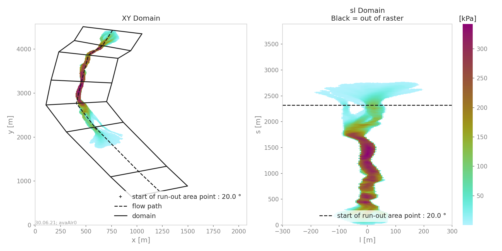
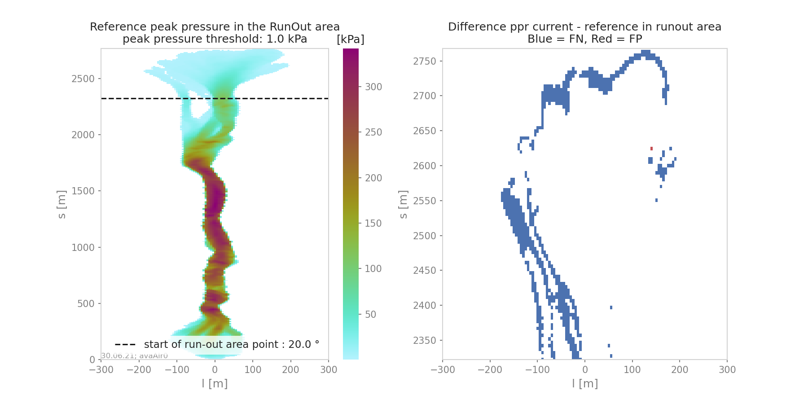
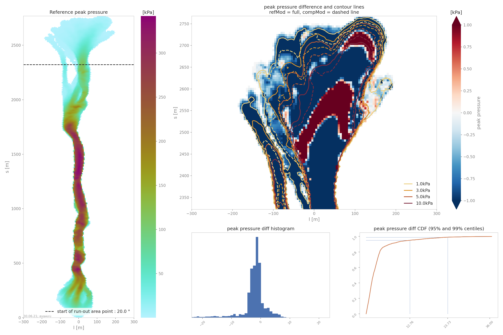

ana3AIMEC: Aimec
==========================

Aimec is a post-processing module to analyze and compare results from avalanche simulations.
It enables the comparison of different simulations (with different input parameter sets for example, or from different models)
of the same avalanche (meaning using the same DEM and going down the same avalanche path) in a standardized way.

In ``AvaFrame/avaframe/runScripts``, three different run scripts are provided that show examples on how the postprocessing module aimec can be used.
These examples include:

*  full aimec analysis for simulation results of one computational module (from 1 simulation to x simulations). :py:func:`runScripts.runAna3AIMEC.runAna3AIMEC`
*  using aimec to compare the results of two different computational modules (for one simulation at a time hence only one simulation result per
   computational module is passed at a time). :py:func:`runScripts.runAna3AIMECCompMods.runAna3AIMECCompMods`
*  using aimec to compare one result parameter (ppr, pfd, pfv) for different simulations in a given inputDir (from 1 simulation to x simulations).
   :py:mod:`runScripts.runAna3AIMECIndi`

Here is an example workflow for the full Aimec analysis, as provided in :py:mod:`runScripts/runAna3AIMEC.py`:

Inputs
-------

*  raster of the DEM (.asc file)
*  avalanche path in LINES (as a shapefile named ``path_aimec.shp``)
*  a splitPoint in POINTS (as a shapefile named ``splitPoint.shp``)
*  Results from avalanche simulation (when using results from com1DFA,
   the helper function :py:func:`ana3AIMEC.dfa2Aimec.mainDfa2Aimec` in :py:mod:`ana3AIMEC.dfa2Aimec` fetches and prepares the input for Aimec)

Outputs
--------

*  output figures in ``NameOfAvalanche/Outputs/ana3AIMEC/com1DFA/pics/``
*  txt file with results in ``NameOfAvalanche/Outputs/ana3AIMEC/com1DFA/``
  (a detailed list of the results is described in :ref:`moduleAna3AIMEC.analyze-results`)

To run
-------

*  first go to ``AvaFrame/avaframe``
*  copy ``ana3AIMEC/ana3AIMECCfg.ini`` to ``ana3AIMEC/local_ana3AIMECCfg.ini`` (if not, the standard settings are used)
*  enter path to the desired ``NameOfAvalanche/`` folder in your local copy of ``avaframeCfg.ini``
*  run::

      python3 runScripts/runAna3AIMEC.py

Theory
-----------

AIMEC (Automated Indicator based Model Evaluation and Comparison, :cite:`Fi2013`) was developed
to analyze and compare avalanche simulations. The computational module presented here is inspired from the original AIMEC code.
The simulations are analyzed and compared by projecting the results along a chosen poly-line (same line for all the simulations
that are compared) called avalanche path.
The raster data, initially located on a regular and uniform grid (with coordinates x and y) is projected on a regular non uniform grid
(grid points are not uniformly spaced) that follows the avalanche path (with curvilinear coordinates (s,l)).
This grid can then be "straightened" or "deskewed" in order to plot it in the (s,l) coordinates system.

The simulation results (two dimensional fields of e.g. peak velocities / pressure or flow depth) are processed in a way
that it is possible to compare characteristic values that are directly linked to the flow variables such as
maximum peak flow depth, maximum peak velocity or deduced quantities, for example maximum peak pressure,
pressure based runout (including direct comparison to possible references, see :ref:`moduleAna3AIMEC:Area indicators`) for different simulations.
The following figure illustrates the raster transformation process.

.. list-table::

    * - .. _fig-aimec-comp-real:

        .. figure:: _static/aimec_comparison_real_topo.png
            :width: 90%

            In the real coordinate system (x,y)

      - .. _fig-aimec-comp-new:

        .. figure:: _static/aimec_comparison_new_topo.png
            :width: 90%

            In the new coordinate system (s,l)

Here is the definition of the different indicators and outputs from the AIMEC post-processing process:

Mean and max values along path
~~~~~~~~~~~~~~~~~~~~~~~~~~~~~~~~

All two dimensional field results (for example peak velocities / pressure or flow depth) can be projected into the curvilinear system using
the previously described method. The maximum and average values of those fields are computed in each cross-section (l direction).
For example the maximum :math:`A_{cross}^{max}(s)` and average :math:`\bar{A}_{cross}(s)` of the two
dimensional distribution :math:`A(s,l)` is:

.. math::
    A_{cross}^{max}(s) = \max_{\forall l \in [-\frac{w}{2},\frac{w}{2}]} A(s,l) \quad\mbox{and}\quad
    \bar{A}_{cross}(s) = \frac{1}{w}\int_{-\frac{w}{2}}^{\frac{w}{2}} A(s,l)dl

Runout point
~~~~~~~~~~~~~~~~~~~~~~~~~~~~~~~~

The runout point corresponding to a given pressure threshold :math:`P_{lim}>0kPa` is the first point :math:`s=s_{runout}`
where the maximum peak pressure falls below the pressure limit (:math:`P_{cross}^{max}(s)<P_{Lim}`). This :math:`s=s_{runout}` is related
to a :math:`(x_{runout},y_{runout})` in the original coordinate system. It is very important to note that the position of this
point depends on the chosen pressure limit value. It would also be possible to use :math:`\bar{P}_{cross}(s)<P_{Lim}` instead of
:math:`P_{cross}^{max}(s)<P_{Lim}`.

Runout length
~~~~~~~~~~~~~~~~~~~~~~~~~~~~~~~~

This length depends on what is considered the beginning of the avalanche :math:`s=s_{start}`. It can be related to the release area,
to the transition point (first point where the slope angle is below :math:`30^{\circ}`) or to the runout area point
(first point where the slope angle is below :math:`10^{\circ}`). The runout length is then defined as :math:`L=s_{runout}-s_{start}`.

Mean and max indicators
~~~~~~~~~~~~~~~~~~~~~~~~~~~~~~~~

From the maximum values along path of the distribution :math:`A(s,l)` calculated in :ref:`moduleAna3AIMEC:Mean and max values along path`, it is possible to calculate
the global maximum (MMA) and average maximum (AMA) values of the two dimensional distribution :math:`A(s,l)`:

.. math::
    MMA = \max_{\forall s \in [s_{start},s_{runout}]} A_{cross}^{max}(s) \quad\mbox{and}\quad
    AMA = \frac{1}{s_{runout}-s_{start}}\int_{s_{start}}^{s_{runout}} A_{cross}^{max}(s)ds

Area indicators
~~~~~~~~~~~~~~~~~~~~~~~~~~~~~~~~

When comparing the runout area (corresponding to a given pressure threshold :math:`P_{cross}^{max}(s)>P_{Lim}`) of two simulations,
it is possible to distinguish four different zones. For example, if the first simulation (sim1) is taken as reference and if True corresponds
to the assertion that the avalanche covered this zone and False there was no avalanche in this zone, those four zones are:

    *  TP (true positive) zone: green zone on :numref:`fig-aimec-comp-new` , sim1 = True  sim2 = True
    *  FP (false positive) zone: blue zone on :numref:`fig-aimec-comp-new` , sim1 = False  sim2 = True
    *  FN (false negative) zone: red zone on :numref:`fig-aimec-comp-new` , sim1 = True  sim2 = False
    *  TN (true negative) zone: gray zone on :numref:`fig-aimec-comp-new` , sim1 = False  sim2 = False

The two simulations are identical (in the runout zone) when the area of both FP and FN is zero. In order to provide a normalized
number describing the difference between two simulations, the area of the different zones is normalized by the area of the reference
simulation :math:`A_{ref} = A_{TP} + A_{FP}`. This leads to the 4 area indicators:

    *  :math:`\alpha_{TP} = A_{TP}/A_{ref}`, which is 1 if sim2 covers at least the reference
    *  :math:`\alpha_{FP} = A_{FP}/A_{ref}`, which is a positive value if sim2 covers an area outside of the reference
    *  :math:`\alpha_{FN} = A_{FN}/A_{ref}`, which is a positive value if the reference covers an area outside of sim2
    *  :math:`\alpha_{TN} = A_{TN}/A_{ref}`

Identical simulations (in the runout zone) lead to :math:`\alpha_{TP} = 1` , :math:`\alpha_{FP} = 0` and :math:`\alpha_{FN} = 0`

Mass indicators
~~~~~~~~~~~~~~~~~~~~~~~~~~~~~~~~

From the analysis of the release mass (:math:`m_r` at the beginning, i.e :math:`t = t_{ini}`), total mass
(:math:`m_t` at the end, i.e :math:`t = t_{end}`) and entrained mass (:math:`m_e` at the end, i.e :math:`t = t_{end}`)
it is possible to calculate the growth index :math:`GI` and growth gradient :math:`GG` of the avalanche:

.. math::
    GI = \frac{m_t}{m_r} = \frac{m_r + m_e}{m_r} \quad\mbox{and}\quad GG = \frac{m_r + m_e}{t_{end}-t_{ini}}

Time evolution of the total mass and entrained one are also analyzed.

Procedure
-----------

This section describes how the theory is implemented in the ``ana3AIMEC`` module.

Perform path-domain transformation
~~~~~~~~~~~~~~~~~~~~~~~~~~~~~~~~~~~~~~

First, the transformation from (x,y) coordinate system (where the original rasters lie in) to (s,l) coordinate system is applied
given a new domain width. This is done by :py:func:`ana3AIMEC.aimecTools.makeDomainTransfo`. A new grid corresponding to the new domain (following the avalanche path) is built.
The transformation information are stored in a ``rasterTransfo`` dictionary (see :py:func:`ana3AIMEC.aimecTools.makeDomainTransfo` for more details).

.. :xllc: x coordinate of the lower left cell of the (x,y) domain
.. :yllc: y coordinate of the lower left cell of the (x,y) domain
.. :cellsize: original raster cell size
.. :domainWidth: desired width for the new domain
.. :gridx: x coordinate of the new raster points (2D numpy array of size (n,m))
.. :gridy: y coordinate of the new raster points (2D numpy array of size (n,m))
.. :s: new s coordinates (1D numpy array of size n)
.. :l: new l coordinates (1D numpy array  of size m)
.. :x: x coordinate of the centerline (s,l=0) of the new raster (1D numpy arrayof size n)
.. :y: y coordinate of the centerline (s,l=0) of the new raster (1D numpy arrayof size m)
.. :rasterArea: area of the cells of the new raster grid (2D numpy array of size (n,m))
.. :indSplit: index of the projected split point on the avalanche path
.. :startOfRunoutAngle: slope angle defining the start of runout point (runout will be measured from this point) in degrees
.. :indstartOfRunout: 	index of the start of runout point (first point under the given startOfRunoutAngle)

Assign data
~~~~~~~~~~~~~

The simulation results (for example peak velocities / pressure or flow depth) are projected on the new grid using the
transformation information by :py:func:`ana3AIMEC.aimecTools.assignData`. The projected results are stored in the ``newRasters`` dictionary.

This results in the following plot:

.. _fig-aimec-domain-transfo:

    Alr avalanche coordinate transformation and peak pressure field reprojetion.

Analyze results
~~~~~~~~~~~~~~~~~~~

Calculates the different indicators described in the :ref:`moduleAna3AIMEC:Theory` section for a given threshold. The threshold
can be based on pressure, flow depth, ... (this needs to be specified in the configuration file).
Returns a ``resAnalysis`` dictionary with the analysis results (see :py:func:`ana3AIMEC.ana3AIMEC.postProcessAIMEC` for more details).

.. :runout: (x,y) coordinates of the runout as well as the runout length based on P_cross_max and the pressure Threshold
.. :runoutMean: (x,y) coordinates of the runout as well as the runout length based on P_cross_mean and the pressure Threshold
.. :AMPP: average maximum peak pressure
.. :MMPP: maximum maximum peak pressure
.. :AMD: average maximum flow depth
.. :MMD: maximum maximum flow depth
.. :elevRel: z coordinate of the release area (first point with max Peak pressure over pressure Threshold)
.. :deltaH: DeltaZ between the release point and runout point
.. :relMass: release Mass
.. :entMass: entrained Mass
.. :growthIndex: growth Index
.. :growthGrad: growth Gradient
.. :pressureLimit: pressure Threshold
.. :pCrossAll: :math:`P_{cross}^{max}(s)` for each simulation

Plot and save results
~~~~~~~~~~~~~~~~~~~~~~~~~

Plots and saves the desired figures. Writes results in ``resAnalysis`` to a text file.
By default, Aimec saves five plots plus as many plots as numerical simulations to
compare to the reference. The first five ones are :

  *  "DomainTransformation" shows the real domain on the left and new domain on the right (:numref:`fig-aimec-domain-transfo`)
  *  "referenceFields" shows the peak pressure, flow depth and speed in the new domain

    .. figure:: _static/avaAlr0_plim_1p0_referenceFields.png
        :width: 90%

        Reference peak fields

  *  "slComparison" shows the difference between all simulations in terms of peak values along profile.
    If only two simulations are provided, a 3 panel plot like the following is produced:

    .. figure:: _static/avaAlr1_ppr_thresholdValue_1_slComparison.png
        :width: 90%

        Maximum peak fields comparison between two simulations

    if more then two simulations are provided only the peak field specified in the configuration file is analyzed
    and the statistics in terms of peak value along profile are plotted (mean, max and quantiles):

    .. figure:: _static/avaAlr0_ppr_thresholdValue_1_slComparisonStat.png
        :width: 90%

        Maximum peak pressure distribution along path

  *  "ROC" shows the normalized area difference between reference and other simulations.

    .. figure:: _static/avaAlr0_ppr_thresholdValue_1_ROC.png
        :width: 90%

        Area analysis plot

  *  "relMaxPeakField" shows the relative difference in maximum peak value between reference and other simulation function of runout length

    .. figure:: _static/avaAlr0_relMaxppr_thresholdValue1.png
        :width: 90%

        Relative maximum peak pressure function of runout

The last plots "_i_ContourComparisonToReference" and "_i_AreaComparisonToReference"  where "i" gives the number of the simulation plots the 2D difference with the reference
and the statistics associated.

    Area comparison

    Contour comparison

Configuration parameters
----------------------------

:domainWidth: width of the domain around the avalanche path in [m]
:startOfRunoutAngle: angle of the slope at the start of the runout zone [°]
:resType: data result type for runout analysis
:thresholdValue: limit value for evaluation of runout (according to the chosen resType)
:contourLevels: contour levels for difference plot (according to the chosen resType)
:diffLim: max/min of chosen resType displayed in difference plot
:interpMethod: interpolation method used to project the a point on the input raster (chose between 'nearest' and 'bilinear')
:distance: resampling distance. The given avalanche path is resampled with a 10m (default) step.
:dsMin: float. Threshold distance [m]. When looking for the beta point make sure at least
  dsMin meters after the beta point also have an angle bellow 10° (dsMin=30m as default).

:anaMod: computational module used to perform ava simulations
:comModules: two computational modules used to perform ava simulations in order to compare the results
:plotFigure: plot figures; default False
:savePlot: Save figures; default True
:WriteRes: Write result to file: default True
