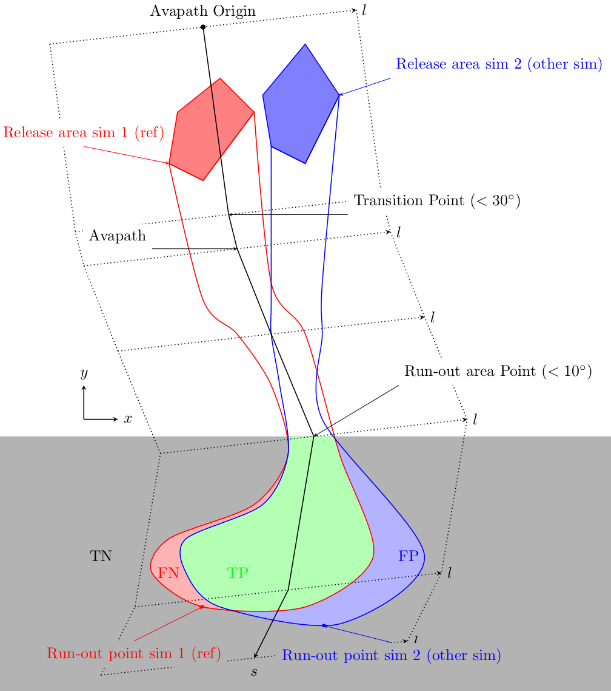
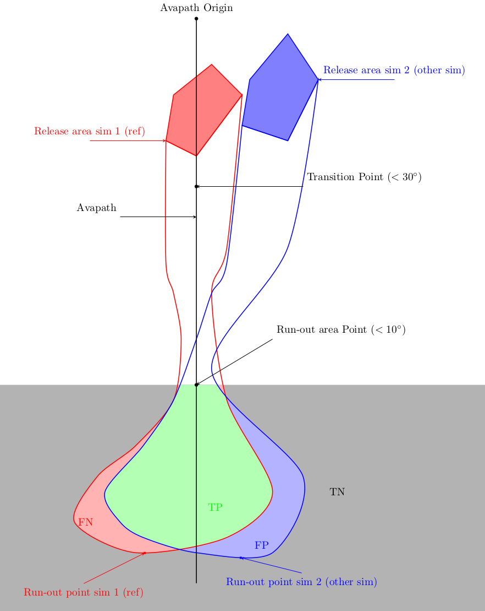

ana3AIMEC: Module Aimec
==========================

Aimec is a post-processing module to analyze and compare results from avalanche simulations.
It enables the comparison of different runs of a same avalanche in a standardized way.

Inputs
-------

* raster of the DEM (.asc file)
* aimec avalanche path in LINES (as a shape file with "aimec" in the name).
* a splitPoint in POINTS (as a shape file).
* Results from avalanche simulation (structured in a similar way as the output from com1DFA)

Outputs
--------

* output figures in ``NameOfAvalanche/Outputs/ana3AIMEC/pics/``
* txt file with results in ``NameOfAvalanche/Outputs/ana3AIMEC/``

To run
-------

* copy ``ana3AIMECCfg.py`` to ``local_ana3AIMECCfg.py`` (if not, the standard settings are used)
* enter paths to the desired ``NameOfAvalanche/`` folder in ``AvaFrame/avaframe/avaframeCfg.ini``
* in ``AvaFrame/avaframe/`` run::

      python3 runAna3AIMEC.py

Theory
-----------

The simulation results are processed in a way that it is possible to compare characteristic values
such as run-out, maximum peak velocity or speed, depth... for different runs.

AIMEC (Automated Indicator based Model Evaluation and Comparison) was developed by J.-T. Fischer ([Fischer2013]_)
to analyze and compare avalanche simulations. In AIMEC, the choice was made to analyze and compare simulations
by projecting the results along a chosen poly-line (same line for all the results that are compared) called avalanche path.
The raster data, initially located on a regular grid (with coordinates x y) is projected on a non uniform raster
that follows the poly-line (with curvilinear coordinates (s,l)).
This raster is then being "straightened" or "deskewed" to end up with a regular grid raster (with coordinates (s,l)).
The following figure illustrates the process.

      .. figure:: _static/aimec_transfo.png
              :width: 90%

              Pressure field on real raster (in blue the chosen path) and on the "deskewed" raster along given path

All two dimensional field results (such as Peak Pressure, speed, depth...) can be
projected following this method and the "deskewed" fields are then analyzed. The maximum and average of those
fields are computed in each cross-section. For example the maximum :math:`A_{cross}^{max}(s)` and
average :math:`\bar{A}_{cross}(s)` of the two dimensional distribution :math:`A(s,l)` is:

.. math::
    A_{cross}^{max}(s) = \max_{\forall l \in [-\frac{w}{2},\frac{w}{2}]} A(s,l) \quad
    \bar{A}_{cross}(s) = \frac{1}{w}\int_{-\frac{w}{2}}^{\frac{w}{2}} A(s,l)dl

The run-out point corresponding to a given pressure threshold :math:`P_{lim}>0kPa` is

        label 1

          label 2

Procedure
-----------

* Coordinate transformation: Find the transformation (from real raster to "deskewed" raster along the  given path). Create the transformation matrix.
* Projection of results (Speed, Pressure...) on "deskewed" raster: Use the transformation matrix to affect results to new raster.
* Analyze results: Calculates the desired indicators
* Plot and save results

Configuration parameters
---------------------------------

:domainWidth: width of the domain around the avalanche path in [m]
:pressureLimit: pressure limit value for evaluation of runout in [kPa]
:distance: re-sampling distance. The given avalanche path is re-sampled with a 10m (default) step.
:plotFigure: plot figures; default False
:savePlot: Save figures; default True
:WriteRes: Write result to file: default True

References
----------

.. [Fischer2013] Fischer, Jan-Thomas. (2013).
    A novel approach to evaluate and compare computational snow avalanche simulation. Natural Hazards and Earth System Sciences. 13. 1655-. 10.5194/nhess-13-1655-2013.
