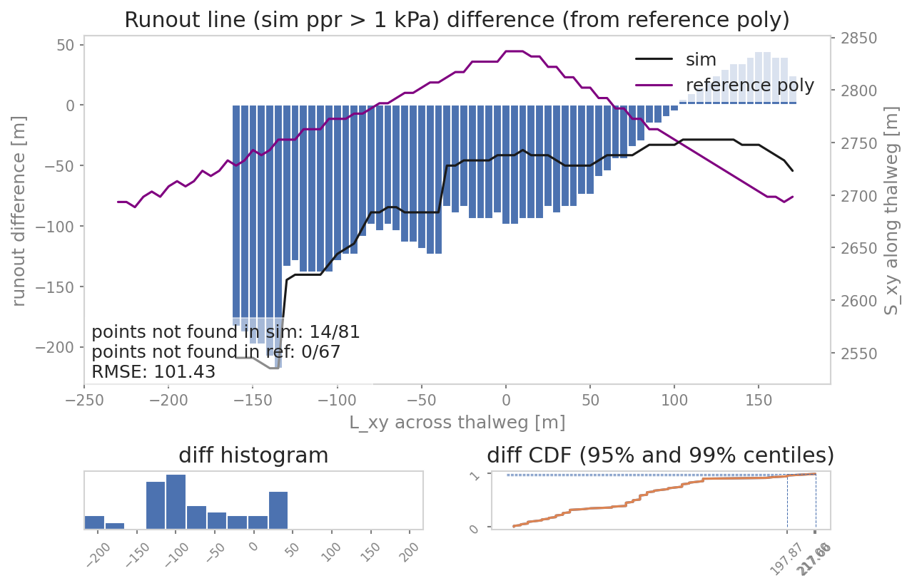

ana3AIMEC: Aimec
==========================

**ana3AIMEC** (Automated Indicator based Model Evaluation and Comparison, :cite:`Fi2013`) is a post-processing
module to analyze and compare results from avalanche simulations.
For this purpose, avalanche simulation results are transformed into an avalanche :term:`thalweg` following coordinate system
(see :numref:`fig-aimec-comp-real`, :numref:`fig-aimec-comp-new`, :numref:`fig-aimec-domain-transfo`),
which enables the comparison of different simulations (for example varying parameter sets,
or performed with different models) of the same avalanche catchment, in a standardized way.
There is also the option to compare simulation results to a reference data set, which can consist of a reference
point, line or polygon. The simulation results are analysed regarding a chosen result variable (peak pressure, thickness or
velocity) and a threshold of this variable. The derived runout point and/or line is then compared to the reference point, line or polygon.
For further information, have a look at the Section :ref:`moduleAna3AIMEC:Analyze with respect to reference data sets`.

In ``AvaFrame/avaframe/runScripts``, two different run scripts are provided and show examples
on how the post-processing module :py:mod:`ana3AIMEC` can be used:

*  full Aimec analysis for simulation results of one computational module (from 1 simulation to
   x simulations). :py:func:`runScripts.runAna3AIMEC.runAna3AIMEC`
*  using Aimec to compare the results of two different computational modules (one reference
   for the reference computational module and multiple simulations in the other computational module).
   :py:func:`runScripts.runAna3AIMECCompMods.runAna3AIMECCompMods`

In all cases, one needs to provide a minimum amount of input data. Below is an example workflow
for the full Aimec analysis, as provided in :py:mod:`runScripts/runAna3AIMEC.py`:

Inputs
-------

*  DEM  (digital elevation model) as raster file with either `ESRI grid format <https://desktop.arcgis.com/en/arcmap/10.3/manage-data/raster-and-images/esri-ascii-raster-format.htm>`_
   or GeoTIFF format. The format of the DEM determines
which format is used for the output.
.. Note:: The spatial resolution of the DEM and its extent can differ from the result raster data.
          Spatial resolution can also differ between simulations. If this is the case, the spatial
          resolution of the reference simulation results raster is used (default) or, if provided,
          the resolution specified in the configuration file (``cellSizeSL``) is used.
          This is done to ensure that all simulations will be transformed and analyzed using the
          same spatial resolution.
*  avalanche thalweg in LINES (as a shapefile named ``NameOfAvalanche/Inputs/LINES/path_aimec.shp``), the line needs to cover the entire affected area but is not allowed
   to exceed the DEM extent
*  results from avalanche simulation (when using results from com1DFA,
   the helper function :py:func:`ana3AIMEC.dfa2Aimec.mainDfa2Aimec` in
   :py:mod:`ana3AIMEC.dfa2Aimec` fetches and prepares the input for Aimec)
* a method to define the reference simulation. By default, an arbitrary simulation
  is defined as reference. This can be changed in the ``ana3AIMEC/local_ana3AIMECCfg.ini``
  as explained in :ref:`moduleAna3AIMEC:Defining the reference simulation`.
* consider adjusting the default settings to your application in the Aimec configuration 
  (in your local copy of ``ana3AIMEC/local_ana3AIMECCfg.ini``) regarding the domain transformation, result types, runout computation and figures

If a comparison to reference data sets is desired, additionally the following inputs are required:

* reference point, line and/or polygon in ``avalancheDir/Inputs/REFDATA`` (as shp file with corresponding suffix, options are ``*_POINT.shp``, ``*_LINE.shp``, ``*_POLY.shp``)

.. Note:: The reference point shp file must only contain a single point.
  

 
Optional inputs
~~~~~~~~~~~~~~~~

There is the option to define a runout area for the analysis, which is based on the slope angle of the avalanche thalweg.
This can be defined in the Aimec configuration by setting the *defineRunoutArea* flag to True. 
The start of runout area is then determined by finding the first point on the thalweg profile where the slope angle falls below the 
*startOfRunoutAreaAngle* value and all points upslope of the a additionally provided split point are ignored (see :numref:`fig-aimec-domain-transfo`). 
This functionality requires an additional input: 
 
* a splitPoint in POINTS (as a shapefile named ``NameOfAvalanche/Inputs/POINTS/splitPoint.shp``), 
  this point is then snapped onto the thalweg based on the shortest horizontal distance

Outputs
--------

*  output figures in ``NameOfAvalanche/Outputs/ana3AIMEC/anaMod/``
*  csv file with the results in ``NameOfAvalanche/Outputs/ana3AIMEC/anaMod/``
   (a detailed list of the results is described in :ref:`moduleAna3AIMEC:Analyze results`)
 
.. Note:: *anaMod* refers to the computational module that has been used to create the avalanche simulation results and is specified in 
          the **ana3AIMEC** configuration. 
   

To run
-------

*  first go to ``AvaFrame/avaframe``
*  in your local copy of ``ana3AIMEC/ana3AIMECCfg.ini`` you can adjust the default settings (if not, the standard settings are used)
*  enter path to the desired ``NameOfAvalanche/`` folder in your local copy of ``avaframeCfg.ini``
*  run::

      python3 runScripts/runAna3AIMEC.py

.. Note:: 
   In the default configuration, the analysis is performed on the simulation result files located in ``NameOfAvalanche/Outputs/anaMod/peakFiles``, where anaMod is specified in the aimecCfg.ini. There is also the option to directly provide a path to an input directory to the :py:func:`ana3AIMEC.ana3AIMEC.fullAimecAnalysis`. However, the peak field file names need to have a specific format: *A_B_C_D_E.*, where:
   
   - A - *releaseAreaScenario*: refers to the name of the release shape file 
   - B - *simulationID*: needs to be unique for the respective simulation
   - C - *simType*: refers to null (no entrainment, no resistance), ent (with entrainment), res (with resistance), entres (with entrainment and resistance)
   - D - *modelType*: can be any descriptive string of the employed model (here dfa for dense flow  avalanche) 
   - E - *result type*: is pft (peak flow thickness) and pfv (peak flow velocity)

Theory
-----------

AIMEC (Automated Indicator based Model Evaluation and Comparison, :cite:`Fi2013`) was developed
to analyze and compare avalanche simulations. The computational module presented here is inspired
from the original AIMEC code. The simulations are analyzed and compared by projecting the
results along a chosen poly-line (same line for all the simulations that are compared)
called avalanche :term:`thalweg`. The raster data, initially located on a regular and uniform grid
(with coordinates x and y) is transformed based on a regular non uniform grid (grid points are not
uniformly spaced) that follows the avalanche thalweg (with curvilinear coordinates (s,l)).
This grid can then be "straightened" or "deskewed" in order to plot it in the (s,l)
coordinates system.

The simulation results (two dimensional fields of e.g. peak flow velocities, pressure or
flow thickness) are processed in a way that it is possible to compare characteristic
values that are directly linked to the flow variables such as maximum peak flow thickness,
maximum peak flow velocity or deduced quantities, for example maximum peak pressure, pressure
based runout (including direct comparison to possible references, see
:ref:`moduleAna3AIMEC:Area indicators`) for different simulations. The following figure
illustrates the raster transformation process.

.. list-table::

    * - .. _fig-aimec-comp-real:

        .. figure:: _static/aimec_comparison_real_topo.png
            :width: 90%

            In the real coordinate system (x,y)

      - .. _fig-aimec-comp-new:

        .. figure:: _static/aimec_comparison_new_topo.png
            :width: 90%

            In the new coordinate system (s,l)

Here is the definition of the different indicators and outputs from the AIMEC
post-processing process:

Mean and max values along thalweg
~~~~~~~~~~~~~~~~~~~~~~~~~~~~~~~~

All two dimensional field results (for example peak flow velocities / pressure or flow thickness) can be
transformed into the curvilinear system using the previously described method. The maximum and
average values of those fields are computed in each cross-section (l direction) along the thalweg.
For example the maximum :math:`A_{cross}^{max}(s)` and average :math:`\bar{A}_{cross}(s)` of
the two dimensional distribution :math:`A(s,l)` is:

.. math::
    A_{cross}^{max}(s) = \max_{\forall l \in [-\frac{w}{2},\frac{w}{2}]} A(s,l) \quad\mbox{and}\quad
    \bar{A}_{cross}(s) = \frac{1}{w}\int_{-\frac{w}{2}}^{\frac{w}{2}} A(s,l)dl

Runout point
~~~~~~~~~~~~~

The runout point is always given with respect to a peak result field (:math:`A(s,l)` which could be
peak pressure or flow thickness, etc.) and a threshold value (:math:`A_{lim}>0`).
The runout point (:math:`s=s_{runout}`) and the respective :math:`(x_{runout},y_{runout})`
in the original coordinate system, correspond to the last point in flow direction where the
chosen peak result :math:`A_{cross}^{max}(s)` is above the threshold value :math:`A_{lim}`.

.. Note:: It is very important to note that the position of the runout point depends on the chosen
          threshold value and peak result field. It is also possible to use
          :math:`\bar{A}_{cross}(s)>A_{lim}` instead of :math:`A_{cross}^{max}(s)>A_{lim}`
          to define the runout point.

Runout length
~~~~~~~~~~~~~~~~

This length depends on what is considered to be the beginning of the avalanche :math:`s=s_{start}`.
It can be related to the release area, to the transition point (first point where the slope
angle is below :math:`30^{\circ}`), to the runout area point (first point where the slope
angle is below :math:`10^{\circ}`) or in a similar way as :math:`s=s_{runout}` is defined
saying that :math:`s=s_{start}` is the first point where :math:`A_{cross}^{max}(s)>A_{lim}`
(this is the option implemented in :py:mod:`ana3AIMEC.ana3AIMEC.py`).
The runout length is then defined as :math:`L=s_{runout}-s_{start}`. In the analysis results,
this is called :math:`deltaSXY`, whereas :math:`s_{runout}` gives the length measured from 
the start of the thalweg to the runout point. 

Mean and max indicators
~~~~~~~~~~~~~~~~~~~~~~~~~~~~~~~~

From the maximum values along path of the distribution :math:`A(s,l)` calculated in
:ref:`moduleAna3AIMEC:Mean and max values along thalweg`, it is possible to calculate
the global maximum (MMA) and average maximum (AMA) values of the two dimensional
distribution :math:`A(s,l)`:

.. math::
    MMA = \max_{\forall s \in [s_{start},s_{runout}]} A_{cross}^{max}(s) \quad\mbox{and}\quad
    AMA = \frac{1}{s_{runout}-s_{start}}\int_{s_{start}}^{s_{runout}} A_{cross}^{max}(s)ds

Area indicators
~~~~~~~~~~~~~~~~~~

When comparing the runout area (corresponding to a given threshold :math:`A_{cross}^{max}(s)>A_{Lim}`)
of two simulations, it is possible to distinguish four different zones. For example, if the
first simulation (sim1) is taken as reference and if True corresponds to the assertion
that the avalanche reached this zone (reached means :math:`A_{cross}^{max}(s)>A_{Lim}`) and
False the avalanche did not reached this zone, those four zones are:

    *  TP (true positive) zone: green zone on :numref:`fig-aimec-comp-new` , sim1 = True  sim2 = True
    *  FP (false positive) zone: blue zone on :numref:`fig-aimec-comp-new` , sim1 = False  sim2 = True
    *  FN (false negative) zone: red zone on :numref:`fig-aimec-comp-new` , sim1 = True  sim2 = False
    *  TN (true negative) zone: gray zone on :numref:`fig-aimec-comp-new` , sim1 = False  sim2 = False

The two simulations are identical (in the runout zone) when the area of both FP and FN are zero.
In order to provide a normalized number describing the difference between two simulations,
the area of the different zones is normalized by the area of the reference simulation
:math:`A_{ref} = A_{TP} + A_{FP}`. This leads to the 4 area indicators:

    *  :math:`\alpha_{TP} = A_{TP}/A_{ref}`, which is 1 if sim2 covers at least the reference
    *  :math:`\alpha_{FP} = A_{FP}/A_{ref}`, which is a positive value if sim2 covers an area
       outside of the reference
    *  :math:`\alpha_{FN} = A_{FN}/A_{ref}`, which is a positive value if the reference covers
       an area outside of sim2
    *  :math:`\alpha_{TN} = A_{TN}/A_{ref}` (this value may not be of great interest because it
       depends on the width and length of the entire domain of the result rasters (s,l))

Identical simulations (in the runout zone) lead to :math:`\alpha_{TP} = 1` , :math:`\alpha_{FP} = 0`
and :math:`\alpha_{FN} = 0`

Mass indicators
~~~~~~~~~~~~~~~~~~~~~~~~~~~~~~~~

From the analysis of the release mass (:math:`m_r` at the beginning, i.e :math:`t = t_{ini}`),
total mass (:math:`m_t` at the end, i.e :math:`t = t_{end}`) and entrained mass
(:math:`m_e` at the end, i.e :math:`t = t_{end}`) it is possible to calculate the
growth index :math:`GI` and growth gradient :math:`GG` of the avalanche:

.. math::
    GI = \frac{m_t}{m_r} = \frac{m_r + m_e}{m_r} \quad\mbox{and} \quad
    GG = \frac{m_r + m_e}{t_{end}-t_{ini}}

Time evolution of the total mass and entrained one are also analyzed.

Procedure
-----------

This section describes how the theory is implemented in the ``ana3AIMEC`` module.

Defining the reference simulation
~~~~~~~~~~~~~~~~~~~~~~~~~~~~~~~~~~~~~~
To apply a complete Aimec analysis, a reference simulation needs to be defined.
The analysis of the other simulations will be compared to the one of the reference simulation.
The reference simulation can be determined by its name (or part of the name) or based on some
configuration parameter and value (to adjust in the local copy of ``ana3AIMEC/ana3AIMECCfg.ini``)
if it comes from the :py:mod:`com1DFA` module (or any computational module that provides a configuration):

  * based on simulation name
     one needs to provide a non-empty string in the AIMEC configuration
     file for the ``referenceSimName`` parameter. This string can be a part or the full name of the
     reference simulation. A warning is raised if several simulation match the criterion (can happen
     if part of the name is given) and the first simulation found is arbitrarily taken as reference.

  * based on some configuration parameter
     one needs to provide a ``varParList`` (parameter or list of parameters separated by ``|``) in the AIMEC configuration file as well as the desired sorting order
     (``ascendingOrder``, True by default) for these parameters and optionally a ``referenceSimValue``.
     The simulations are first going to be sorted according to ``varParList`` and ``ascendingOrder``
     (this is done by the pandas function `sort_values <https://pandas.pydata.org/pandas-docs/stable/reference/api/pandas.DataFrame.sort_values.html>`_).
     The reference simulation is either the first simulation found after sorting if no ``referenceSimValue``
     or the simulation matching the ``referenceSimValue`` provided (closest value if the parameter is a
     float or integer, case insensitive for strings). If multiple simulations match the criterion,
     the first simulation is taken as reference and a warning is raised.

Perform thalweg-domain transformation
~~~~~~~~~~~~~~~~~~~~~~~~~~~~~~~~~~~~~~

First, the transformation from (x,y) coordinate system (where the original rasters lie in) to
(s,l) coordinate system is applied given a new domain width (``domainWidth``). This is done by
:py:func:`ana3AIMEC.aimecTools.makeDomainTransfo`. A new grid corresponding to the new domain
(following the avalanche thalweg) is built with a cell size defined by the reference simulation
(default) or  ``cellSizeSL`` if provided. The transformation information are stored in
a ``rasterTransfo`` dictionary (see :py:func:`ana3AIMEC.aimecTools.makeDomainTransfo` for more details).

Assign data
~~~~~~~~~~~~~

The simulation results (for example peak velocities / pressure or flow thickness) are
projected on the new grid using the transformation information by
:py:func:`ana3AIMEC.aimecTools.assignData`. The projected results are stored in
the ``newRasters`` dictionary.

This results in the following plot:

.. _fig-aimec-domain-transfo:

    Alr avalanche coordinate transformation and peak pressure field reprojetion.

Analyze results
~~~~~~~~~~~~~~~

Calculates the different indicators described in the :ref:`moduleAna3AIMEC:Theory` section
for a given threshold. The threshold can be based on pressure, flow thickness, ...
(this needs to be specified in the configuration file). Returns a ``resAnalysisDF`` dataFrame
with the analysis results (see :py:func:`ana3AIMEC.ana3AIMEC.postProcessAIMEC` for more details).
In this dataFrame there are multiple columns, one for each result from the analysis
(one column for runout length, one for MMA, MAM...) and one row for each simulation analyzed.

Analyze with respect to reference data sets
----------------------------------------------
To include a comparison to reference data sets, the flag ``includeReference`` in your local copy of ``ana3AIMEC/ana3AIMECCfg.ini``
must to be set to ``True``. After reading the coordinates of the point, line or polygon from the respective shp file, a raster with the same extent
as the DEM is created with values indicating which cells are affected by the features (see :py:func:`ana3AIMEC.ana3AIMEC.postProcessReference`).
This raster is then transformed into the thalweg following coordinate system. From the transformed rasters, a runout line/point is computed.
This is done by identifying for each L coordinate (across thalweg) the corresponding S coordinate (along thalweg) for
the point, line or polygon feature (see :py:func:`ana3AIMEC.aimecTools.computeRunoutLine`).
In case of the polygon the S coordinate furthest in thalweg direction is chosen.
A runout line is also derived from the simulation results. This is done by identifying for each simulation, the
last point along the thalweg where the chosen threshold of the chosen ``runoutResType`` is still exceeded (similar to the
identification of the runout point), for each L coordinate (across thalweg).
For each simulation the derived runout line is compared to the runout line derived from the reference line or polygon, whereas
in the case of the reference point, a distance between this point and the simulation runout point is computed.
The derived difference measures are saved to the aimec result DataFrame, see :ref:`moduleAna3AIMEC:List of Aimec result variables`
and several plots are created, see :ref:`moduleAna3AIMEC:Reference data set analysis plots`.

Plot and save results
-------------------------

Plots and saves the desired figures and writes results in ``resAnalysisDF`` to a csv file.
By default, Aimec saves five summary plots plus three plots per simulation comparing the
numerical simulations to the reference. The five summary plots are:

Domain overview plots
~~~~~~~~~~~~~~~~~~~~~~~

  *  "DomainTransformation" shows the computational domain (xy) on the left and new thalweg-following domain (sl) on the right
     (:numref:`fig-aimec-domain-transfo`)
     
  *  "referenceFields" shows the peak pressure, flow thickness and flow velocity in the sl domain

    .. figure:: _static/ana3AIMEC/avaAlr_referenceFields.png
        :width: 90%

        Reference peak fields

Analysis summary plots
~~~~~~~~~~~~~~~~~~~~~~~~

  * "slComparisonStats" shows the peak field specified in the configuration and computed runout points 
    in the top panel, wherease in the bottom panel the statistics
    in terms of cross maximum peak value along profile are plotted (mean, max and quantiles)

    .. figure:: _static/ana3AIMEC/avaAlr_slComparisonStat.png
        :width: 90%

        Reference peak field runout area with runout points and distribution of cross max values of peak field along thalweg
     
  * if only two simulations are compared, additionally the difference between
    the two simulations in terms of peak values along profile are shown for 
    peak pressure, peak flow velocity and peak flow thickness in "slComparison".

    .. figure:: _static/ana3AIMEC/avaAlr_slComparison.png
        :width: 90%

        Maximum peak fields comparison between two simulations

  *  "ROC" shows the normalized area difference between reference and other simulations.

    .. figure:: _static/ana3AIMEC/avaAlr_ROC.png
        :width: 90%

        Area analysis plot
        
  * "deltaSXvsrunoutAngle" and "pfvFieldMaxvspftFieldMax" show the distribution of these values for all the simulations.
    There is the option to indicate scenarios in these plots using the available simulation parameters
    Acutally other parameter vs parameter plots can be added by setting the parameter names in the **ana3AIMEC** configuration
    in the section called PLOTS. 
    
    .. figure:: _static/ana3AIMEC/avaAlr_deltaSXYvsrunoutAngle.png
        :width: 90%

        DeltaSXY vs runout angle of all sims colorcoded using the simType
    
    .. figure:: _static/ana3AIMEC/avaAlr_pfvFieldMaxvspftFieldMax.png
        :width: 90%

        Max field values of peak flow velocity vs flow thickness of all sims colorcoded using the simType
        

Analysis on simulation level plots
~~~~~~~~~~~~~~~~~~~~~~~~~~~~~~~~~~~

  * "thalwegAltitude" shows the cross section max values of peak flow thickness as bars on top of the thalweg elevation profile. 
    The colors of the bars correspond to the cross section max values of the respective peak flow velocity. 
    Using the specified *velocityThresholdValue* (aimecCfg.ini section PLOTS), runout length :math:`/Delta S_{xy}`, 
    elevation drop :math:`/Delta z` and the corresponding runout angle :math:`\alpha` are computed. 
    The red dots indicate the location of overall max peak flow velocity and thickness and the grey shaded area the runout area. 
    
    .. figure:: _static/ana3AIMEC/avaAlr_thalwegAltitude.png
        :width: 90%

        Thalweg altitude plot
    
Comparison to reference simulation plots
~~~~~~~~~~~~~~~~~~~~~~~~~~~~~~~~~~~~~~~~~~~

The plots "_hashID_ContourComparisonToReference" and "_hashID_massAnalysis" where "hashID" is the name of the simulation show the 2D difference to the reference,
the statistics associated and the mass analysis figure (this means these figures are created for each simulation).

.. figure:: _static/ana3AIMEC/avaAlr_ContourComparisonToReference.png
    :width: 90%

    The area comparison panel (top left) shows the false negative (FN in blue, which is where the reference field exceeds the
    threshold but not the simulation) and true positive (TP in red, which is where the simulation field exceeds the
    threshold but not the reference) areas. The contour comparison panel (top right) shows the contour lines of the reference (full lines) and the simulation (dashed lines)
    of the desired result fields in the runout area. It also shows the difference between the reference and simulation
    and computes the repatriation of this difference (Probability Density Function and Cumulative Density Function
    of the difference)

    The mass analysis plot shows the evolution of the total and entrained mass during
    the simulation and compares it to the reference

Reference data set analysis plots
~~~~~~~~~~~~~~~~~~~~~~~~~~~~~~~~~~~~~~
* *referenceLineTransfo_referenceFeature* plot where referenceFeature corresponds to either the reference point, line or polygon, As an example we here show the transformation plot of a polygon:

    Reference polygon in cartesian coordinate system already indicating which coordinates have been identified as
    runout line in the thalweg following (SL) coordinate system (left panel), transformed into
    the thalweg following coordinate system with identified runout line in blue (right panel).

* *runoutLineComparison* plot where the runout line derived from the simulation is compared to the runout line derived from the reference line or polygon is compared and some statistical measures are provided:

    Difference between runout line derived from simulation using the *runoutResType* and *threhsoldValue* from
    the ana3AIMEC configuration and the reference data set, in this example the line is derived from
    the reference polygon. The root mean squared error is computed over all points where both, the runout
    line derived from the simulation and the reference data set have points.

List of Aimec result variables
~~~~~~~~~~~~~~~~~~~~~~~~~~~~~~~~~~
The result variables listed below are partly included in the above described plots and are also saved to the Aimec results directory as `..resAnalysisDF.csv`, with one row per simulation. In the following, the resType represents the result type(s) set in the aimecCfg.ini for the parameter *resTypes*.

- resTypeFieldMax: maximum value of resType simulation result (simulation coordinate system)
- resTypeFieldMin: minimum value of resType simulation result (simulation coordinate system), values smaller than a threshold (minValueField in aimecCfg.ini) are masked
- resTypeFieldMean: average value of resType simulation result (simulation coordinate system), values smaller than a threshold (minValueField in aimecCfg.ini) are masked
- resTypeFieldStd: standard deviation of resType simulation result (simulation coordinate system), values smaller than a threshold (minValueField in aimecCfg.ini) are masked
- maxresTypeCrossMax: maximum value of cross profile maximum values of resType field (transformed in thalweg-following coordinate system)
- sRunout: the last point along the thalweg (:math:`S_{XY}`) where the transformed resType field (cross profile maximum values) still exceeds a threshold value (thresholdValue in aimecCfg.ini)
- lRunout: the cross profile coordinate (:math:`L_{XY}`) of the last point along the thalweg (:math:`S_{XY}`) where the transformed resType field (cross profile maximum values) still exceeds a threshold value (thresholdValue in aimecCfg.ini)
- xRunout, yRunout: x and y coordinates of the *sRunout* point (simulation coordinate system)
- sMeanRunout, xMeanRunout, yMeanRunout: runout point coordinates derived with cross profile mean values of transformed resType field instead of cross profile maximum values
- deltaSXY: distance along thalweg (:math:`S_{XY}`) where the transformed resType field exceeds a threshold value (thresholdValue in aimecCfg.ini)
- zRelease: altitude along thalweg where the transformed resType field first exceeds a threshold value (thresholdValue in aimecCfg.ini)
- zRunout: altitude of the *sRunout* point
- deltaZ: altitude difference between *zRelease* and *zRunout*
- runoutAngle: corresponding runout angle based on *deltaSXY* and *deltaZ*

If reference data sets are included in analysis, additionally these outputs are provided:

- refSim_Diff_sRunout: difference between simulation runout point and reference point along S coordinate
- refSim_Diff_lRunout: difference between simulation runout point and reference point along S coordinate
- runoutLineDiff_line_RMSE: root mean squared error between difference along S coordinate over all L coordinates between runout line derived from simulation and reference line
- runoutLineDiff_poly_RMSE: root mean squared error between difference along S coordinate over all L coordinates between runout line derived from simulation and reference polygon
- runoutLineDiff_line_pointsNotFoundInSim: number of runout points not found in simulation but in reference / all points found in reference runout line
- runoutLineDiff_line_pointsNotFoundInRef: number of runout points not found in reference but in simulation / all points found in simulation runout line
- runoutLineDiff_poly_pointsNotFoundInSim: number of runout points not found in simulation but in reference / all points found in reference runout polygon
- runoutLineDiff_poly_pointsNotFoundInRef: number of runout points not found in reference but in simulation / all points found in simulation runout polygon

Configuration parameters
----------------------------

All configuration parameters are explained in ``ana3AIMEC/ana3AIMECCfg.ini`` (and can be modified in a local copy
``ana3AIMEC/local_ana3AIMECCfg.ini``):

.. literalinclude:: _cfgFiles/ana3AIMECCfg.ini
