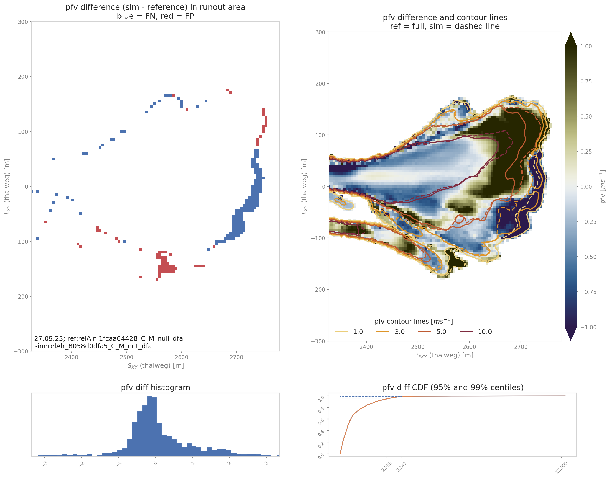

ana3AIMEC: Aimec
==========================

**ana3AIMEC** (Automated Indicator based Model Evaluation and Comparison, :cite:`Fi2013`) is a post-processing
module to analyze and compare results from avalanche simulations.
It enables the comparison of different simulations (with different input parameter sets for example,
or from different models) of the same avalanche (going down the same avalanche path)
in a standardized way. To do so, the ratser results are transformed into the path following coordinate system
to make data comparable.

In ``AvaFrame/avaframe/runScripts``, two different run scripts are provided and show examples
on how the post-processing module :py:mod:`ana3AIMEC` can be used:

*  full Aimec analysis for simulation results of one computational module (from 1 simulation to
   x simulations). :py:func:`runScripts.runAna3AIMEC.runAna3AIMEC`
*  using Aimec to compare the results of two different computational modules (one reference
   for the reference computational module and multiple simulations in the other computation module).
   :py:func:`runScripts.runAna3AIMECCompMods.runAna3AIMECCompMods`

In all cases, one needs to provide a minimum amount of input data. Bellow is an example workflow
for the full Aimec analysis, as provided in :py:mod:`runScripts/runAna3AIMEC.py`:

Inputs
-------

*  raster of the DEM (.asc file)
*  avalanche path in LINES (as a shapefile named ``NameOfAvalanche/Inputs/LINES/path_aimec.shp``)
*  a splitPoint in POINTS (as a shapefile named ``NameOfAvalanche/Inputs/POINTS/splitPoint.shp``)
*  Results from avalanche simulation (when using results from com1DFA,
   the helper function :py:func:`ana3AIMEC.dfa2Aimec.mainDfa2Aimec` in
   :py:mod:`ana3AIMEC.dfa2Aimec` fetches and prepares the input for Aimec)
* a method to define the reference simulation. By default, an arbitrary simulation
  is defined as reference. This can be changed in the ``ana3AIMEC/local_ana3AIMECCfg.ini``
  as explained in :ref:`moduleAna3AIMEC:Defining the reference simulation`.

.. Note:: The spatial resolution of the DEM and its extent can differ from the result raster data.
          Spatial resolution can also differ between simulations. If this is the case, the spatial
          resolution of the reference simulation results raster is used (default) or the resolution
          specified in the configuration file (``cellSizeSL``) is used if this one is provided.
          This way, all simulations will be transformed and analyzed using the same resolution.

Outputs
--------

*  output figures in ``NameOfAvalanche/Outputs/ana3AIMEC/com1DFA/``
*  csv file with the results in ``NameOfAvalanche/Outputs/ana3AIMEC/com1DFA/``
   (a detailed list of the results is described in :ref:`moduleAna3AIMEC.analyze-results`)

To run
-------

*  first go to ``AvaFrame/avaframe``
*  in your local copy of ``ana3AIMEC/ana3AIMECCfg.ini`` you can adjust the default settings (if not, the standard settings are used)
*  enter path to the desired ``NameOfAvalanche/`` folder in your local copy of ``avaframeCfg.ini``
*  run::

      python3 runScripts/runAna3AIMEC.py

Theory
-----------

AIMEC (Automated Indicator based Model Evaluation and Comparison, :cite:`Fi2013`) was developed
to analyze and compare avalanche simulations. The computational module presented here is inspired
from the original AIMEC code. The simulations are analyzed and compared by projecting the
results along a chosen poly-line (same line for all the simulations that are compared)
called avalanche path. The raster data, initially located on a regular and uniform grid
(with coordinates x and y) is projected on a regular non uniform grid (grid points are not
uniformly spaced) that follows the avalanche path (with curvilinear coordinates (s,l)).
This grid can then be "straightened" or "deskewed" in order to plot it in the (s,l)
coordinates system.

The simulation results (two dimensional fields of e.g. peak velocities / pressure or
flow thickness) are processed in a way that it is possible to compare characteristic
values that are directly linked to the flow variables such as maximum peak flow thickness,
maximum peak velocity or deduced quantities, for example maximum peak pressure, pressure
based runout (including direct comparison to possible references, see
:ref:`moduleAna3AIMEC:Area indicators`) for different simulations. The following figure
illustrates the raster transformation process.

.. list-table::

    * - .. _fig-aimec-comp-real:

        .. figure:: _static/aimec_comparison_real_topo.png
            :width: 90%

            In the real coordinate system (x,y)

      - .. _fig-aimec-comp-new:

        .. figure:: _static/aimec_comparison_new_topo.png
            :width: 90%

            In the new coordinate system (s,l)

Here is the definition of the different indicators and outputs from the AIMEC
post-processing process:

Mean and max values along path
~~~~~~~~~~~~~~~~~~~~~~~~~~~~~~~~

All two dimensional field results (for example peak velocities / pressure or flow thickness) can be
projected into the curvilinear system using the previously described method. The maximum and
average values of those fields are computed in each cross-section (l direction).
For example the maximum :math:`A_{cross}^{max}(s)` and average :math:`\bar{A}_{cross}(s)` of
the two dimensional distribution :math:`A(s,l)` is:

.. math::
    A_{cross}^{max}(s) = \max_{\forall l \in [-\frac{w}{2},\frac{w}{2}]} A(s,l) \quad\mbox{and}\quad
    \bar{A}_{cross}(s) = \frac{1}{w}\int_{-\frac{w}{2}}^{\frac{w}{2}} A(s,l)dl

Runout point
~~~~~~~~~~~~~

The runout point is always given with respect to a peak result field (:math:`A(s,l)` which could be
peak pressure or flow thickness, etc.) and a threshold value (:math:`A_{lim}>0`).
The runout point (:math:`s=s_{runout}`) and the respective :math:`(x_{runout},y_{runout})`
in the original coordinate system, correspond to the last point in flow direction where the
chosen peak result :math:`A_{cross}^{max}(s)` is above the threshold value :math:`A_{lim}`.

.. Note:: It is very important to note that the position of the runout point depends on the chosen
          threshold value and peak result field. It is also possible to use
          :math:`\bar{A}_{cross}(s)>A_{lim}` instead of :math:`A_{cross}^{max}(s)>A_{lim}`
          to define the runout point.

Runout length
~~~~~~~~~~~~~~~~

This length depends on what is considered to be the beginning of the avalanche :math:`s=s_{start}`.
It can be related to the release area, to the transition point (first point where the slope
angle is below :math:`30^{\circ}`), to the runout area point (first point where the slope
angle is below :math:`10^{\circ}`) or in a similar way as :math:`s=s_{runout}` is defined
saying that :math:`s=s_{start}` is the first point where :math:`A_{cross}^{max}(s)>A_{lim}`
(this is the option implemented in :py:mod:`ana3AIMEC.ana3AIMEC.py`).
The runout length is then defined as :math:`L=s_{runout}-s_{start}`.

Mean and max indicators
~~~~~~~~~~~~~~~~~~~~~~~~~~~~~~~~

From the maximum values along path of the distribution :math:`A(s,l)` calculated in
:ref:`moduleAna3AIMEC:Mean and max values along path`, it is possible to calculate
the global maximum (MMA) and average maximum (AMA) values of the two dimensional
distribution :math:`A(s,l)`:

.. math::
    MMA = \max_{\forall s \in [s_{start},s_{runout}]} A_{cross}^{max}(s) \quad\mbox{and}\quad
    AMA = \frac{1}{s_{runout}-s_{start}}\int_{s_{start}}^{s_{runout}} A_{cross}^{max}(s)ds

Area indicators
~~~~~~~~~~~~~~~~~~

When comparing the runout area (corresponding to a given threshold :math:`A_{cross}^{max}(s)>A_{Lim}`)
of two simulations, it is possible to distinguish four different zones. For example, if the
first simulation (sim1) is taken as reference and if True corresponds to the assertion
that the avalanche reached this zone (reached means :math:`A_{cross}^{max}(s)>A_{Lim}`) and
False the avalanche did not reached this zone, those four zones are:

    *  TP (true positive) zone: green zone on :numref:`fig-aimec-comp-new` , sim1 = True  sim2 = True
    *  FP (false positive) zone: blue zone on :numref:`fig-aimec-comp-new` , sim1 = False  sim2 = True
    *  FN (false negative) zone: red zone on :numref:`fig-aimec-comp-new` , sim1 = True  sim2 = False
    *  TN (true negative) zone: gray zone on :numref:`fig-aimec-comp-new` , sim1 = False  sim2 = False

The two simulations are identical (in the runout zone) when the area of both FP and FN are zero.
In order to provide a normalized number describing the difference between two simulations,
the area of the different zones is normalized by the area of the reference simulation
:math:`A_{ref} = A_{TP} + A_{FP}`. This leads to the 4 area indicators:

    *  :math:`\alpha_{TP} = A_{TP}/A_{ref}`, which is 1 if sim2 covers at least the reference
    *  :math:`\alpha_{FP} = A_{FP}/A_{ref}`, which is a positive value if sim2 covers an area
       outside of the reference
    *  :math:`\alpha_{FN} = A_{FN}/A_{ref}`, which is a positive value if the reference covers
       an area outside of sim2
    *  :math:`\alpha_{TN} = A_{TN}/A_{ref}` (this value may not be of great interest because it
       depends on the width and length of the entire domain of the result rasters (s,l))

Identical simulations (in the runout zone) lead to :math:`\alpha_{TP} = 1` , :math:`\alpha_{FP} = 0`
and :math:`\alpha_{FN} = 0`

Mass indicators
~~~~~~~~~~~~~~~~~~~~~~~~~~~~~~~~

From the analysis of the release mass (:math:`m_r` at the beginning, i.e :math:`t = t_{ini}`),
total mass (:math:`m_t` at the end, i.e :math:`t = t_{end}`) and entrained mass
(:math:`m_e` at the end, i.e :math:`t = t_{end}`) it is possible to calculate the
growth index :math:`GI` and growth gradient :math:`GG` of the avalanche:

.. math::
    GI = \frac{m_t}{m_r} = \frac{m_r + m_e}{m_r} \quad\mbox{and} \quad
    GG = \frac{m_r + m_e}{t_{end}-t_{ini}}

Time evolution of the total mass and entrained one are also analyzed.

Procedure
-----------

This section describes how the theory is implemented in the ``ana3AIMEC`` module.

Defining the reference simulation
~~~~~~~~~~~~~~~~~~~~~~~~~~~~~~~~~~~~~~
To apply a complete Aimec analysis, a reference simulation needs to be defined.
The analysis of the other simulations will be compared to the one of the reference simulation.
The reference simulation can be determined by its name (or part of the name) or based on some
configuration parameter and value (to adjust in the local copy of ``ana3AIMEC/ana3AIMECCfg.ini``)
if it comes from the :py:mod:`com1DFA` module (or any computational module that provides a configuration).:

  * Based on the simulation name
     one needs to provide a not-empty string in the AIMEC configuration
     file for the ``referenceSimName`` parameter. This string can be a part or the full name of the
     reference simulation. A warning is raised if several simulation match the criterion (can happen
     if part of the name is given) and the first simulation found is arbitrarily taken as reference.

  * Based on some configuration parameter
     one needs to provide a ``varParList`` (parameter or list of
     parameters separated by |) in the AIMEC configuration file as well as the desired sorting order
     (``ascendingOrder``, True by default) for these parameters and optionally a ``referenceSimValue``.
     The simulations are first going to be sorted according to ``varParList`` and ``ascendingOrder``
     (this is done by the pandas function `sort_values <https://pandas.pydata.org/pandas-docs/stable/reference/api/pandas.DataFrame.sort_values.html>`_).
     The reference simulation is either the first simulation found after sorting if no ``referenceSimValue``
     or the simulation matching the ``referenceSimValue`` provided (closest value if the parameter is a
     float or integer, case insensitive for strings). If multiple simulations match the criterion,
     the first simulation is taken as reference and a warning is raised.

Perform path-domain transformation
~~~~~~~~~~~~~~~~~~~~~~~~~~~~~~~~~~~~~~

First, the transformation from (x,y) coordinate system (where the original rasters lie in) to
(s,l) coordinate system is applied given a new domain width (``domainWidth``). This is done by
:py:func:`ana3AIMEC.aimecTools.makeDomainTransfo`. A new grid corresponding to the new domain
(following the avalanche path) is built with a cell size defined by the reference simulation
(default) or  ``cellSizeSL`` if provided. The transformation information are stored in
a ``rasterTransfo`` dictionary (see :py:func:`ana3AIMEC.aimecTools.makeDomainTransfo` for more details).

Assign data
~~~~~~~~~~~~~

The simulation results (for example peak velocities / pressure or flow thickness) are
projected on the new grid using the transformation information by
:py:func:`ana3AIMEC.aimecTools.assignData`. The projected results are stored in
the ``newRasters`` dictionary.

This results in the following plot:

.. _fig-aimec-domain-transfo:

.. figure:: _static/ana3AIMEC/avaAlr_DomainTransformation.png
    :width: 90%

    Alr avalanche coordinate transformation and peak pressure field reprojetion.

Analyze results
~~~~~~~~~~~~~~~~~~~

Calculates the different indicators described in the :ref:`moduleAna3AIMEC:Theory` section
for a given threshold. The threshold can be based on pressure, flow thickness, ...
(this needs to be specified in the configuration file). Returns a ``resAnalysisDF`` dataFrame
with the analysis results (see :py:func:`ana3AIMEC.ana3AIMEC.postProcessAIMEC` for more details).
In this dataFrame there are multiple columns, one for each result from the analysis
(one column for runout length, one for MMA, MAM...) and one row for each simulation analyzed.

Plot and save results
~~~~~~~~~~~~~~~~~~~~~~~~~

Plots and saves the desired figuresand writes results in ``resAnalysisDF`` to a csv file.
By default, Aimec saves five summary plots plus three plots per simulation comparing the
numerical simulations to the reference. The five summary plots are :

  *  "DomainTransformation" shows the real domain on the left and new domain on the right
     (:numref:`fig-aimec-domain-transfo`)
  *  "referenceFields" shows the peak pressure, flow thickness and velocity in the new domain

    .. figure:: _static/ana3AIMEC/avaAlr_referenceFields.png
        :width: 90%

        Reference peak fields

  *  "slComparison" shows the difference between all simulations in terms of peak values along profile.
     If only two simulations are provided, a three panel plot like the following is produced:

    .. figure:: _static/ana3AIMEC/avaAlr_slComparison.png
        :width: 90%

        Maximum peak fields comparison between two simulations

    if more than two simulations are provided only the peak field specified in the configuration
    file is analyzed and the statistics in terms of peak value along profile are plotted
    (mean, max and quantiles):

    .. figure:: _static/ana3AIMEC/avaAlr_slComparisonStat.png
        :width: 90%

        Maximum peak pressure distribution along path

  *  "ROC" shows the normalized area difference between reference and other simulations.

    .. figure:: _static/ana3AIMEC/avaAlr_ROC.png
        :width: 90%

        Area analysis plot

  *  "relMaxPeakField" shows the relative difference in maximum peak value between reference
     and other simulation function of runout length

    .. figure:: _static/ana3AIMEC/avaAlr_relMaxppr_thresholdValue1.png
        :width: 90%

        Relative maximum peak pressure function of runout

The last plots "_hashID_ContourComparisonToReference", "_hashID_AreaComparisonToReference" and
"_hashID_massAnalysis" where "hashID" is the name of the simulation show the 2D difference to the reference,
the statistics associated and the mass analysis figure (this means these figures are created for each simulation).

.. figure:: _static/ana3AIMEC/avaAlr_AreaComparisonToReference.png
    :width: 90%

    The area comparison plot shows the false negative (FN in blue, which is where the reference field exceeds the
    threshold but not the simulation) and true positive (TP in red, which is where the simulation field exceeds the
    threshold but not the reference) areas.
    and reference

    The contour comparison plot shows the contour lines of the reference (full lines) and the simulation (dashed lines)
    of the desired result fields in the runout area. It also shows the difference between the reference and simulation
    and computes the repatriation of this difference (Probability Density Function and Cumulative Density Function
    of the difference)

.. figure:: _static/ana3AIMEC/avaAlr_massAnalysis.png
    :width: 90%

    The mass analysis plot shows the evolution of the total and entrained mass during
    the simulation and compares it to the reference

Configuration parameters
----------------------------

All configuration parameters are explained in ``ana3AIMEC/ana3AIMECCfg.ini`` (and can be modified in a local copy
``ana3AIMEC/local_ana3AIMECCfg.ini``):

.. literalinclude:: _cfgFiles/ana3AIMECCfg.ini
