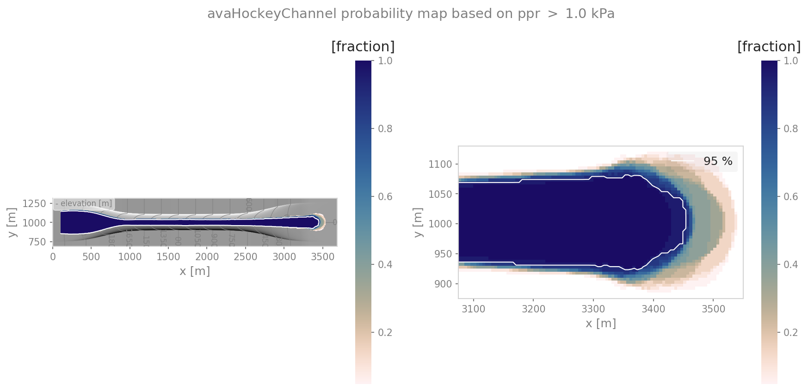
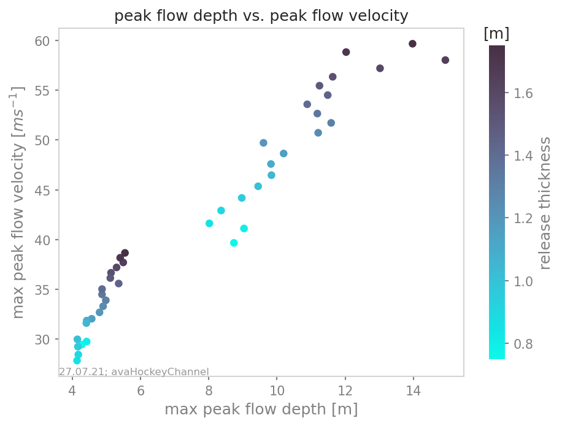
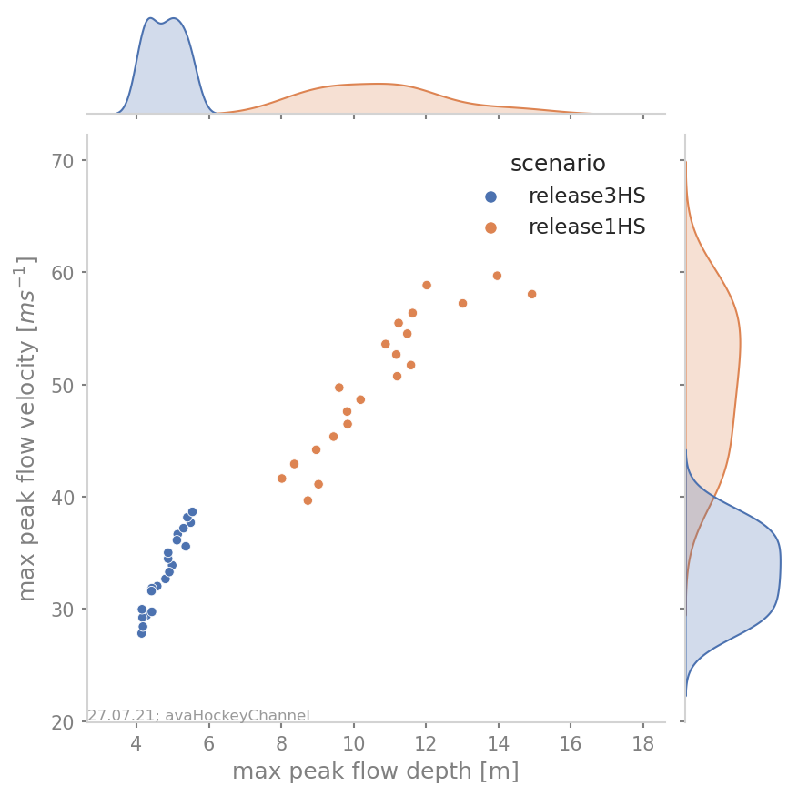

######################################
ana4Stats: Statistical analysis tools
######################################

probAna - Probability maps
==========================

probAna is used to derive simple probability maps for a set of simulations for one avalanche track.
These maps show for each point in space the fraction of simulations where a chosen parameter has exceeded a given threshold.
For example, it is possible to compute the probability map for an avalanche with respect to a
peak pressure threshold of 1kPa, but it is also possible to chose other result variables and threshold values.

A set of multiple avalanche simulations is required to generate these maps. The simulations can be generated with :py:mod:`com1DFA`
using a parameter variation, different release-, entrainment- or resistance scenarios.
An example run script is given by :py:mod:`runAna4ProbAna`: where firstly, :py:mod:`com1DFA` is used to
perform avalanche simulations varying parameters set in the ``ana4Stats/probAnaCfg.ini`` file.
Using these simulations, a probability map is generated.
The output is a raster file (.asc) with values ranging from 0-1. 0 meaning that no simulation exceeded the threshold
in this point in space. 1 on the contrary means that all simulations exceeded the threshold.
Details on this function, as for example required inputs can be found in: :py:mod:`ana4Stats.probAna`.

To run - via QGis Connector
---------------------------

Since version 1.6 it is possible to generate probability maps via the QGis connector. This is provided in the
experimental folder of the QGis processing plugin via **Probability run**. A standard setup is used in which mu and
release thickness are varied.

The input requirements are the same as for :py:mod:`com1DFA` with one important difference: an additional *ci95*
attribute is needed for the release shapes.
This describes the confidence intervall for the release thickness, using the same units. I.e. if you are using a
release thickness of 1.5m, you need to provide the ci in [m] as well, for example ci=0.3m. The release thickness is
then automatically varied within the release thickness plus/minus the confidence interval.

To run - example run scripts
----------------------------
In :py:mod:`runProbAnaCom1DFA.py`, avalanche simulations are performed with the settings defined in the configuration file of
:py:mod:`com1DFA` and in addition a parameter variation is performed according to the parameters
set in ``ana4Stats/probAnaCfg.ini`` in the section PROBRUN.
The parameters to be varied are set in **varParList**, the type of variation in **variationType**
(options are: percent, range, rangefromci) and the value of the variation in **variationValue**.
Then there are two sampling strategies to choose from, for performing the parameter variation:
(1) a latin hypercube sample of all the parameters to be varied (provided in varParList)
is generated and simulations are performed using sets of parameters drawn from this sample.
Using sampling strategy (2) all the parameters set in *PROBRUN* are varied on at a time, i.e.
simulations are performed for the standard settings of all parameters,
except the one parameter to be varied, subsequently the other variations are performed.
One probability map is created for all the different simulations and in case of sampling strategy (2),
also one map per parameter that is varied once at a time, is created in addition.
In order to run this example:

* first go to ``AvaFrame/avaframe``
* copy ``avaframeCfg.ini`` to ``local_avaframeCfg.ini`` and set your desired avalancheDir
* copy ``ana4Stats/probAnaCfg.ini`` to ``ana4Stats/local_probAnaCfg.ini`` and optionally adjust variation settings
* uncomment ``'FILTER'`` section in ``local_probAnaCfg.ini`` and insert filter parameters if you want to first filter simulations
* run::

      python3 runAna4ProbAna.py

Another example on how to generate probability maps for avalanche simulations performed with :py:mod:`com1DFA`
is given in :py:mod:`runScripts.runProbAna`, where for *avaHockeyChannel* simulations are performed with
varying release thickness values ranging from 0.75 to 1.75 meters in steps of 0.05 meters.
The resulting simulations are then used to generate the probability map with :py:func:`out3Plot.statsPlots.plotProbMap`. There is also the option
to filter the simulations further - using the function :py:func:`in3Utils.fileHandlerUtils.getFilterDict` which generates a
parameter dictionary for filtering according to the filter criteria set in the
configuration file (``ana4Stats/probAnaCfg.ini``) of the :py:mod:`ana4Stats.probAna` function.
In order to run this example:

* first go to ``AvaFrame/avaframe``
* copy ``ana4Stats/probAnaCfg.ini`` to ``ana4Stats/local_probAnaCfg.ini``
* uncomment ``'FILTER'`` section in ``local_probAnaCfg.ini`` and insert filter parameters if you want to first filter simulations
* run::

      python3 runScripts/runProbAna.py

    Probability map example.

.. _Theory:

Theory
-----------
This point-wise probability is expressed by the relative
frequency of avalanche peak flow field exceeding a certain threshold for a set of deterministic avalanche simulations
derived from a range of input parameters (see :cite:`HyBeBu2019`).

getStats
==========================

In :py:mod:`ana4Stats.getStats`, functions that help to compute statistical properties of simulation results are gathered.
:py:func:`ana4Stats.getStats.extractMaxValues` can be used to determine the maximum peak values of the simulation results.
These values can then be plotted using the functions in :py:mod:`out3Plot.statsPlots` in order to visualise the statistics of
a set of avalanche simulations.
For further details on the specific functions, have a look at: :py:mod:`ana4Stats.getStats`.

To run
-------

An example on how to use these statistical functions is given in :py:mod:`runScripts.runStatsExample`, where
for ``avaHockeyChannel`` simulations are performed for two different release area scenarios and
the release thickness is varied from 0.75 to 1.75 meters in steps of 0.05 meters. The resulting
simulations are then analysed using the :py:func:`ana4Stats.getStats.extractMaxValues` function and plots are generated using the
plotting routines from :py:mod:`out3Plot.statsPlots` .
If in the configuration file ``ana4Stats/getStats.ini`` the flag aimec is set to True,
additionally an :ref:`moduleAna3AIMEC:ana3AIMEC: Aimec` analysis is performed.

* first go to ``AvaFrame/avaframe``
* copy ``ana4Stats/getStats.ini`` to ``ana4Stats/local_getStatsCfg.ini``
* uncomment ``'FILTER'`` section in ``ana4Stats/local_getStatsCfg.ini`` and insert filter parameters if you want to first filter simulations
* run::

      python3 runScripts/runStatsExample.py

    Scatter plot of the hockey example with color-coded release thickness values.

    Scatter plot of the hockey example including a marginal kde plot and color coded with release
    area scenario.
