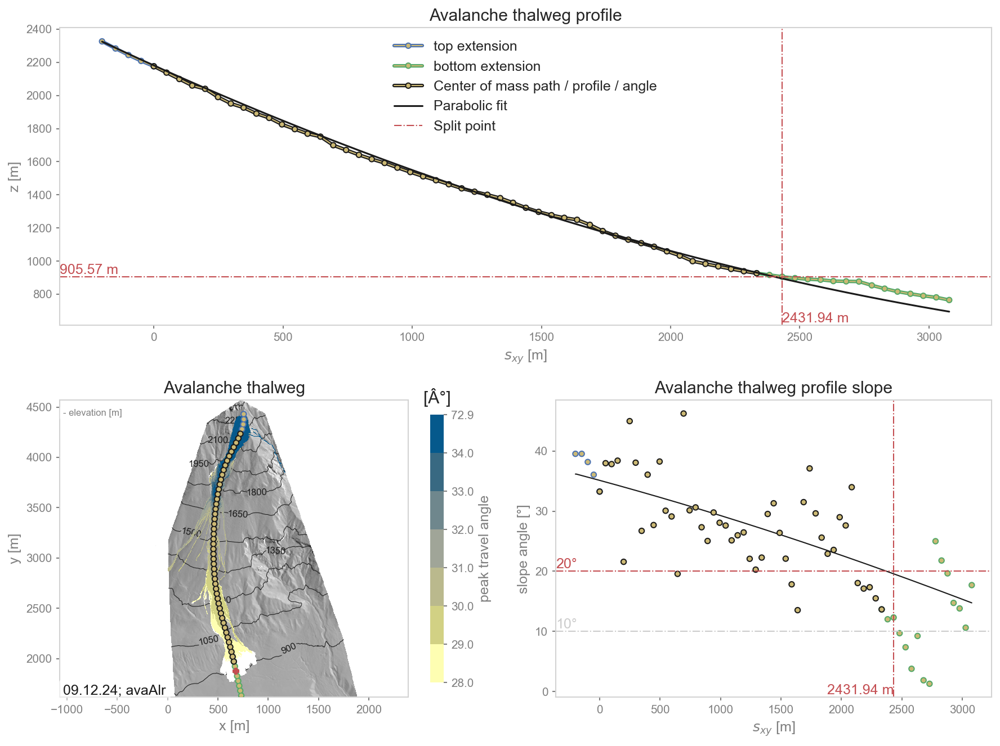
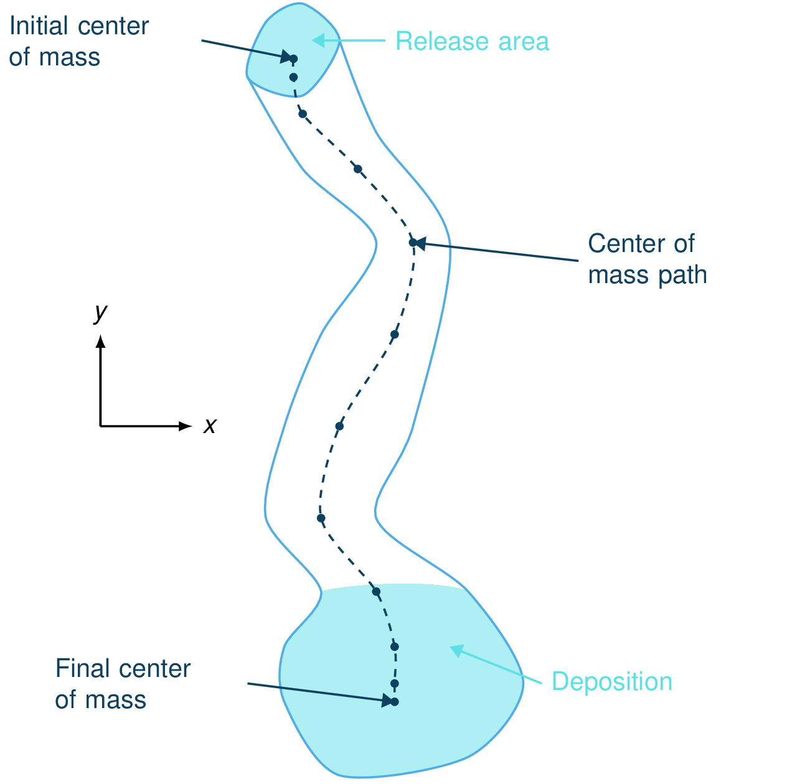
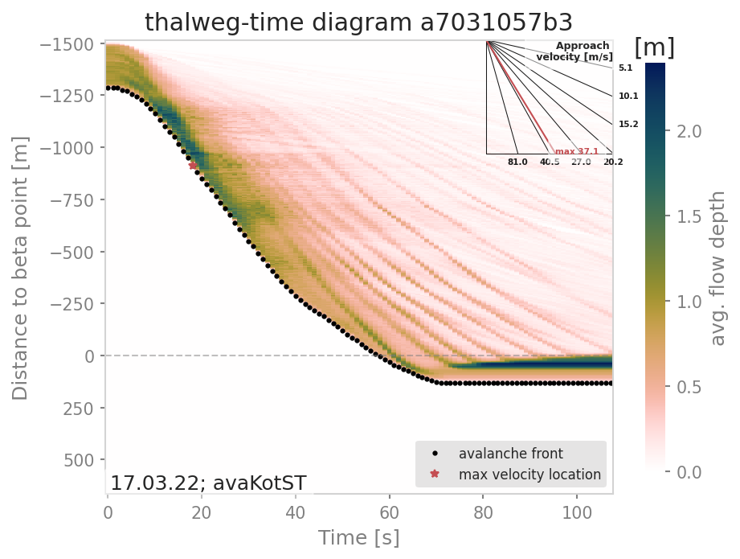

#####################################################################
ana5Utils
#####################################################################

Automated path generation
-------------------------

Computational modules such as :ref:`moduleCom2AB:com2AB: Alpha Beta Model`, :ref:`moduleCom3Hybrid:com3Hybrid: Hybrid modeling`,
and analysis modules like :ref:`moduleAna3AIMEC:ana3AIMEC: Aimec` or the Distance-Time Analysis
(:ref:`moduleAna5Utils:ana5Utils`) require a two-dimensional avalanche path (thalweg) and a split point as input.
This thalweg and split point are usually created manually based on expert opinion. The aim of this module is to
automatically generate an avalanche path from a dense flow avalanche (DFA) simulation and place a split point. The path
is generated from the center of mass position of the dense material, hence referred to as the "mass
average path". This mass average path is then extended towards the top of the release area and at the bottom,
resulting in a path that covers the entire length of the avalanche with additional buffer in the runout area.
The split point is determined by fitting a parabola to the avalanche path profile.

Input
~~~~~

The automatic path generation requires results from dense flow simulations as input.
These results can either be flow mass and thickness, or particle results from multiple simulation time steps.
Com1DFA already provides these in the correct format.

We provide :py:mod:`runAna5DFAPathGeneration`, in which two main options exist:

1.  **Default option:** Use com1DFA to generate the simulation results before generating a path.
    The ``runDFAModule`` flag in :py:mod:`DFAPathGenerationCfg.ini` is set to True. The default configuration for
    com1DFA is read, with overrides for the following settings: ``tSteps``, ``resType``, ``simTypeList``, and ``dt``.

2.  **DFA simulation results already exist:** in this case, you may want to provide these as inputs to the
    path generation function. To do this, set the ``runDFAModule`` flag in :py:mod:`DFAPathGenerationCfg.ini` to
    ``False``. Ensure that the avalanche directory contains ``Outputs/com1DFA`` with one or more simulation results.
    Additionally, the simulation DEM must be available.

Output
~~~~~~

A mass averaged path and corresponding split point are produced for each com1DFA simulation. These are saved as
shapefiles to ``avalancheDir/Outputs/ana5Utils/DFAPath``, in addition to a plot showing how the path was generated (see
example figure below).

    runAna5DFAPathGeneration output plot example.

Additionally, if ``runDFAModule`` is set to True, com1DFA results with adjusted parameters are generated and saved
to ``avalancheDir/Outputs/com1DFA``.

To run
~~~~~~
1.  go to ``AvaFrame/avaframe`` ::

        cd avaframe

2.  copy ``ana5Utils/DFAPathGenerationCfg.ini`` to ``ana5Utils/local_DFAPathGenerationCfg.ini``
    and edit (if not, default values are used)
3.  run::

        python runAna5DFAPathGeneration.py

Theory
~~~~~~

Mass average path
=================
Any DFA simulation should be able to produce information about mass distribution for different
time steps of the simulation (either flow thickness, mass, velocities... rasters or particles).
This information is used to compute time dependent mass average quantities such as position
(center of mass), velocity... For a flow quantity :math:`\mathbf{a}(\mathbf{x}, t)`,
the associated mass averaged quantity is defined by:

.. math::
    \bar{\mathbf{a}}(t) = \int\limits_V \rho \mathbf{a}(\mathbf{x}, t)\,dV
    \approx \sum\limits_k m_k \mathbf{a}_k(t)

where :math:`m_k` respectively :math:`\mathbf{a}_k(t)` defines the mass respectively flow quantity
of particle or raster cell :math:`k`.
Applying the mass averaging to :math:`(x, y, z)` gives the mass average path profile.

.. Note::
    The mass average path profiles does not necessarily lie on the topography

It is also possible to compute the mass averaged velocity squared :math:`\overline{\mathbf{u^2}}(t)`,
kinetic energy :math:`\overline{\frac{1}{2}m\mathbf{u^2}}(t)` or travel distance :math:`s`
(which are used in the :ref:`moduleAna1Tests:Energy line test`).

    Schematic showing how the mass average path is generated.

Path extension
==============
The mass average path is extended towards the top of the release area to produce meaningful results when used in modules
such as com2AB. Since the outcomes from the :math:`\alpha\beta` analysis depend on the starting point of the path
profile, adjusting the starting point will shift the :math:`\alpha` angle upwards or downwards, subsequently affecting
the runout value.

There are two options available to extend the mass averaged path profile in the release area
(``extTopOption`` in the configuration file):

0. Extend the path up to the highest point in the release
   (highest particle or highest cell depending on which particles or rasters are available).

1. Extend the path towards the point that will lead to the longest runout.
   This point does not necessarily coincide with the highest point in the
   release area and corresponds to the point for which
   :math:`(\Delta z - \Delta s \tan{\alpha})` is maximum. :math:`\alpha` corresponds
   to the angle of the runout line going from first to last point of the mass averaged
   line. :math:`\Delta z` and :math:`\Delta s` represent the vertical and horizontal
   distance between a point in the release and the first point of the mass averaged
   path profile.

We also extend the path at the bottom, to have some buffer in the runout area. This is done by finding the direction of
the path given by the last few points within the path in the x,y domain (all points at a distance ``nCellsMinExtend`` *
cellSize < distance < ``nCellsMaxExtend`` * cellSize)) and extending in this direction by a given factor
(``factBottomExt``) of the total length of the path :math:`s`.

Resampling
==========
If the center of mass positions are derived in an equal time interval from the simulations,
derived points will not be spaced equally due to variations in flow velocity.
Especially in the release and runout area, lower velocites result in a denser spacing of extracted centers of mass,
which can cause a crossing of grid lines that are drawn perpendicularly to the thalweg over the width of the domain.
In order to reduce these overlaps, a resampling function is used, where the thalweg is generated based on a spline of
degree k (`scipy splprep <https://docs.scipy.org/doc/scipy/reference/generated/scipy.interpolate.splrep.html>`_)
and a user defined approximate distance ``nCellsResample`` between points along the spline. The path is resampled at
``nCellsResample`` * cellSize.

Split point generation
======================
A split point is required as input for computational models such as com2AB, to define a threshold below which to look
for the :math:`\beta`-point. To generate this split point, a parabolic curve is fitted to the non-extended avalanche
path profile extracted from the DFA simulation, ensuring that the first and last points of the parabolic profile match
the avalanche path profile. To find the best fitting parabolic profile, an additional constraint is needed, where we
provide two options:

1. **Default Option** (``fitOption= 0``): Minimizes the distance between the parabolic profile and the avalanche path
profile.

2. **Second Option** (``fitOption= 1``): Matches the slope at the end of the parabolic curve to the avalanche path
profile.

This parabolic fit determines the split point location. It is the first point for which the slope is
lower than the ``slopeSplitPoint`` angle. This point is then projected on the avalanche path profile.

Distance-Time Analysis
----------------------

With the functions gathered in this module, flow variables of avalanche simulation results can be
visualized in a distance versus time diagram, the so called **thalweg-time diagram**.
The **tt-diagram** provides a way to identify main features of the temporal evolution of
flow variables along the avalanche  :term:`path`.
This is based on the ideas presented in :cite:`FiFrGaSo2013` and :cite:`RaKo2020`, where
avalanche simulation results have been transformed into the radar coordinate system to facilitate
direct comparison, combined with the attempt to analyze simulation results in an avalanche path
dependent coordinate system (:cite:`Fi2013`).
In addition to the **tt-diagram**, :py:mod:`ana5Utils.distanceTimeAnalysis` also offers the possibility to
produce simulated **range-time diagrams** of the flow variables with respect to a radar field
of view. With this, simulation results can be directly compared to radar measurements (for
example moving-target-identification (MTI) images from :cite:`KoMeSo2018`) in terms
of front position and inferred approach velocity. The color-coding of the simulated
**range-time** diagrams show the average values of the chosen flow parameter
(e.g. flow thickness (FT), flow velocity (FV)) at specified range gates. This color-coding is not directly
comparable to the MTI intensity given in the range-time diagram from radar measurements.

.. Note::
  The data processing for the **tt-diagram** and the **range-time diagram** can be done
  *during run time* of :py:mod:`com1DFA`, or as a postprocessing step. However, the second option
  requires first saving and then reading all the required time steps of the flow variable fields,
  which is much more computationally expensive compared to the first option.

To run
~~~~~~~

During run-time of :py:mod:`com1DFA`:

* in your local copy of ``com1DFA/com1DFACfg.ini`` in [VISUALISATION] set `createRangeTimeDiagram`
  to True and choose if you want a *TTdiagram* by setting this flag to True or in the case of a
  simulated range-time diagram to False

* in your local copy of ``ana5Utils/distanceTimeAnalysisCfg.ini`` you can adjust the default settings
  for the generation of the diagrams

* run :py:mod:`runCom1DFA.py` to calculate mtiInfo dictionary (saved as pickle in
  ``avalancheDir/Outputs/com1DFA/distanceTimeAnalysis/mtiInfo_simHash.p``) that contains the required
  data for producing the **tt-diagram** or **range-time diagram**

* run  :py:mod:`runScripts.runThalwegTimeDiagram.py` or :py:mod:`runScripts.runRangeTimeDiagram.py`
  and set the `preProcessedData` flag to `True`

As a postprocessing step:

* first you need to run :py:mod:`com1DFA` to produce fields of the desired flow variable (e.g. FT, FV)
  of sufficient temporal resolution (every second), for this in your local copy of `com1DFACfg.ini`
  add e.g. FT to the `resType` and change the `tSteps` to `0:1`

* have a look at :py:mod:`runScripts.runThalwegTimeDiagram.py` and :py:mod:`runScripts.runRangeTimeDiagram.py`

* in your local copy of ``ana5Utils/distanceTimeAnalysisCfg.ini`` you can adjust the default settings
  for the generation of the diagrams

The resulting figures are saved to ``avalancheDirectory/Outputs/ana5Utils``.

    Thalweg-time diagram example: The y-axis contains the distance from the beta point along
    the avalanche path (projected on the horizontal plane), e.g. the thalweg. Dots represent
    the avalanche front with the slope being the approach velocity.
    Red star marks the maximal approach velocity (this approach velocity is also projected on
    the horizontal plane).

.. Note::
  The **tt-diagram** requires info on an avalanche path (see :ref:`moduleAna3AIMEC:ana3AIMEC: Aimec`).
  The simulated **range-time diagram** requires info on the coordinates of the radar location
  (x0, y0), a point in the direction of the field of view (x1, y1), the aperture angle and the width of
  the range gates. The maximum approach velocity is indicated in the distance-time diagrams with a
  red star and is computed as the ratio of the distance traveled by the front and the respective
  time needed for a time step difference of at least `minVelTimeStep` which is set to 2 seconds as
  default. The approach velocity is a projection on the horizontal plane since the distance traveled
  by the front is also measured in this same plane.

Theory
~~~~~~

Thalweg-time diagram
====================

First, the flow variable result field is transformed into a path-following coordinate system, of
which the centerline is the avalanche :term:`path`.
For this step, functions from :py:mod:`ana3AIMEC` are used.
The distance of the avalanche front to the *start of runout area point* is determined using a user
defined threshold of the flow variable. The front positions defined with this
method for all the time steps are shown as black dots in the **tt-diagram**.
The mean values of the flow variable are computed at cross profiles along the avalanche path for
each time step and included in the **tt-diagram** as colored field. When computing the mean values,
all the area where the flow variable is bigger than zero is taken into account.
For this analysis, all available flow variables can be chosen, but the interpretation of the
tt-diagram structures and the corresponding meaning of avalanche front may be different for
flow thickness or flow velocity.

Simulated Range-Time diagram
============================

The radar's field of view is determined using its location, a point in the direction of the field of
view and the horizontal (azimuth) aperture angle of the antenna. The elevation or vertical aperture
angle is not yet included. The line-of-sight distance of every grid point in the simulation results
to the radar location is computed. The simulation results which lie outside the radar's field of
view are masked.
The distance of the avalanche front with respect to the radar location is determined for a user
defined threshold in the flow variable and the average values of the result field for each
range gate along the radar's line of sight are computed.
This data is plotted in a range-time diagram, where the black dots indicate the avalanche front,
and the colored field indicates the mean values of the flow variable for the range gates at each
time step.