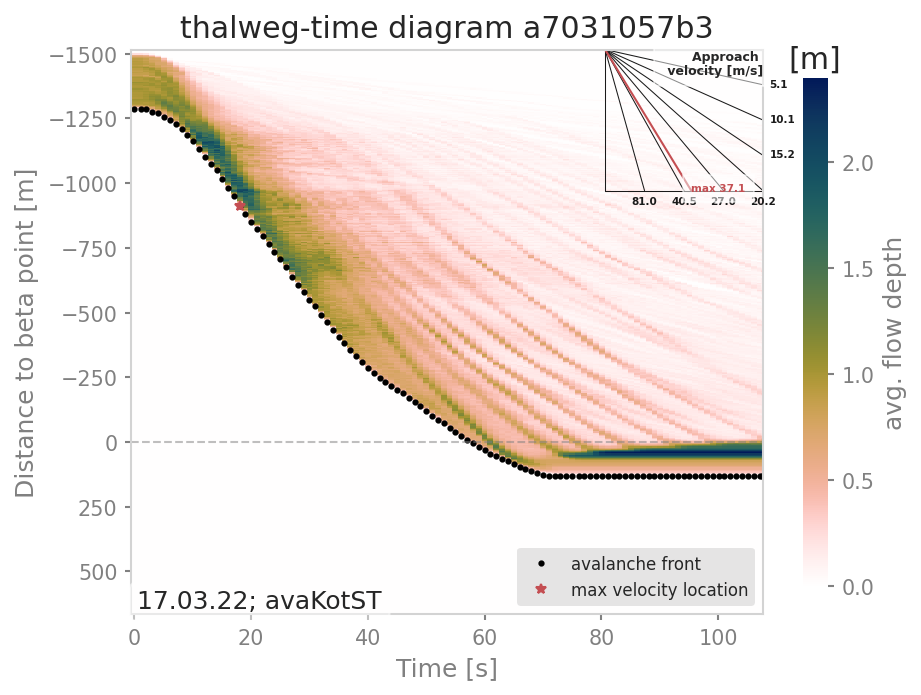

#####################################################################
ana5Utils
#####################################################################

distanceTimeAnalysis: Visualizing the temporal evolution of flow variables
------------------------------------------------------------------------------

With the functions gathered in this module, flow variables of avalanche simulation results can be
visualized in a distance versus time diagram, the so called **thalweg-time diagram**.
The **tt-diagram** provides a way to identify main features of the temporal evolution of
flow variables along the :term:`avalanche path`.
This is based on the ideas presented in :cite:`FiFrGaSo2013` and :cite:`RaKo2020`, where
avalanche simulation results have been transformed into the radar coordinate system to facilitate
direct comparison, combined with the attempt to analyze simulation results in an avalanche path
dependent coordinate system (:cite:`Fi2013`).
In addition to the **tt-diagram**, :py:mod:`ana5Utils.distanceTimeAnalysis` also offers the possibility to
produce simulated **range-time diagrams** of the flow variables with respect to a radar field
of view. With this, simulation results can be directly compared to radar measurements (for
example moving-target-identification (MTI) images from :cite:`KoMeSo2018`) in terms
of front position and inferred approach velocity. The colorcoding of the simulated
**range-time** diagrams show the average values of the chosen flow parameter
(e.g. flow depth (FD), flow velocity (FV)) at specified range gates. This colorcoding is not directly
comparable to the MTI intensity given in the range-time diagram from radar measurements.

.. Note::
  The data processing for the **tt-diagram** and the **range-time diagram** can be done
  *during run time* of :py:mod:`com1DFA`, or as a postprocessing step. However, the second option
  requires first saving and then reading all the required time steps of the flow variable fields,
  which is much more computationally expensive compared to the first option.

To run
~~~~~~~

During run-time of :py:mod:`com1DFA`:

* in your local copy of ``com1DFA/com1DFACfg.ini`` in [VISUALISATION] set `createRangeTimeDiagram`
  to True and choose if you want a *TTdiagram* by setting this flag to True or in the case of a
  simulated range-time diagram to False

* in your local copy of ``ana5Utils/distanceTimeAnalysisCfg.ini`` you can adjust the default settings
  for the generation of the diagrams

* run :py:mod:`runCom1DFA.py` to calculate mtiInfo dictionary (saved as pickle in
  ``avalancheDir/Outputs/com1DFA/distanceTimeAnalysis/mtiInfo_simHash.p``) that contains the required
  data for producing the **tt-diagram** or **range-time diagram**

* run  :py:mod:`runScripts.runThalwegTimeDiagram.py` or :py:mod:`runScripts.runRangeTimeDiagram.py`
  and set the `preProcessedData` flag to `True`

As a postprocessing step:

* first you need to run :py:mod:`com1DFA` to produce fields of the desired flow variable (e.g. FD, FV)
  of sufficient temporal resolution (every second), for this in your local copy of `com1DFACfg.ini`
  add e.g. FD to the `resType` and change the `tSteps` to `0:1`

* have a look at :py:mod:`runScripts.runThalwegTimeDiagram.py` and :py:mod:`runScripts.runRangeTimeDiagram.py`

* in your local copy of ``ana5Utils/distanceTimeAnalysisCfg.ini`` you can adjust the default settings
  for the generation of the diagrams

The resulting figures are saved to ``avalancheDirectory/Outputs/ana5Utils``.

    Thalweg-time diagram example: The y-axis contains the distance from the beta point along
    the avalanche path (projected on the horizontal plane), e.g. the thalweg. Dots represent
    the avalanche front with the slope being the approach velocity.
    Red star marks the maximal approach velocity (this approach velocity is also projected on
    the horizontal plane).

.. Note::
  The **tt-diagram** requires info on an avalanche path (see :ref:`moduleAna3AIMEC:ana3AIMEC: Aimec`).
  The simulated **range-time diagram** requires info on the coordinates of the radar location
  (x0, y0), a point in the direction of the field of view (x1, y1), the aperture angle and the width of
  the range gates. The maximum approach velocity is indicated in the distance-time diagrams with a
  red star and is computed as the ratio of the distance traveled by the front and the respective
  time needed for a time step difference of at least `minVelTimeStep` which is set to 2 seconds as
  default. The approach velocity is a projection on the horizontal plane since the distance traveled
  by the front is also measured in this same plane.

Theory
~~~~~~~~~

Thalweg-time diagram
~~~~~~~~~~~~~~~~~~~~~~

First, the flow variable result field is transformed into a path-following coordinate system, of
which the centerline is the :term:`avalanche path`.
For this step, functions from :py:mod:`ana3AIMEC` are used.
The distance of the avalanche front to the *start of runout area point* is determined using a user
defined threshold of the flow variable. The front positions defined with this
method for all the time steps are shown as black dots in the **tt-diagram**.
The mean values of the flow variable are computed at cross profiles along the avalanche path for
each time step and included in the **tt-diagram** as colored field. When computing the mean values,
all the area where the flow variable is bigger than zero is taken into account.
For this analysis, all available flow variables can be chosen, but the interpretation of the
tt-diagram structures and the corresponding meaning of avalanche front may be different for
flow thickness or flow velocity.

Simulated Range-Time diagram
~~~~~~~~~~~~~~~~~~~~~~~~~~~~~~~

The radar's field of view is determined using its location, a point in the direction of the field of
view and the horizontal (azimuth) aperture angle of the antenna. The elevation or vertical aperture
angle is not yet included. The line-of-sight distance of every grid point in the simulation results
to the radar location is computed. The simulation results which lie outside the radar's field of
view are masked.
The distance of the avalanche front with respect to the radar location is determined for a user
defined threshold in the flow variable and the average values of the result field for each
range gate along the radar's line of sight are computed.
This data is plotted in a range-time diagram, where the black dots indicate the avalanche front,
and the colored field indicates the mean values of the flow variable for the range gates at each
time step.

Automated path generation
--------------------------

Computational modules like :math:`\alpha\beta` (:ref:`moduleCom2AB`) or analysis modules like
the Thalweg-time diagram (:ref:`moduleAna5Utils`) or Aimec (:ref:`moduleAna3AIMEC`) require
an avalanche path as input. This avalanche path is usually based on an experts opinion.
This makes it constraining and difficult to reproduce or automate. The objective of this
module is to automatically generate an avalanche path from a dense flow avalanche (DFA) simulation.
The path is generated from the center of mass position of the dense material (we talk of mass
averaged path). This path is then extended towards the top (of the release area) and bottom (runout).

Input
=====

There are two options her. Either you already have DFA simulation results and in this case
you want to provide these as inputs to the path generation function. Or you don't and in this
case you can use com1DFA to generate some DFA simulation results before generating a path.

In the first case (default case), the flag ``runDFAModule`` in :py:mod:`runComputeDFAPath` is
set to ``False``. You only need to provide the avalanche directory in your ``local_avaframeCfg.ini``
file. This avalanche directory should already have in ``Outputs/com1DFA`` one or multiple simulation results
The simulation DEM is also required.

.. Note::

  The run script will work if the results were produces by com1DFA module. If the DFA
  results come frome another source, you will need to adapt the run script and provide
  flow mass and flow thickness or particles for multiple times steps.

In the second case, if you do not have DFA results, you need to change the ``runDFAModule`` flag
in :py:mod:`runComputeDFAPath` to True. The default configuration for com1DFA is read and
the ``tSteps`` saved, the ``resType`` and ``simTypeList`` are modified before running com1DFA.

Outputs
========

A mass averaged path is produced for each com1DFA simulation. The path is/are saved in
``avalancheDir/Outputs/DFAPath``

To run
=========

* go to ``AvaFrame/avaframe``
* copy ``ana5Utils/DFAPathGenerationCfg.ini`` to ``ana5Utils/local_DFAPathGenerationCfg.ini``
  and edit (if not, default values are used)
* run::

      python3 runScripts/runComputeDFAPath.py

Theory
========

Mass average path
~~~~~~~~~~~~~~~~~~
Any DFA simulation should be able to produce information about mass distribution for different
time steps of the simulation (either flow thickness, mass, velocities... rasters or particles).
This information is used to compute time dependent mass average quantities such as position
(center of mass), velocity... For a flow quantity :math:`\mathbf{a}(\mathbf{x}, t)`,
the associated mass averaged quantity is defined by:

.. math::
    \bar{\mathbf{a}}(t) = \int\limits_V \rho \mathbf{a}(\mathbf{x}, t)\,dV
    \approx \sum\limits_k m_k \mathbf{a}_k(t)

where :math:`m_k` respectively :math:`\mathbf{a}_k(t)` defines the mass respectively flow quantity
of particle or raster cell :math:`k`.
Applying the mass averaging to :math:`(x, y, z)` gives the mass average path profile.

.. Note::
    The mass average path profiles does not necessarily lie on the topography

It is also possible to compute the mass averaged velocity squared :math:`\overline{\mathbf{u^2}}(t)`,
kinetic energy :math:`\overline{\frac{1}{2}m\mathbf{u^2}}(t)` or travel distance :math:`s`
(which are used in the :ref:`ana1Tests:Energy line test`).

The path is resampled at ``nCellsResample`` x cellsize and needs to be extended towards the top
(in the release area), in order to produce meaningful results when used in the com2AB module.
Indeed, the result from the :math:`\alpha\beta` analysis depends on where the path profile starts.
Moving the starting point of the profile will shift the :math:`\alpha` upwards or downwards and
affect the runout value.

Extending path towards the top (release)
~~~~~~~~~~~~~~~~~~~~~~~~~~~~~~~~~~~~~~~~~

There are two options available to extend the mass averaged path profile in the release
(``extTopOption`` in the configuration file):

0. Extend the path up to the highest point in the release
   (highest particle or highest cell depending on if particles or rasters are available).

1. Extend the path towards the point that will lead to the longest runout.
   This point does not necessarily coincide with the highest point in the
   release and and corresponds to the point for which
   :math:`(\Delta z - \Delta s \tan{\alpha})` is maximum. :math:`\alpha` corresponds
   to the angle of the runout line going from first to last point of the mass averaged
   line. :math:`\Delta z` and :math:`\Delta s` represent the vertical and horizontal
   distance between a point in the release and the first point of the mass averaged
   path profile.

Extending path towards the bottom (runout)
~~~~~~~~~~~~~~~~~~~~~~~~~~~~~~~~~~~~~~~~~~~

It is also necessary to extend the profile in the runout area. This is done by finding the
direction of the path given by the few last points in the path in (x,y) (all points at a distance
``nCellsMinExtend`` x cellSize < distance < ``nCellsMaxExtend`` x cellSize)) and extending in
this direction for a given percentage (``factBottomExt``) of the total length of the path :math:`s`.
