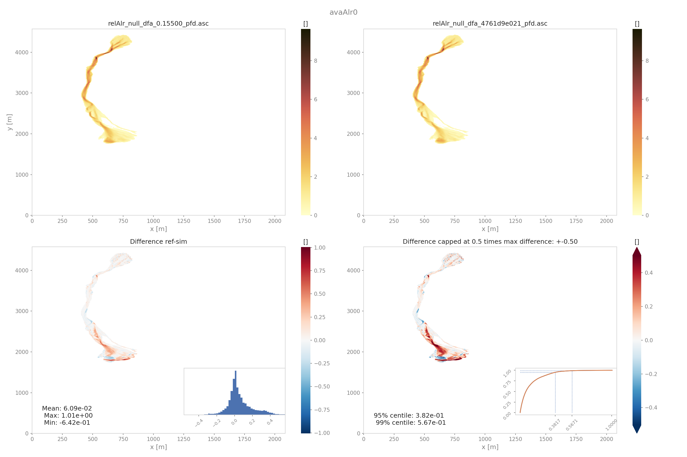
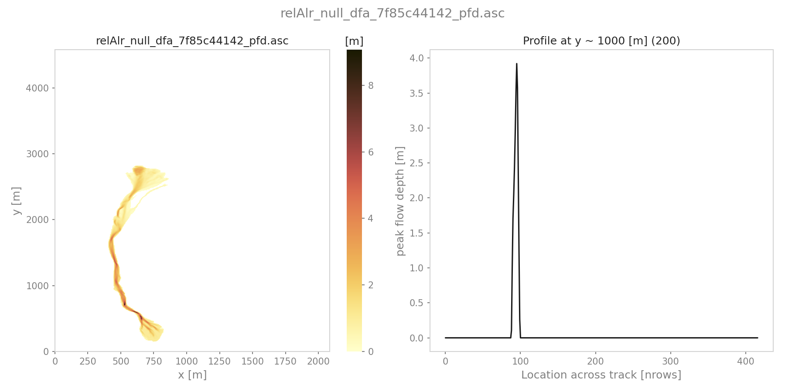

##################################
out3Plot: Plots
##################################

This module gathers various functions for producing visualisations of simulation results,
analysis results, etc. Details on these functions can be found in :py:mod:`out3Plot`.
Further information on general settings for plots can be found in :py:mod:`out3Plot.plotUtils`
and the respective configuration file ``out3Plot/plotUtilsCfg.ini``.

In the following sections, some of these plotting functions are described in more detail.

outQuickPlot
=================

:py:mod:`out3Plot.outQuickPlot` is used to generate plots of raster datasets,
as for example the simulation results of :py:mod:`com1DFA`.

generatePlot
--------------

:py:func:`out3Plot.outQuickPlot.generatePlot` creates two plots, one plot with four panels, first dataset, second dataset, the absolute difference of the two datasets
and the absolute difference capped to a smaller range of differences (ppr: +- 100kPa, pfd: +-1m, pfv:+- 10ms-1).
The difference plots also include an insert showing the histogram and the cumulative density function of the differences.
The second plot shows a cross- and along profile cut of the two datasets.
In addition to the plots, a dictionary is returned with information on the plot paths,
as well as the statistical measures of the difference plots, such as mean, max and min difference.
Details on the required inputs for this function can be found in :py:func:`out3Plot.outQuickPlot.generatePlot`.

          Output plot from generatePlot on peak flow depth results

To run
~~~~~~~~~~~~~~~~~~

* first go to ``AvaFrame/avaframe``
* in your run scripts call::

    generatePlot(dataDict, avaName, outDir, cfg, plotDict)

quickPlotBench
----------------

:py:func:`out3Plot.outQuickPlot.quickPlotBench` calls :py:func:`out3Plot.outQuickPlot.generatePlot` to generate all comparison plots between the results of
two simulations. This requires information on simulation names and paths to the simulation results and the desired result type.
For further details have a look at :py:func:`out3Plot.outQuickPlot.quickPlotBench`.

To run
~~~~~~~~~~~~~~~~~~

* first go to ``AvaFrame/avaframe``
* in your run script call::

    quickPlotBench(avaDir, simNameRef, simNameComp, refDir, compDir, cfg, cfgPlot, suffix)

quickPlotSimple
-----------------

:py:func:`out3Plot.outQuickPlot.quickPlotSimple` is a bit more general, as it calls :py:func:`out3Plot.outQuickPlot.generatePlot`
to generate the comparison plots between of two raster datasets of identical shape in a given input directory, without requiring further information.
For further details have a look at :py:func:`out3Plot.outQuickPlot.quickPlotSimple`.

To run
~~~~~~~~~~~~~~~~~~
An example on how to create the difference plots for two raster datasets of identical shape is provided
in :py:mod:`runScript/runQuickPlotSimple`

* first go to ``AvaFrame/avaframe``
* copy ``avaframeCfg.ini``  to ``local_avaframeCfg.ini``  and set your avalanche directory and the flag ``showPlot``
* specifiy input directory, default is ``data/NameOfAvalanche/Work/simplePlot``
* run::

    python3 runScripts/runQuickPlotSimple.py

generateOnePlot
-----------------

:py:func:`out3Plot.outQuickPlot.generateOnePlot` creates one plot of a single raster dataset.
The first panel shows the dataset and the second panel shows a cross- or along profile of the dataset.
The function returns a list with the file path of the generated plot.
For further details have a look at :py:func:`out3Plot.outQuickPlot.generateOnePlot`.

          Output plot from generatePlotOne on peak flow depth results

quickPlotOne
-------------

:py:func:`out3Plot.outQuickPlot.quickPlotOne` calls :py:func:`out3Plot.outQuickPlot.generateOnePlot` to generate the plot corresponding to the
input data. For information on the required inputs have a look at :py:func:`out3Plot.outQuickPlot.quickPlotOne`.

To run
~~~~~~~~~
An example on how to create this plot from a given input directory or from the default one ``data/NameOfAvalanche/Work/simplePlot``,
is provided in :py:mod:`runScript/runQuickPlotOne`

* first go to ``AvaFrame/avaframe``
*  copy ``avaframeCfg.ini``  to ``local_avaframeCfg.ini``  and set your avalanche directory and the flag ``showPlot``
*  copy ``out3Plot/outQuickPlotCfg`` to ``out3Plot/outQuickPlotCfg`` and optionally specify input directory
*  run::

    python3 runScripts/runQuickPlotOne.py

in1DataPlots
=================

:py:mod:`out3Plot.in1DataPlots` can be used to plot a sample and its characteristics derived with ``computeFromDistribution.py``,
such as: cumulative distribution function (CDF), bar plot of sample values, probability density function (PDF) of the sample,
comparison plot of empirical- and desired CDF and comparison of empirical- and desired PDF.

statsPlots
=================

:py:mod:`out3Plot.statsPlots` can be used to create scatter plots using a peak dictionary where information on two result parameters of avalanche simulations is saved.
This peak dictionary can be created using the function :py:func:`ana4Stats.extractMaxValues` of :py:mod:`ana4Stats/getStats.py`.
This can be used to visualize results of avalanche simulations where a parameter variation has been used or for e.g. in the case of
different release area scenarios. If a parameter variation was used to derive the simulation results, the plots indicate the parameter values in color.
If the input data includes information about the 'scenario' that was used, for example different release scenarios, the plots use different colors for each scenario.
There is also the option to add a kde (kernel density estimation) plot for each result parameter as marginal plots.
An example on how these plotting functions are used and exemplary plots can be found in :ref:`moduleAna4Stats:getStats`

plotValuesScatter
-------------------

:py:func:`out3Plot.statsPlots.plotValuesScatter` produces a scatter plot of
result type 1 vs result type 2 with color indicating values of the varied parameter.

plotValuesScatterHist
-----------------------

:py:func:`out3Plot.statsPlots.plotValuesScatterHist` produces a scatter plot
with marginal kde plots of result type 1 vs result type 2 with color indicating different scenarios (optional).

plotHistCDFDiff
-----------------------

:py:func:`out3Plot.statsPlots.plotHistCDFDiff` generates the histogram plot and CDF plot of a input dataset.

.. figure:: _static/avaAlr_plotHistCDFDiff.png

          Output plot from plotHistCDFDiff on peak pressure results from two simulations of avaAlr
