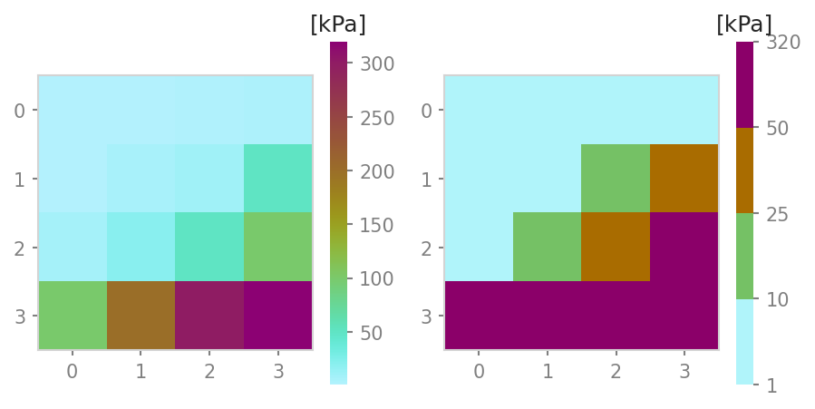
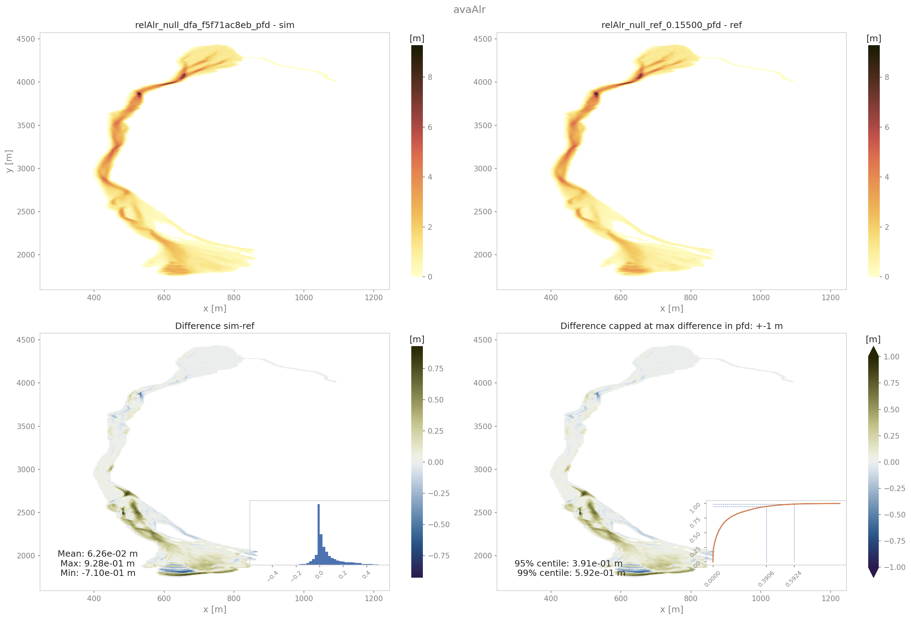
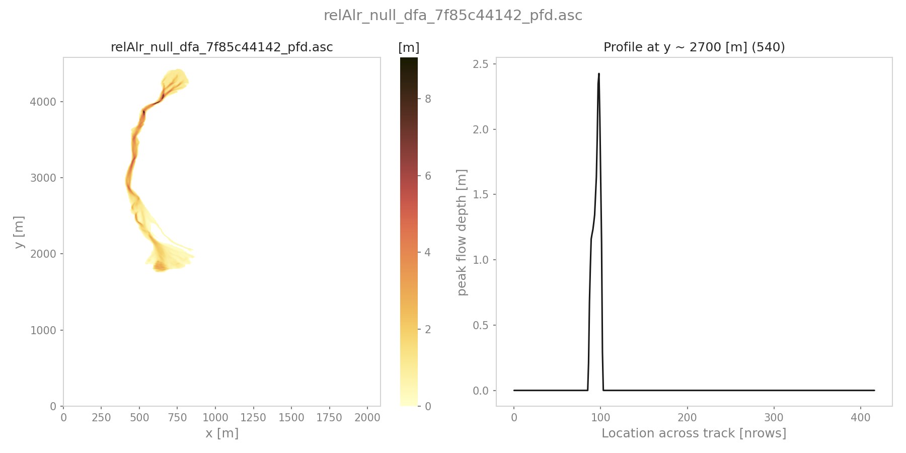
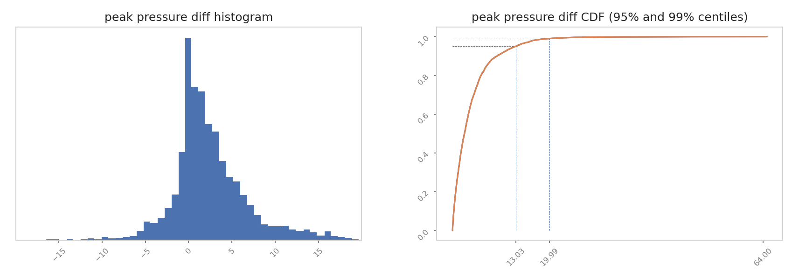

##################################
out3Plot: Plots
##################################

This module gathers various functions for creating visualisations of simulation results,
analysis results, etc. Details on these functions can be found in :py:mod:`out3Plot`.
General plot settings can be found in :py:mod:`out3Plot.plotUtils`
and the respective configuration file ``out3Plot/plotUtilsCfg.ini``.

In the following sections, some of these plotting functions are described in more detail.

plotUtils
==========
:py:mod:`out3Plot.plotUtils` gathers the general settings used for creating plots as well as small utility functions.

makeColorMap
-------------
When plotting raster data, :py:func:`out3Plot.plotUtils.makeColorMap` is useful for deriving
a suitable colormap. As inputs, this function requires: ::

  makeColorMap(colormapDict, minimum level, maximum level, continuous flag)

By setting the continuous flag, there is the option to return a continuous or discrete colormap.
Within this function, several default colormaps are available, as for example the ones used
to visualize flow thickness, flow velocity or pressure.
These can be initialised by::

  from avaframe.out3Plot import plotUtils
  plotUtils.cmapThickness

A colormap dictionary is loaded with information about the colormap,
specific colors and levels corresponding to the default option of visualising pressure in com1DFA.
If the flag `continuous` is set to `True`, this function returns a colormap object and a norm object
fitted to the minimum and maximim values provided as input parameters.
If the `continuous` flag is set to `False`, it will return a colormap object and a norm object
representing the discrete levels defined in the dictionary. The maximum
level provided in the inputs will be added as maximum level of the colorscale. See the two example plots below,
where the predefined levels correspond to 1, 10, 25, and 50 kPa and the maximum level provided as input
is 320 kPa.

          left panel: continuous colormap. right panel: default discrete colormap used for pressure in com1DFA

In order to define customized discrete colorbars, there are different options. Firstly, provide
a colorbar dictionary that follows the structure in the example dictionary: ::

  from cmcrameri import cm as cmapCameri
  colormapDict = {'cmap': cmapCameri.hawaii.reversed(),
                  'colors': ["#B0F4FA", "#75C165", "#A96C00", "#8B0069"],
                  'levels': [1.0, 10.0, 25.0, 50.0]}

It is also possible to provide key colors only.  In this case the number of levels will match the number of colors and are equally distributed between the provided maximum and minimum value. If neither colors nor levels are provided in the dictionary, a default of six levels will be used.
Another option is to just provide a colormap object instead of a dictionary.  Here the `continuous` flag will be ignored and a colormap object as well as a norm object fitted to the maximum and minimum value will be returned.

outQuickPlot
=================

:py:mod:`out3Plot.outQuickPlot` is used to generate plots of raster datasets,
as for example the simulation results of :py:mod:`com1DFA`.

generatePlot
--------------

:py:func:`out3Plot.outQuickPlot.generatePlot` creates two plots, one plot with four panels, first dataset, second dataset, the absolute difference of the two datasets
and the absolute difference capped to a smaller range of differences (ppr: +- 100kPa, pft: +-1m, pfv:+- 10ms-1).
The difference plots also include an insert showing the histogram and the cumulative density function of the differences.
The second plot shows a cross- and along profile cut of the two datasets.
In addition to the plots, a dictionary is returned with information on the plot paths,
as well as the statistical measures of the difference plots, such as mean, max and min difference.
Details on the required inputs for this function can be found in :py:func:`out3Plot.outQuickPlot.generatePlot`.

          Output plot from generatePlot on peak flow thickness results

quickPlotBench
----------------

:py:func:`out3Plot.outQuickPlot.quickPlotBench` calls :py:func:`out3Plot.outQuickPlot.generatePlot` to generate all comparison plots between the results of
two simulations. This requires information on simulation names and paths to the simulation results and the desired result type.
For further details have a look at :py:func:`out3Plot.outQuickPlot.quickPlotBench`.

quickPlotSimple
-----------------

:py:func:`out3Plot.outQuickPlot.quickPlotSimple` is a bit more general, as it calls :py:func:`out3Plot.outQuickPlot.generatePlot`
to generate the comparison plots between of two raster datasets of identical shape in a given input directory, without requiring further information.
For further details have a look at :py:func:`out3Plot.outQuickPlot.quickPlotSimple`.

To run
~~~~~~~~~~~~~~~~~~
An example on how to create the difference plots for two raster datasets of identical shape is provided
in :py:mod:`runScript/runQuickPlotSimple`

* first go to ``AvaFrame/avaframe``
* copy ``avaframeCfg.ini``  to ``local_avaframeCfg.ini``  and set your avalanche directory and the flag ``showPlot``
* specifiy input directory, default is ``data/NameOfAvalanche/Work/simplePlot``
* run::

    python3 runScripts/runQuickPlotSimple.py

generateOnePlot
-----------------

:py:func:`out3Plot.outQuickPlot.generateOnePlot` creates one plot of a single raster dataset.
The first panel shows the dataset and the second panel shows a cross- or along profile of the dataset.
The function returns a list with the file path of the generated plot.
For further details have a look at :py:func:`out3Plot.outQuickPlot.generateOnePlot`.

          Output plot from generatePlotOne on peak flow thickness results

quickPlotOne
-------------

:py:func:`out3Plot.outQuickPlot.quickPlotOne` calls :py:func:`out3Plot.outQuickPlot.generateOnePlot` to generate the plot corresponding to the
input data. For information on the required inputs have a look at :py:func:`out3Plot.outQuickPlot.quickPlotOne`.

To run
~~~~~~~~~
An example on how to create this plot from a given input directory or from the default one ``data/NameOfAvalanche/Work/simplePlot``,
is provided in :py:mod:`runScript/runQuickPlotOne`

* first go to ``AvaFrame/avaframe``
*  copy ``avaframeCfg.ini``  to ``local_avaframeCfg.ini``  and set your avalanche directory and the flag ``showPlot``
*  copy ``out3Plot/outQuickPlotCfg`` to ``out3Plot/outQuickPlotCfg`` and optionally specify input directory
*  run::

    python3 runScripts/runQuickPlotOne.py

in1DataPlots
=================

:py:mod:`out3Plot.in1DataPlots` can be used to plot a sample and its characteristics derived with :py:mod:`in1Data.computeFromDistribution`,
such as: cumulative distribution function (CDF), bar plot of sample values, probability density function (PDF) of the sample,
comparison plot of empirical- and desired CDF and comparison of empirical- and desired PDF.

statsPlots
=================

:py:mod:`out3Plot.statsPlots` can be used to create scatter plots using a peak dictionary where information on two result parameters of avalanche simulations is saved.
This peak dictionary can be created using the function :py:func:`ana4Stats.getStats.extractMaxValues` of :py:mod:`ana4Stats.getStats`.
This can be used to visualize results of avalanche simulations where a parameter variation has been used or for e.g. in the case of
different release area scenarios. If a parameter variation was used to derive the simulation results, the plots indicate the parameter values in color.
If the input data includes information about the 'scenario' that was used, for example different release scenarios, the plots use different colors for each scenario.
There is also the option to add a kde (kernel density estimation) plot for each result parameter as marginal plots.
An example on how these plotting functions are used and exemplary plots can be found in :ref:`moduleAna4Stats:getStats`

Additionally, a plotting function for visualising probability maps is provided by :py:func:`out3Plot.statsPlots.plotProbMap`, where probability maps can be plotted
including contour lines.
An example on how these plotting function is used and an exemplary plot can be found in :ref:`moduleAna4Stats:probAna`.

plotValuesScatter
-------------------

:py:func:`out3Plot.statsPlots.plotValuesScatter` produces a scatter plot of
result type 1 vs result type 2 with color indicating values of the varied parameter.

plotValuesScatterHist
-----------------------

:py:func:`out3Plot.statsPlots.plotValuesScatterHist` produces a scatter plot
with marginal kde plots of result type 1 vs result type 2 with color indicating different scenarios (optional).

plotHistCDFDiff
-----------------------

:py:func:`out3Plot.statsPlots.plotHistCDFDiff` generates the histogram plot and CDF plot of a input dataset.

          Output plot from plotHistCDFDiff on peak pressure results from two simulations of avaAlr
