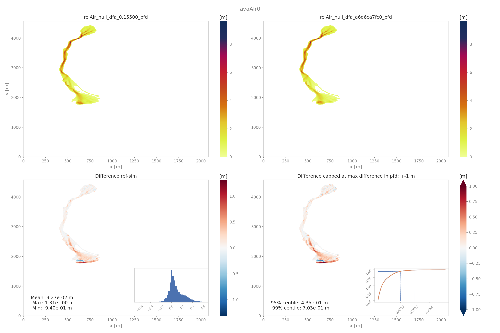

##################################
out3Plot: Plots
##################################

:py:mod:`out3Plot.outQuickPlot`

generatePlot
===============

This function creates two plots, one plot with four panels, first dataset, second dataset, the absolute difference of the two datasets
and the absolute difference capped to a smaller range of differences (ppr: +- 100kPa, pfd: +-1m, pfv:+- 10ms-1).
The difference plots also include an insert showing the histogram and the cumulative density function of the differences.
The second plot shows a cross- and along profile cut of the two datasets.
The folder and simulation name of the datasets has to be passed to the function.

:py:mod:`out3Plot.outQuickPlot.generatePlot`

Input
-----

* dataDict dictionary containing the two sets of data to compare:

  - name1 and name2 (str): strings with the names of the data sets
  - data1 and data2 (2D numpy arrays): rasters of the data sets
  - cellSize (float)
  - suffix (str): optional information about the data type compared ('ppr', 'pfd', 'pfv')

* avaName (str): name of the avalanche

* outDir (str): path to output directory where the plots will be saved

* cfg (configParser): cfg['FLAGS'].getboolean('showPlot')- True if plots shall be printed to screen

* plotDict (dict): dictionary to update

Outputs
-------

* plot with four panels showing the specified dataset, the reference dataset, and their difference including a text box with Mean, Max and Min of the difference
  as well as a histogram and the cumulative density function of the differences
* plot of a cross- and along profile of the two datasets
* plotDict: dictionary updated with the full file paths to the generated plots

Both plots are saved in *Outputs/out3Plot*.

          Output plot from quickPlotBench on peak pressure results

To run
------
Call:

* generatePlot(dataDict, avaName, outDir, cfg, plotDict)

quickPlotBench
===============

Calls :py:mod:`out3Plot.outQuickPlot.generatePlot` to generate all comparison plots between the results of
two simulations.

Input
-----

* avalanche directory
* reference simulation name
* comparison simulation name
* path to reference simulation directory
* path to comparison simulation directory
* plotFlag - True if plots shall be printed to screen
* result parameter ('ppr', 'pfd', 'pfv')

Outputs
-------

* plots generated by :py:mod:`out3Plot.outQuickPlot.generatePlot` for the expected result parameters
* list of dictionaries with information about simulation and the full file paths to the generated plots

All plots are saved in *Outputs/out3Plot*.

To run
------
Call:

* quickPlotBench(avaDir, simNameRef, simNameComp, refDir, compDir, cfg, cfgPlot, suffix)

quickPlotSimple
=================

Calls :py:mod:`out3Plot.outQuickPlot.generatePlot` to generate the comparison plots between
the two results file in the input directory.

Input
-----

* avalanche directory
* input directory (where the two datasets are located)
* plotFlag - True if plots shall be printed to screen

Outputs
-------

* plots generated by :py:mod:`out3Plot.outQuickPlot.generatePlot` for the files in
  theinput directory (where the two datasets are located)

Both plots are saved in *Outputs/out3Plot*.

To run
------

* copy *avaframeCfg.ini* to *local_avaframeCfg.ini* and set your avalanche directory and showPlot flag
* specifiy input directory, default is *Work/simplePlot*
* runQuickPlotSimple.py

quickPlotOne
=================

This function creates one plot of a single raster dataset.
The first panel shows the dataset and the second panel shows a cross- or along profile of the dataset.
The function returns a list with the file path of the generated plot.

Input
-----

* avalanche directory
* input directory (where the two datasets are located)
* plotFlag - True if plots shall be printed to screen

Outputs
-------

* plot two panels showing dataset 1 and a cross- or a longprofile of the dataset
* list with full file path of the generated plot

Both plots are saved in *inputDir/out3Plots*. If no inputDir is specified in the ini file,
as default *avalancheDir/Work/simplePlot* is used.

To run
------

* copy *avaframeCfg.ini* to *local_avaframeCfg.ini* and set your avalanche directory and showPlot flag
* copy *outQuickPlotCfg.ini* to *local_outQuickPlotCfg.ini* and set desired settings - specifiy input directory, default is *Work/simplePlot*
* runQuickPlotSimple.py

in1DataPlots
=================

in1DataPlots can be used to plot a sample and its characteristics derived with ``computeFromDistribution.py``,
such as: cumulative distribution function (CDF), bar plot of sample values, probability density function (PDF) of the sample,
comparison plot of empirical- and desired CDF and comparison of empirical- and desired PDF.

statsPlots
=================

statsPlots can be used to create scatter plots using a peak dictionary where information on two result parameters of avalanche simulations is saved.
This peak dictionary can be created using the function ``extractMaxValues`` of ``ana4Stats/getStats.py``.
This can be used to visualize results of avalanche simulations where parameter variation has been used or for e.g. the case of
different release area scenarios. If parameter variation was used to derive the simulation results, the plots indicate the parameter values in color.
If the input data includes information about the 'scenario' that was used, for example different release scenarios, the plots use different colors for each scenario.
There is also the option to add a kde (kernel density estimation) plot for each result parameter as marginal plots.

Input
-----

plotValuesScatter
~~~~~~~~~~~~~~~~~~

* peak info dictionary
* result parameter type 1
* result parameter type 2
* parameter that has been varied to perform avalanche simulations
* configuration
* flagShow - if True show plots

plotValuesScatterHist
~~~~~~~~~~~~~~~~~~~~~~

* peak info dictionary
* result parameter type 1
* result parameter type 2
* parameter that has been varied to perform avalanche simulations
* configuration
* path to avalanche directory
* flagShow - if True show plots
* flagHue - if True scenario information is provided and plot uses different colors for each scenario

Outputs
-------

plotValuesScatter
~~~~~~~~~~~~~~~~~~

* scatter plot of result type 1 vs result type 2 with color indicating values of the varied parameter.

plotValuesScatterHist
~~~~~~~~~~~~~~~~~~~~~~~

* scatter plot with marginal kde plots of result type 1 vs result type 2 with color indicating different scenarios (optional)

To run
------

runStatsExample includes an example run script to perform avalanche simulations for varying release thickness and for two different
release area scenarios. The simulation results are visualized using the plotValuesScatter and plotValuesScatterHist and saved to
``data/avaHockeyChannel``. This script can be used as a template to design your own workflow.
