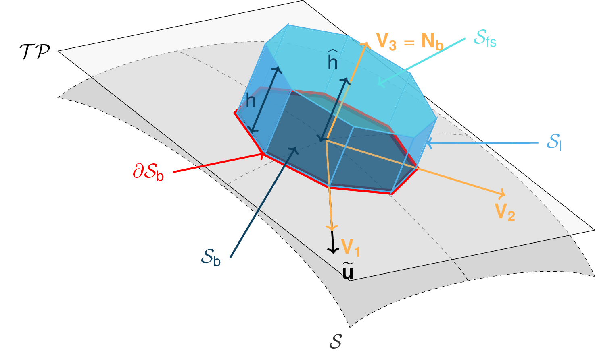
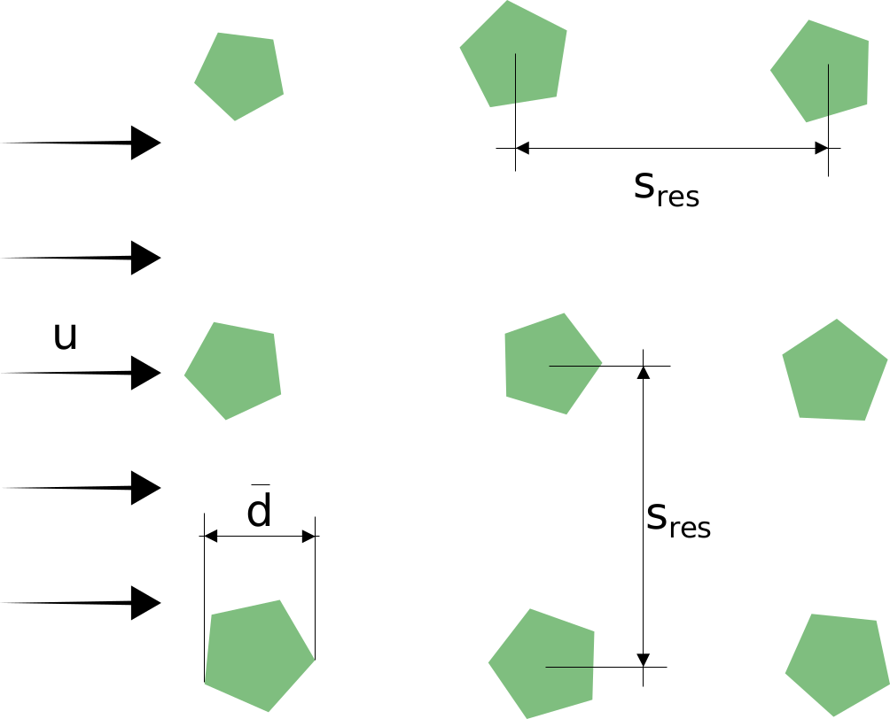
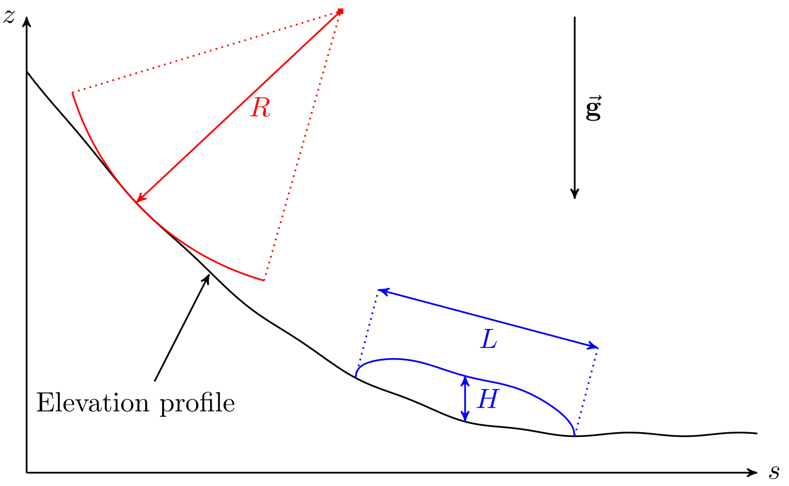

com1DFA DFA-Kernel theory
============================

.. warning::

   This theory has not been fully reviewed yet. Read its content with a critical mind.

Governing Equations for the Dense Flow Avalanche
------------------------------------------------------

The governing equations of the dense flow avalanche are derived from the
incompressible mass and momentum balance on a Lagrange control volume (:cite:`Zw2000,ZwKlSa2003`).

Mass balance:
~~~~~~~~~~~~~~~

.. math::
    \frac{d}{dt} \int\limits_{V(t)} \rho_0 \,\mathrm{d}V = \rho_0 \frac{dV(t)}{dt} =
    \oint\limits_{\partial V(t)} q^{\text{ent}} \,\mathrm{d}A
    :label: mass-balance1

Where :math:`q^{\text{ent}}` represents the snow entrainment rate.

Momentum balance:
~~~~~~~~~~~~~~~~~~~

.. math::
    \rho_0 \frac{d}{dt} \int\limits_{V(t)} u_i \,\mathrm{d}V = \oint\limits_{\partial V(t)}
    \sigma^{\text{tot}}_{ij}n_j \,\mathrm{d}A + \rho_0 \int\limits_{V(t)} g_i \,\mathrm{d}V, \quad i=(1,2,3)
    :label: momentum-balance1

We introduce the volume average of a quantity :math:`P(\mathbf{x},t)`:

.. math::
    \overline{P}(\mathbf{x},t) =  \frac{1}{V(t)} \int\limits_{V(t)} P(\mathbf{x},t) \,\mathrm{d}V
..    :label: volume-average

and split the area integral into :

.. math::
   \oint\limits_{\partial V(t)} \sigma^{\text{tot}}_{ij}n_j \,\mathrm{d}A =
   \oint\limits_{\partial V(t)} \sigma_{ij}n_j \,\mathrm{d}A + F_i^{\text{ent}} + F_i^{\text{res}}, \quad i=(1,2,3)
..   :label: area-integral

:math:`F_i^{\text{ent}}` represents the force required to break the
entrained snow from the ground and to compress it (since the dense-flow
bulk density is usually larger than the density of the entrained snow,
i.e. :math:`\rho_{\text{ent}}<\rho`) and :math:`F_i^{\text{res}}`
represents the resistance force due to obstacles (for example trees).
This leads to in :eq:`momentum-balance1`:

.. math::
   \rho_0 \frac{dV(t) \overline{u}_i}{dt} = \rho_0 V \frac{d\overline{u}_i}{dt} +
   \rho_0 \overline{u}_i \frac{dV}{dt} = \oint\limits_{\partial V(t)} \sigma_{ij}n_j
   \,\mathrm{d}A + \rho_0 V g_i + F_i^{\text{ent}} + F_i^{\text{res}}, \quad i=(1,2,3)
..   :label: momentum-balance2

Using the mass balance equation :eq:`mass-balance1`, we get:

.. math::
   \rho_0 V \frac{d\overline{u}_i}{dt} = \oint\limits_{\partial V(t)} \sigma_{ij}n_j \,\mathrm{d}A
   + \rho_0 V g_i  + F_i^{\text{ent}} + F_i^{\text{res}} - \overline{u}_i \oint\limits_{\partial V(t)} q^{\text{ent}} \,\mathrm{d}A, \quad i=(1,2,3)
   :label: momentum-balance3

Boundary conditions:
~~~~~~~~~~~~~~~~~~~~~~~~~~~~~~

The free surface is defined by :

    .. math:: F_s(\mathbf{x},t) = z-s(x,y,t)=0

The bottom surface is defined by :

    .. math:: F_b(\mathbf{x}) = z-b(x,y)=0

The boundary conditions at the free surface and bottom of the flow read:

.. math::
   \left\{\begin{aligned}
   &\frac{dF_s}{dt} = \frac{\partial F_s}{\partial t} +  u_i\frac{\partial F_s}{\partial x_i} =0 \quad & \mbox{at  }F_s(\mathbf{x},t) =0 \quad & \mbox{Kinematic BC (Material boundary)}\\
   &\sigma_{ij}n_j = 0 \quad & \mbox{at  }F_s(\mathbf{x},t) =0 \quad & \mbox{Dynamic BC (Traction free surface)}\\
   &u_in_i = 0 \quad & \mbox{at  }F_b(\mathbf{x},t) =0 \quad & \mbox{Kinematic BC (No detachment)}\\
   &\tau^{(b)}_i = f(\sigma^{(b)},\overline{u},\overline{h},\rho_0,t,\mathbf{x})\quad & \mbox{at  }F_b(\mathbf{x},t) =0\quad & \mbox{Dynamic BC (Chosen friction law)}
   \end{aligned}
   \right.
   :label: boundary-conditions

:math:`\sigma^{(b)}_i = (\sigma_{kl}n_ln_k)n_i` represents the normal stress at the bottom and
:math:`\tau^{(b)}_i = \sigma_{ij}n_j - \sigma^{(b)}_i` represents the shear stress at the bottom surface.
:math:`f` describes the chosen friction model and are described in :ref:`theoryCom1DFA:Friction Model`.
The normals at the free surface (:math:`n_i^{(s)}`) and bottom surface (:math:`n_i^{(b)}`) are:

.. math::
   n_i^{(s,b)} = \frac{\partial F_{s,b}}{\partial x_i}\left(\frac{\partial F_{s,b}}{\partial x_j}
   \frac{\partial F_{s,b}}{\partial x_j}\right)^{-1/2}
..   :label: surface-normals

Choice of the coordinate system:
~~~~~~~~~~~~~~~~~~~~~~~~~~~~~~~~~~~~~~~~~~~~~

The previous equations will be developed in the orthonormal coordinate
system :math:`(B,\mathbf{v_1},\mathbf{v_2},\mathbf{v_3})`, further
referenced as Natural Coordinate System (NCS). In this NCS,
:math:`\mathbf{v_1}` is aligned with the velocity vector at the bottom
and :math:`\mathbf{v_3}` with the normal to the slope, i.e.:

.. math::
   \mathbf{v_1} = \frac{\mathbf{u}}{\left\Vert \mathbf{u}\right\Vert},\quad \mathbf{v_2} = \mathbf{v_3}\wedge\mathbf{v_1},
   \quad \mathbf{v_3} = \mathbf{n^{(b)}}
..   :label: natural-coordinate-system

The origin :math:`B` of the NCS is attached to the slope. This choice
leads to:

.. math::
   n^{(b)}_i = \delta_{i3}, \quad \left.\frac{\partial b}{\partial x_i}\right\rvert_{\mathbf{0}} = 0\quad
   \mbox{for} \quad i=(1,2),\quad \mbox{and} \quad u^{(b)}_2 = u^{(b)}_3 = 0
..   :label: NCS-consequence

Thickness averaged equations:
~~~~~~~~~~~~~~~~~~~~~~~~~~~~~
In this NCS and considering a prism-like Control volume, the volume
content :math:`V(t) = A_b(t)\overline{h}` is obtained by multiplication
of the basal area of the prism, :math:`A_b`, with the averaged value of
the flow thickness,

.. math::
    \overline{h} = \frac{1}{A_b(t)}\int\limits_{A_b(t)} [s(\mathbf{x})-b(\mathbf{x})]\,\mathrm{d}A = \frac{1}{A_b(t)}\int\limits_{A_b(t)} h(\mathbf{x})\,\mathrm{d}A,\qquad
    \overline{u}_i = \frac{1}{V(t)}\int\limits_{V(t)} u_i(\mathbf{x})\,\mathrm{d}V
    :label: hmean-umean

.. _small-lagrange:

        Small Lagrangian prism-like Control volume

Entrainment:
"""""""""""""

The snow entrainment is either due to plowing at the front of the avalanche or to erosion
at the bottom. The entrainment rate at the front :math:`q^{\text{plo}}` can be expressed as a function of the
properties of the entrained snow (density :math:`\rho_{\text{ent}}` and
snow thickness :math:`h_{\text{ent}}`), the velocity of the avalanche at the
front :math:`\overline{\mathbf{u}}` and length :math:`w_f` of the front (measured perpendicularly
to the flow velocity :math:`\overline{\mathbf{u}}`). It obviously only happens on the front of
the avalanche:

.. math::
   \oint\limits_{\partial V(t)} q^{\text{plo}}\,\mathrm{d}A = \int\limits_{l_{\text{front}}}\int_b^s q^{\text{plo}}\,
   \mathrm{d}{l}\,\mathrm{d}{z} =  \rho_{\text{ent}}\,w_f\,h_{\text{ent}}\,\left\Vert \overline{\mathbf{u}}\right\Vert
   :label: ploughing

The entrainment rate at the bottom :math:`q^{\text{ero}}` can be expressed as a function of the
bottom area :math:`A_b` of the control volume, the velocity of the avalanche :math:`\overline{\mathbf{u}}`,
the bottom shear stress :math:`\tau^{(b)}` and the specific erosion energy :math:`e_b`:

.. math::
    \oint\limits_{\partial V(t)} q^{\text{ero}}\,\mathrm{d}A = \int\limits_{A_b} q^{\text{ero}}\,
    \mathrm{d}A = A_b\,\frac{\tau^{(b)}}{e_b}\,\left\Vert \overline{\mathbf{u}}\right\Vert
    :label: erosion

This leads in the mass balance :eq:`mass-balance1` to :

.. math::
   \frac{\mathrm{d}V(t)}{\mathrm{d}t} = \frac{\mathrm{d}(A_b\overline{h})}{\mathrm{d}t}
   = \frac{\rho_{\text{ent}}}{\rho_0}\,w_f\,h_{\text{ent}}\,\left\Vert \overline{\mathbf{u}}\right\Vert +
   \frac{A_b}{\rho_0}\,\frac{\tau^{(b)}}{e_b}\,\left\Vert \overline{\mathbf{u}}\right\Vert
   :label: mass-balance2

The force :math:`F_i^{\text{ent}}` required to break the entrained snow
from the ground and to compress it is expressed as a function of the required
breaking energy per fracture surface unit :math:`e_s`
(:math:`J.m^{-2}`), the deformation energy per entrained mass element
:math:`e_d` (:math:`J.kg^{-1}`) and the entrained snow thickness
(:cite:`Sa2007,SaFeFr2008,FiFrGaSo2013`):

.. math:: F_i^{\text{ent}} = -w_f\,(e_s+\,q^{\text{ent}}\,e_d)

Resistance:
"""""""""""""

The force :math:`F_i^{\text{res}}` due to obstacles is expressed
as a function of the characteristic diameter :math:`\overline{d}` and height
:math:`h_{\text{res}}` of the obstacles, the spacing
:math:`s_{\text{res}}` between the obstacles and an empirical
coefficient :math:`c_w` (see :numref:`f-res`). The effective height :math:`h^{\text{eff}}`
is defined as :math:`\min(\overline{h}, h_{res} )`:

.. math::
   F_i^{\text{res}} = -(\frac{1}{2}\,\overline{d}\,c_w/s^2_{\text{res}})\,\rho_0\,A\,
    h^{\text{eff}}\,\overline{u}^2\,
    \frac{\overline{u}_i}{\|\overline{u}\|}

.. _f-res:

        Resistance force due to obstacles (from :cite:`FiKo2013`)

Surface integral forces:
"""""""""""""""""""""""""

The surface integral is split in three terms, an integral over
:math:`A_b` the bottom :math:`x_3 = b(x_1,x_2)`, :math:`A_s` the top
:math:`x_3 = s(x_1,x_2,t)` and :math:`A_h` the lateral surface.
Introducing the boundary conditions :eq:`boundary-conditions` leads to:

.. math::
   \begin{aligned}
   \oint\limits_{\partial{V(t)}}\sigma_{ij}n_j\,\mathrm{d}A & =
   \int\limits_{A_b}\underbrace{\sigma_{ij}\,n_j^{(b)}}_{-\sigma_{i3}}\,\mathrm{d}A +  \int\limits_{A_s}\underbrace{\sigma_{ij}\,n_j^{(s)}}_{0}\,\mathrm{d}A + \int\limits_{A_h}\sigma_{ij}\,n_j\,\mathrm{d}A\\
   &= -A_b\overline{\sigma}_{i3}^{(b)} + \oint\limits_{\partial A_b}\left(\int_b^s\sigma_{ij}\,n_j\,\mathrm{d}x_3\right)\,\mathrm{d}l
   \end{aligned}
..   :label: surface forces

Which simplifies the momentum balance :eq:`momentum-balance3` to:

.. math::
   \begin{aligned}
   \rho_0 V \frac{d\overline{u}_i}{dt} = & \oint\limits_{\partial A_b}\left(\int_b^s\sigma_{ij}\,n_j\,
   \mathrm{d}x_3\right)\,\mathrm{d}l -A_b\overline{\sigma}_{i3}^{(b)} + \rho_0 V g_i  + F_i^{\text{ent}} +
   F_i^{\text{res}} - \overline{u}_i \oint\limits_{\partial V(t)} q^{\text{ent}} \,\mathrm{d}A,\\
   &\quad i=(1,2,3)
   \end{aligned}
   :label: momentum-balance5

The momentum balance in direction :math:`x_3` (normal to the slope) is
used to obtain a relation for the vertical distribution of the stress
tensor (:cite:`Sa2007`). Due to the choice of
coordinate system and because of the kinematic boundary condition at the
bottom, the left side of :eq:`momentum-balance5` can be
expressed as a function of the velocity :math:`\overline{u}_1` in direction
:math:`x_1` and the curvature of the terrain in this same direction
:math:`\frac{\partial^2{b}}{\partial{x_1^2}}` (:cite:`Zw2000`):

.. math::
   \rho\,A_b\,\overline{h}\,\frac{\,\mathrm{d}\overline{u}_3}{\,\mathrm{d}t} =
   \rho\,A_b\,\overline{h}\,\frac{\partial^2{b}}{\partial{x_1^2}}\,\overline{u}_1^2,

rearranging the terms in the momentum equation leads to:

.. math::
  \overline{\sigma}_{33}(x_3) = \rho_0\,(s-x_3)\left(g_3-\frac{\partial^2{b}}{\partial{x_1^2}}\,\overline{u}_1^2\right)+ \frac{1}{A_b}
  \oint\limits_{\partial A_b}\left(\int_{x_3}^s\sigma_{3j}\,n_j\,\mathrm{d}x_3\right)\,\mathrm{d}l
  :label: sigma33

Non-dimensional Equations
~~~~~~~~~~~~~~~~~~~~~~~~~~~~~~

.. _fig-characteristic_size:

        Characteristic size of the avalanche along its path (from :cite:`Zw2000`, modified)

The previous equations :eq:`momentum-balance5` and :eq:`sigma33` can be further simplified by
introducing a scaling based on the characteristic values of the physical
quantities describing the avalanche. The characteristic length L, the
thickness H, the acceleration due to gravity g and the characteristic
radius of curvature of the terrain R are the chosen quantities. From
those values, it is possible to form two non dimensional parameters that
describe the flow:

-  Aspect ratio: :math:`\qquad\qquad\varepsilon = H / L\qquad`

-  Curvature:  :math:`\qquad\lambda = L / R\qquad`

The different properties involved are then expressed in terms of
characteristic quantities :math:`L`, :math:`H`, :math:`g`, :math:`\rho_0` and :math:`R`
(see :numref:`fig-characteristic_size`):

.. math::
   \begin{aligned}
    x_i &= L\, x_i^*\\
    (dx_3,h,\overline{h}) &= H\,(dx_3^*,h^*,\overline{h}^*)\\
    A_b &= L^2\, A_b^*\\
    t &= \sqrt{L/\text{g}}\, t^*\\
    \overline{u_i} &= \sqrt{\text{g}L}\,\overline{u_i}^*\\
    \text{g}_i &= \text{g} \, \text{g}_i^*\\
    \frac{\partial^2{b}}{\partial{x_1}^2} &= \frac{1}{R}\,\frac{\partial^2{b^*}}{\partial{x_1}^{*2}}\end{aligned}

The normal part of the stress tensor is directly related to the
hydro-static pressure:

.. math:: \sigma_{ii} = \rho_0\,\text{g}\,H\,\sigma_{ii}^*

The dimensionless properties are indicated by a superscripted asterisk.
Introducing those properties in :eq:`sigma33`, leads to
:

.. math::
   \overline{\sigma^*}_{33} = \left(g^*_3-\lambda\frac{\partial^2{b^*}}{\partial{x_1^{*2}}}\,\overline{u}_1^{*2}\right)
   (s^*-x^*_3) + \underbrace{\varepsilon\oint\limits_{\partial A_b^*}\left(\int\limits_{x^*_3}^{s^*}\sigma^*_{31}\,\mathrm{d}x^*_3\right)\,\mathrm{d}l^*}_{O(\varepsilon)}.
   :label: sigma33star

The height, H of dense flow avalanches is assumed to be small compared
to its length, L. Meaning that the equations are examined in the limit
:math:`\varepsilon \ll 1`. It is then possible to neglect the last term
in :eq:`sigma33star` which leads to (after reinserting
the dimensions):

.. math::
    \overline{\sigma}_{33}(x_3) = \rho_0\,\underbrace{\left(g_3-\overline{u_1}^2\,\frac{\partial^2{b}}{\partial{x_1^2}}\right)}_{g_\text{eff}}
    \left[\overline{h}-x_3\right]
    :label: sigma33dim

And at the bottom of the avalanche, with :math:`x_3 = 0`, the normal
stress can be expressed as:

.. math::
     \overline{\sigma}^{(b)}_{33} = \rho_0\,\left(g_3-\overline{u_1}^2\,\frac{\partial^2{b}}{\partial{x_1^2}}\right)\,\overline{h}
     :label: sigmab

Calculating the surface integral in equation :eq:`momentum-balance5` requires to
express the other components of the stress tensor. Here again a
magnitude consideration between the shear stresses :math:`\sigma_{12} = \sigma_{21}` and :math:`\sigma_{13}`.
The shear stresses are based on a generalized Newtonian law of materials,
which controls the influence of normal stress and the rate of deformation through the viscosity.

.. math::
    \tau_{ij} = \eta\left(\frac{\partial{u_i}}{\partial{x_j}}+\frac{\partial{u_j}}{\partial{x_i}}\right), ~ i\neq j

Because :math:`\partial x_1` and :math:`\partial x_2` are of the order of :math:`L`, whereas :math:`\partial x_3`
is of the order of :math:`H`, it follows that:

.. math::
    O\left(\frac{\sigma_{12}}{\sigma_{13}}\right) = \frac{H}{L} = \varepsilon \ll 1

and thus :math:`\sigma_{12} = \sigma_{21}` is negligible compared to :math:`\sigma_{13}`.
:math:`\sigma_{13}` is expressed using the bottom friction law
:math:`\tau^{(b)}_i = f(\sigma^{(b)},\overline{u},\overline{h},\rho_0,t,\mathbf{x})`
introduced in :eq:`boundary-conditions`.

In addition, a relation linking the horizontal normal stresses,
:math:`\sigma_{ii}`, :math:`i = (1,2)`, to the vertical pressure distribution given
by :eq:`sigmab` is introduced. In complete analogy to the arguments used by
Savage and Hutter (:cite:`SaHu1989`) the horizontal normal stresses are given as:

.. math::
    \sigma_{ii} = K_{(i)}\,\sigma_{33}

Where :math:`K_{(i)}` are the earth pressure coefficients (cf. :cite:`ZwKlSa2003,Sa2004`):

.. math::
    \sigma_{11} &= K_{x~akt/pass}\,\sigma_{33}\\
    \sigma_{22} &= K_{y~akt/pass}^{(x~akt/pass)}\,\sigma_{33}

With the above specifications, the integral of the stresses over the
flow height is simplified in equation :eq:`momentum-balance5` to:

.. math::
   \int\limits_b^s\sigma_{ij}\,\mathrm{d}x_3 = \int\limits_b^s K_{(i)}\,\sigma_{33}\,\mathrm{d}x_3 =
    K_{(i)}\,\frac{\overline{h}\,\sigma^{(b)}}{2}

and the momentum balance can be written:

.. math::
    \begin{aligned}
    \rho_0\,A\,\overline{h}\,\frac{\,\mathrm{d}\overline{u}_i}{\,\mathrm{d}t} =
    &\rho_0\,A\,\overline{h}\,g_i + \underbrace{K_{(i)}\,\oint\limits_{\partial{A}}\left(\frac{\overline{h}\,\sigma^{(b)}}{2}\right)n_i\,\mathrm{d}l}_{F_i^{\text{lat}}}
    \underbrace{-\delta_{i1}\,A\,\tau^{(b)}}_{F_i^{\text{bot}}}
    \underbrace{- \rho_0\,A\,h_{\text{eff}}\,C_{\text{res}}\,\overline{\mathbf{u}}^2\,\frac{\overline{u_i}}{\|\overline{\mathbf{u}}\|}}_{F_i^{\text{res}}}\\
    &- \overline{u_i}\,\rho_0\,\frac{\mathrm{d}\left(A\,\overline{h}\right)}{\mathrm{d}t}
    + F_i^{\text{ent}}
    \end{aligned}
    :label: momentum-balance6

with

.. math:: C_{\text{res}} = \frac{1}{2}\,\overline{d}\,\frac{c_w}{s_{\text{res}}^2}.

The mass balance :eq:`mass-balance2`
remains unchanged:

.. math::
   \frac{\mathrm{d}V(t)}{\mathrm{d}t} = \frac{\mathrm{d}\left(A_b\overline{h}\right)}{\mathrm{d}t}
   = \frac{\rho_{\text{ent}}}{\rho_0}\,w_f\,h_{\text{ent}}\,\left\Vert \overline{\mathbf{u}}\right\Vert
   + \frac{A_b}{\rho_0}\,\frac{\tau^{(b)}}{e_b}\,\left\Vert \overline{\mathbf{u}}\right\Vert
   :label: mass-balance3

The unknown :math:`\overline{u}_1`, :math:`\overline{u}_2` and
:math:`\overline{h}` satisfy :eq:`sigmab`,
:eq:`momentum-balance6` and
:eq:`mass-balance3`. In equation
:eq:`momentum-balance6` the bottom shear
stress :math:`\tau^{(b)}` remains unknown, and and a constitutive equation
has to be introduced in order to completely solve the equations.

Friction Model
~~~~~~~~~~~~~~~~~

The problem can be solved by introducing a constitutive equation which
describes the basal shear stress tensor :math:`\tau^{(b)}` as a function
of the flow state of the avalanche.

.. math::
    \tau^{(b)}_i = f(\sigma^{(b)},\overline{u},\overline{h},\rho_0,t,\mathbf{x})
    :label: samosAT friction model

With

.. math::
   \begin{aligned}
   &\sigma^{(b)} \qquad &\text{normal component of the stress tensor}\\
   &\overline{u} \qquad &\text{average velocity}\\
   &\overline{h} \qquad &\text{average flow thickness}\\
   &\rho_0 \qquad &\text{density}\\
   &t \qquad &\text{time}\\
   &\mathbf{x} \qquad &\text{position vector}\end{aligned}

Several friction models already implemented in the simulation tool are
described here.

Mohr-Coulomb friction model
"""""""""""""""""""""""""""""""
The Mohr-Coulomb friction model describes the friction interaction between twos solids.
The bottom shear stress simply reads:

.. math::
 \tau^{(b)} = \tan{\delta}\,\sigma^{(b)}

:math:`\tan{\delta}=\mu` is the friction coefficient (and :math:`\delta` the friction angle). The bottom shear stress linearly
increases with the normal stress component :math:`\sigma^{(b)}` (:cite:`Zw2000,BaSaGr1999,WaHuPu2004,Sa2007`).

With this friction model, an avalanche starts to flow if the slope inclination is steeper than the
friction angle :math:`\delta`. In the case of an infinite slope of constant inclination,
the avalanche velocity would increase indefinitely. This is unrealistic to model snow
avalanches because it leads to over prediction of the flow velocity.
The Mohr-Coulomb friction model is on the other hand well suited to model
granular flow. Because of its relative simplicity, this friction model is also
very convenient to derive analytic solutions and validate the numerical implementation.

Chezy friction model
""""""""""""""""""""""""
The Chezy friction model describes viscous friction interaction.
The bottom shear stress then reads:

.. math::
 \tau^{(b)} = c_{\text{dyn}}\,\rho_0\,\bar{u}^2

:math:`c_{\text{dyn}}` is the viscous friction coefficient. The bottom shear stress
is a quadratic function of the velocity. (:cite:`Zw2000,BaSaGr1999,WaHuPu2004,Sa2007`).

This model enables to reach more realistic velocities for avalanche simulations.
The draw back is that the avalanche doesn't stop flowing before the slope inclination approaches zero.
This implies that the avalanche flows to the lowest local point.

Voellmy friction model
"""""""""""""""""""""""""
Anton Voellmy was a Swiss engineer interested in avalanche dynamics :cite:`Vo1955`.
He first had the idea to combine both the Mohr-Coulomb and the Chezy model by summing them up
in order to take advantage of both. This leads to the following friction law:

.. math::
 \tau^{(b)} = \tan{\delta}\,\sigma^{(b)} + c_\text{dyn}\,\rho_0\,\bar{u}^2

This model is described as Voellmy-Fluid :cite:`Sa2004,Sa2007`, and the turbulent
friction term :math:`\xi` is used instead of :math:`c_{\text{dyn}}`.

SamosAT friction model
""""""""""""""""""""""""

SamosAT friction model is a modification of some more classical models
such as Voellmy model :ref:`Voellmy friction model`. The basal shear stress tensor :math:`\tau^{(b)}`
is expressed as (:cite:`Sa2007`):

.. math::
   \tau^{(b)} = \tau_0 + \tan{\delta}\,\left(1+\frac{R_s^0}{R_s^0+R_s}\right)\,\sigma^{(b)}
    + \frac{\rho_0\,\overline{u}^2}{\left(\frac{1}{\kappa}\,\ln\frac{\overline{h}}{R} + B\right)^2}

With

.. math::
   \begin{aligned}
   &\tau_0 \qquad &\text{minimum shear stress}\\
   &R_s \qquad &\text{relation between friction and normal pressure (fluidization factor)}\\
   &R \qquad &\text{empirical  constant}\\
   &R_s^0 \qquad &\text{empirical  constant}\\
   &B \qquad &\text{empirical  constant}\\
   &\kappa \qquad &\text{empirical  constant}\end{aligned}

The minimum shear stress :math:`\tau_0` defines a lower limit below
which no flow takes place with the condition
:math:`\rho_0\,\overline{h}\,g\,\sin{\alpha} > \tau_0`. :math:`\alpha`
being the slope. :math:`\tau_0` is independent of the flow thickness, which
leeds to a strong avalanche deceleration, especially for avalanches with
low flow heights. :math:`R_s` is expressed as
:math:`R_s = \frac{\rho_0\,\overline{u}^2}{\sigma^{(b)}}`. Together
with the empirical parameter :math:`R_s^0` the term
:math:`\frac{R_s^0}{R_s^0+R_s}` defines the Coulomb basal friction.
Therefore lower avalanche speeds lead to a higher bed friction, making
avalanche flow stop already at steeper slopes :math:`\alpha`, than
without this effect. This effect is intended to avoid lateral creep of
the avalanche mass (:cite:`SaGr2009`).

.. Logarithmic friction model
.. """""""""""""""""""""""""""""
.. Im Gegensatz zum Chezy-Modell, welches eine Näherung der Bodenreibung in turbulenten Strömungen liefert,
.. wird mit der turbulenten Grenzschichttheorie das Verhalten einer solchen Strömung in Bodennähe genauer analysiert.
.. Für die Grundlagen der Grenzschichttheorie.
.. Im Falle einer Lawine kann man von einem vollkommen rauen Untergrund ausgehen. Somit kann in unmittelbarer
.. Bodennäche ein logarithmisches Geschwindigkeitsprofil zugrunde gelegt werden,
.. welches proportional zum Abstand von der Geländeoberfläche $x_3$ ist.
.. Die Verteilung der Geschwindigkeit wird somit über das logarithmisches Geschwindigkeitsprofil $\tilde{u}(x_3)$ ersetzt.
.. Diese Profil wird ''universelles Wandgesetz'' genannt.
..
.. .. math::
..   \begin{aligned}
..     \frac{\tilde{u}}{u_{\tau}} &= \frac{1}{\kappa}\,\ln{\frac{x_3}{R}} + B\\
..     &\text{mit}\\
..     u_{\tau} &= \sqrt{\frac{\tau^{(b)}}{\bar{\rho}}},
..   \end{aligned}
..
..
.. .. math::
..   \begin{aligned}
..   &R \qquad &\text{Surface rugosity}\\
..   &B \qquad &\text{empirical  constant}\\
..   &\kappa \qquad &\text{Karman constant (0.4 fur Newtonsche Flussigkeiten)}\\
..   &u_{\tau} \quad &\text{Schubspannungsgeschwindigkeit}\end{aligned}
..
..
..
.. sind. Für Kanalströmungen mit vorgegebener Fließhöhe $\bar{h}$ lässt sich zudem
.. das Geschwindigkeitsprofil auch in größeren Entfernungen von der Wand logarithmisch darstellen.
.. Daraus folgt das ''Mittengesetz''.
..
.. .. math::
..   \begin{align*}
..     \frac{\tilde{u}}{u_{\tau}} &= \frac{\tilde{u}_\text{max}}{u_{\tau}} + \frac{1}{\kappa}\,\ln{\frac{x_3}{\bar{h}}}
..     \intertext{mit}
..     \tilde{u}_\text{max} &= \tilde{u}(x_3 = \bar{h})
..   \end{align*}
..
.. Kombiniert man nun diese beiden Gesetze, indem das Mittengesetz dem Wandgesetz gleichsetzt,
.. erhält man
..
.. .. math::
..     \frac{\tilde{u}_\text{max}}{u_{\tau}} = \frac{1}{\kappa}\,\ln{\frac{\bar{h}}{R}} + B.
..
.. Durch Einsetzen für $u_{\tau}$ und Ersetzen von $\tilde{u}_\text{max}$ durch die in Kapitel \ref{sec:vereinfachtegleichungen}
.. tiefengemittelte Geschwindigkeit $\bar{u}$
.. erhält man nach Umformen schließlich eine Beziehung für die gesuchte Bodenschubspannung $\tau^{(b)}$.
..
.. .. math::
..     \tau^{(b)} = \frac{\bar{\rho}\,\bar{u}^2}{\left(\frac{1}{\kappa}\,\ln{\frac{\bar{h}}{R}}+B\right)^2}
..
..
.. Dieses Modell lässt sich wie beim Voellmy-Modell mit der Coulomb'schen Reibung kombinieren.
..
.. .. math::
..     \tau^{(b)} = \tan{\delta}\,\sigma^{(b)} +
..     \frac{\bar{\rho}\,\bar{u}^2}{\left(\frac{1}{\kappa}\,\ln{\frac{\bar{h}}{R}}+B\right)^2}
..
..
.. Im Gegensatz zum klassischen Voellmy-Modell ist die Bodenschubspannung also auch von der Fließmächtigkeit $\bar{h}$
.. und Bodenrauhigkeit $R$ abhängig.
.. Steigende Fließmächtigkeit, bzw. abnehmende Bodenrauhigkeit führt demnach
.. zu einer Reduktion der Reibung \citep[vgl.][]{Sa2007}.

.. .. _fig-infinitesimales_element:
..
.. .. figure:: _static/infinitesimales_element.png
..         :width: 90%
..
..         Infinitesimal volume element and acting forces on it (from [FiKo2013]_)
