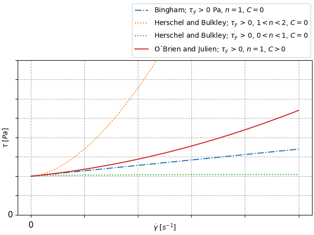
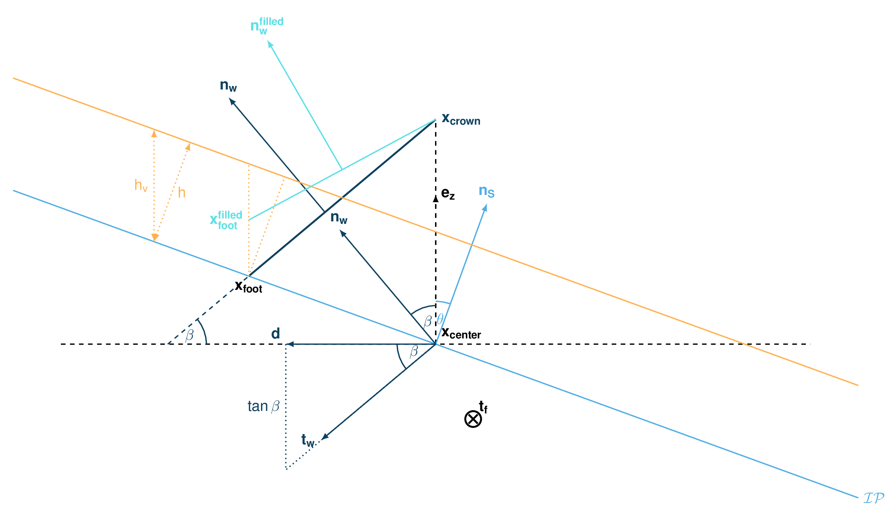

com1DFA DFA-Kernel theory
============================

Governing Equations for the Dense Flow Avalanche
------------------------------------------------------

The governing equations of the dense flow avalanche are derived from the
incompressible mass and momentum balance on a Lagrange control volume (:cite:`Zw2000,ZwKlSa2003`).

Mass balance
~~~~~~~~~~~~~~~

.. math::
    \frac{d}{dt} \int\limits_{V(t)} \rho_0 \,\mathrm{d}V = \rho_0 \frac{dV(t)}{dt} =
    \oint\limits_{\partial V(t)} q^{\text{ent}} \,\mathrm{d}A
    + \oint\limits_{\partial V(t)} q^{\text{det}} \,\mathrm{d}A
    :label: mass-balance1

Where :math:`q^{\text{ent}}` represents the snow entrainment rate, 
:math:`q^{\text{det}}` the snow detrainment rate (:math:`q^{\text{det}} < 0`).

Momentum balance
~~~~~~~~~~~~~~~~~~~

.. math::
    \rho_0 \frac{d}{dt} \int\limits_{V(t)} u_i \,\mathrm{d}V = \oint\limits_{\partial V(t)}
    \sigma^{\text{tot}}_{ij}n_j \,\mathrm{d}A + \rho_0 \int\limits_{V(t)} g_i \,\mathrm{d}V, \quad i=(1,2,3)
    :label: momentum-balance1

We introduce the volume average of a quantity :math:`P(\mathbf{x},t)`:

.. math::
    \overline{P}(\mathbf{x},t) =  \frac{1}{V(t)} \int\limits_{V(t)} P(\mathbf{x},t) \,\mathrm{d}V
..    :label: volume-average

and split the area integral into :

.. math::
   \oint\limits_{\partial V(t)} \sigma^{\text{tot}}_{ij}n_j \,\mathrm{d}A =
   \oint\limits_{\partial V(t)} \sigma_{ij}n_j \,\mathrm{d}A + F_i^{\text{ent}} + F_i^{\text{res}}, \quad i=(1,2,3)
..   :label: area-integral

:math:`F_i^{\text{ent}}` represents the force required to break the
entrained snow from the ground (the dense-flow
bulk density is usually larger than the density of the entrained snow,
i.e. :math:`\rho_{\text{ent}}<\rho`) and :math:`F_i^{\text{res}}`
represents the resistance force due to obstacles (for example trees).
This leads to in :eq:`momentum-balance1`:

.. math::
   \rho_0 \frac{dV(t) \overline{u}_i}{dt} = \rho_0 V \frac{d\overline{u}_i}{dt} +
   \rho_0 \overline{u}_i \frac{dV}{dt} = \oint\limits_{\partial V(t)} \sigma_{ij}n_j
   \,\mathrm{d}A + \rho_0 V g_i + F_i^{\text{ent}} + F_i^{\text{res}}, \quad i=(1,2,3)
..   :label: momentum-balance2

Using the mass balance equation :eq:`mass-balance1`, we get:

.. math::
   \rho_0 V \frac{d\overline{u}_i}{dt} = \oint\limits_{\partial V(t)} \sigma_{ij}n_j \,\mathrm{d}A
   + \rho_0 V g_i  + F_i^{\text{ent}} + F_i^{\text{res}} - \overline{u}_i \oint\limits_{\partial V(t)} q^{\text{ent}} \,\mathrm{d}A - 
   \overline{u}_i \oint\limits_{\partial V(t)} q^{\text{det}} \,\mathrm{d}A, 
   :label: momentum-balance3
   
   \quad i=(1,2,3)

Boundary conditions
~~~~~~~~~~~~~~~~~~~~~~~~~~~~~~

The free surface is defined by :

    .. math:: F_s(\mathbf{x},t) = z-s(x,y,t)=0

The bottom surface is defined by :

    .. math:: F_b(\mathbf{x}) = z-b(x,y)=0

The boundary conditions at the free surface and bottom of the flow read:

.. math::
   \left\{\begin{aligned}
   &\frac{dF_s}{dt} = \frac{\partial F_s}{\partial t} +  u_i\frac{\partial F_s}{\partial x_i} =0 \quad & \mbox{at  }F_s(\mathbf{x},t) =0 \quad & \mbox{Kinematic BC (Material boundary)}\\
   &\sigma_{ij}n_j = 0 \quad & \mbox{at  }F_s(\mathbf{x},t) =0 \quad & \mbox{Dynamic BC (Traction free surface)}\\
   &u_in_i = 0 \quad & \mbox{at  }F_b(\mathbf{x},t) =0 \quad & \mbox{Kinematic BC (No detachment)}\\
   &\tau^{(b)}_i = f(\sigma^{(b)},\overline{u},\overline{h},\rho_0,t,\mathbf{x})\quad & \mbox{at  }F_b(\mathbf{x},t) =0\quad & \mbox{Dynamic BC (Chosen friction law)}
   \end{aligned}
   \right.
   :label: boundary-conditions

:math:`\sigma^{(b)}_i = (\sigma_{kl}n_ln_k)n_i` represents the normal stress at the bottom and
:math:`\tau^{(b)}_i = \sigma_{ij}n_j - \sigma^{(b)}_i` represents the shear stress at the bottom surface.
:math:`f` describes the chosen friction model and are described in :ref:`theoryCom1DFA:Friction Model`.
The normals at the free surface (:math:`n_i^{(s)}`) and bottom surface (:math:`n_i^{(b)}`) are:

.. math::
   n_i^{(s,b)} = \frac{\partial F_{s,b}}{\partial x_i}\left(\frac{\partial F_{s,b}}{\partial x_j}
   \frac{\partial F_{s,b}}{\partial x_j}\right)^{-1/2}
..   :label: surface-normals

Choice of the coordinate system
~~~~~~~~~~~~~~~~~~~~~~~~~~~~~~~~~~~~~~~~~~~~~

The previous equations will be developed in the orthonormal coordinate
system :math:`(B,\mathbf{v_1},\mathbf{v_2},\mathbf{v_3})`, further
referenced as Natural Coordinate System (NCS). In this NCS,
:math:`\mathbf{v_1}` is aligned with the velocity vector at the bottom
and :math:`\mathbf{v_3}` with the normal to the slope, i.e.:

.. math::
   \mathbf{v_1} = \frac{\mathbf{u}}{\left\Vert \mathbf{u}\right\Vert},\quad \mathbf{v_2} = \mathbf{v_3}\wedge\mathbf{v_1},
   \quad \mathbf{v_3} = \mathbf{n^{(b)}}
..   :label: natural-coordinate-system

The origin :math:`B` of the NCS is attached to the slope. This choice
leads to:

.. math::
   n^{(b)}_i = \delta_{i3}, \quad \left.\frac{\partial b}{\partial x_i}\right\rvert_{\mathbf{0}} = 0\quad
   \mbox{for} \quad i=(1,2),\quad \mbox{and} \quad u^{(b)}_2 = u^{(b)}_3 = 0
..   :label: NCS-consequence

Thickness averaged equations
~~~~~~~~~~~~~~~~~~~~~~~~~~~~~
In this NCS and considering a prism-like Control volume, the volume
content :math:`V(t) = A_b(t)\overline{h}` is obtained by multiplication
of the basal area of the prism, :math:`A_b`, with the averaged value of
the flow thickness,

.. math::
    \overline{h} = \frac{1}{A_b(t)}\int\limits_{A_b(t)} [s(\mathbf{x})-b(\mathbf{x})]\,\mathrm{d}A = \frac{1}{A_b(t)}\int\limits_{A_b(t)} h(\mathbf{x})\,\mathrm{d}A,\qquad
    \overline{u}_i = \frac{1}{V(t)}\int\limits_{V(t)} u_i(\mathbf{x})\,\mathrm{d}V
    :label: hmean-umean

.. _small-lagrange:

.. figure:: _static/smallLagrange.png
        :width: 90%

        Small Lagrangian prism-like Control volume

Entrainment
"""""""""""""

The Snow entrainment processes are plowing at the front of the avalanche and erosion
at the bottom. Please note: com1DFA uses one or the other process, not both at the same time (default: erosion). The
other process is set to zero.
The entrainment rate at the front :math:`\dot{q}^{\text{plo}}` can be expressed as a function of the
properties of the entrained snow (density :math:`\rho_{\text{ent}}` and
snow thickness :math:`h_{\text{ent}}`), the velocity of the avalanche at the
front :math:`\overline{\mathbf{u}}` and length :math:`w_f` of the front (measured perpendicularly
to the flow velocity :math:`\overline{\mathbf{u}}`). It obviously only happens on the front of
the avalanche:

.. math::
   \oint\limits_{\partial V(t)} \dot{q}^{\text{plo}}\,\mathrm{d}A = \int\limits_{l_{\text{front}}}\int_b^s \dot{q}^{\text{plo}}\,
   \mathrm{d}{l}\,\mathrm{d}{z} =  \rho_{\text{ent}}\,w_f\,h_{\text{ent}}\,\left\Vert \overline{\mathbf{u}}\right\Vert
   :label: ploughing

The entrainment rate at the bottom :math:`\dot{q}^{\text{ero}}` can be expressed as a function of the
bottom area :math:`A_b` of the control volume, the velocity of the avalanche :math:`\overline{\mathbf{u}}`,
the bottom shear stress :math:`\tau^{(b)}` and the specific erosion energy :math:`e_b`:

.. math::
    \oint\limits_{\partial V(t)} \dot{q}^{\text{ero}}\,\mathrm{d}A = \int\limits_{A_b} \dot{q}^{\text{ero}}\,
    \mathrm{d}A = A_b\,\frac{\tau^{(b)}}{e_b}\,\left\Vert \overline{\mathbf{u}}\right\Vert
    :label: erosion

This leads in the mass balance :eq:`mass-balance1` to :

.. math::
   \frac{\mathrm{d}V(t)}{\mathrm{d}t} = \frac{\mathrm{d}(A_b\overline{h})}{\mathrm{d}t}
   = \frac{\rho_{\text{ent}}}{\rho_0}\,w_f\,h_{\text{ent}}\,\left\Vert \overline{\mathbf{u}}\right\Vert +
   \frac{A_b}{\rho_0}\,\frac{\tau^{(b)}}{e_b}\,\left\Vert \overline{\mathbf{u}}\right\Vert
   :label: mass-balance2

The force :math:`F_i^{\text{ent}}` required to break the entrained snow
from the ground is expressed as a function of the required
breaking energy per fracture surface unit :math:`e_s`
(:math:`J.m^{-2}`), the deformation energy per entrained mass element
:math:`e_d` (:math:`J.kg^{-1}`) and the entrained snow thickness
(:cite:`Sa2007,SaFeFr2008,FiKoFeGrKl2015`):

.. math:: 
   F_i^{\text{ent}} = -w_f\,(e_s+\,q^{\text{ent}}\,e_d),
   :label: entrainmentForce 
      
where :math:`q^{\text{ent}}` refers to the entrainable mass per surface area (:math:`kg.m^{-2}`)
defined by :math:`q^{\text{ent}}: =\rho^{\text{ent}} h^{\text{ent}}` which depending on whether entrainment is due to ploughing
or erosion, is derived using the integral of :math:`\dot{q}^{\text{plo}}`, or respectively
:math:`\dot{q}^{\text{ero}}`, over time.

Detrainment
"""""""""""""

The detrained snow :math:`M_{det}` at obstacles (e.g., trees) is computed by following the approach of (:cite:`FeBeTeBuChThBa2014`):

.. math::
   \oint\limits_{\partial V(t)} \dot{q}^{\text{det}}\,\mathrm{d}A = \frac{\mathrm{d}M_{det}(t)}{\mathrm{d}t} = - K\,\frac{A_b}{\left\Vert \overline{\mathbf{u}}\right\Vert}
   :label: mass-balance-detrainment
   
The parameter :math:`K` (:math:`Pa`) depends on the structure of the obstacles and the properties of the snow.

Currently, detrainment is only applicable when using the ``ResistanceModel =  default``. In this case,
if flow thickness or flow velocity fall below minimum thresholds defined in the configuration file, detrainment is applied.

.. _resistance:

Resistance
"""""""""""""

The force :math:`F_i^{\text{res}}` due to obstacles is expressed
as a function of the characteristic coefficient :math:`c_{\text{resH}}`:

.. math::
   F_i^{\text{res}} = -c_{\text{res}H}\,\rho_0\,A\,
    \overline{u}^2\,
    \frac{\overline{u}_i}{\|\overline{u}\|}

.. Note::

    In  versions earlier than 1.13, this formula included information about tree diameter, tree spacing, etc. and
    was dependent on an effective thickness (a function of flow thickness). Please check out previous documentation
    versions for details.

In the default setup (``ResistanceModel =  default`` and ``detrainment = True``) either detrainment or increased
friction (using :math:`F_i^{\text{res}}`) is applied, depending on the flow thickness (FT) and velocity (FV) at the
current cell and time step:

   * FV OR FT below min thresholds: apply only detrainment, no increased friction
   * FV AND FT within min and max thresholds: no detrainment, only apply increased friction
   * FV OR FT above max thresholds: no detrainment and no increased friction applied

If ``detrainment = False``, the additional resistance force is accounted for in the entire resistance area.

Adaptive surface
"""""""""""""

When the flowing mass changes (due to detrainment, entrainment and/or stopping = velocity is zero),
the surface topography can be adapted (if ``adaptSfcDetrainment = 1``, ``adaptSfcEntrainment = 1`` and/or
``adaptSfcStopped = 1``, respectively).

The detrained/ entrained/ stopped mass is converted into the corresponding
snow depth changes :math:`h_{det}, h_{ent}, h_{stop}` at the location of the particle
using the :ref:`DFAnumerics:Particles to mesh` method.

The adapted surface at a specific time step :math:`z(t)` is computed as (with :math:`h_{det}, h_{ent}, h_{stop} > 0`):

.. math::
  z(t) = z(t=0) + \sum_{i=0}^t (h_{det}(i) + h_{stop}(i) - h_{ent}(i))

In every time step the surface is adapted, the :ref:`DFAnumerics:Cell normals` and
:ref:`DFAnumerics:Cell area` are also adapted.

If the surface is adapted due to stopped particles (velocity = 0 and ``adaptSfcStopped = 1``), the stopped particles
are deleted and stored in a separate dictionary ``stoppedParticles`` (see :ref:`com1DFAAlgorithm:Particle properties`).

.. Note::

    This feature requires more detailed testing and may cause numerical problems if the change in snow
    depth is very high.

Surface integral forces
"""""""""""""""""""""""""

The surface integral is split in three terms, an integral over
:math:`A_b` the bottom :math:`x_3 = b(x_1,x_2)`, :math:`A_s` the top
:math:`x_3 = s(x_1,x_2,t)` and :math:`A_h` the lateral surface.
Introducing the boundary conditions :eq:`boundary-conditions` leads to:

.. math::
   \begin{aligned}
   \oint\limits_{\partial{V(t)}}\sigma_{ij}n_j\,\mathrm{d}A & =
   \int\limits_{A_b}\underbrace{\sigma_{ij}\,n_j^{(b)}}_{-\sigma_{i3}}\,\mathrm{d}A +  \int\limits_{A_s}\underbrace{\sigma_{ij}\,n_j^{(s)}}_{0}\,\mathrm{d}A + \int\limits_{A_h}\sigma_{ij}\,n_j\,\mathrm{d}A\\
   &= -A_b\overline{\sigma}_{i3}^{(b)} + \oint\limits_{\partial A_b}\left(\int_b^s\sigma_{ij}\,n_j\,\mathrm{d}x_3\right)\,\mathrm{d}l
   \end{aligned}
..   :label: surface forces

Which simplifies the momentum balance :eq:`momentum-balance3` to:

.. math::
   \begin{aligned}
   \rho_0 V \frac{d\overline{u}_i}{dt} = & \oint\limits_{\partial A_b}\left(\int_b^s\sigma_{ij}\,n_j\,
   \mathrm{d}x_3\right)\,\mathrm{d}l -A_b\overline{\sigma}_{i3}^{(b)} + \rho_0 V g_i  + F_i^{\text{ent}} +
   F_i^{\text{res}} \\
   - \overline{u}_i \oint\limits_{\partial V(t)} q^{\text{ent}} \,\mathrm{d}A -
   \overline{u}_i \oint\limits_{\partial V(t)} q^{\text{det}} \,\mathrm{d}A,
   &\quad i=(1,2,3)
   \end{aligned}
   :label: momentum-balance5

The momentum balance in direction :math:`x_3` (normal to the slope) is
used to obtain a relation for the vertical distribution of the stress
tensor (:cite:`Sa2007`). Due to the choice of
coordinate system and because of the kinematic boundary condition at the
bottom, the left side of :eq:`momentum-balance5` can be
expressed as a function of the velocity :math:`\overline{u}_1` in direction
:math:`x_1` and the curvature of the terrain in this same direction
:math:`\frac{\partial^2{b}}{\partial{x_1^2}}` (:cite:`Zw2000`):

.. math::
   \rho\,A_b\,\overline{h}\,\frac{\,\mathrm{d}\overline{u}_3}{\,\mathrm{d}t} =
   \rho\,A_b\,\overline{h}\,\frac{\partial^2{b}}{\partial{x_1^2}}\,\overline{u}_1^2,

rearranging the terms in the momentum equation leads to:

.. math::
  \overline{\sigma}_{33}(x_3) = \rho_0\,(s-x_3)\left(g_3-\frac{\partial^2{b}}{\partial{x_1^2}}\,\overline{u}_1^2\right)+ \frac{1}{A_b}
  \oint\limits_{\partial A_b}\left(\int_{x_3}^s\sigma_{3j}\,n_j\,\mathrm{d}x_3\right)\,\mathrm{d}l
  :label: sigma33

Non-dimensional Equations
~~~~~~~~~~~~~~~~~~~~~~~~~~~~~~

.. _fig-characteristic_size:

.. figure:: _static/characteristic_size.png
        :width: 90%

        Characteristic size of the avalanche along its path (from :cite:`Zw2000`, modified)

The previous equations :eq:`momentum-balance5` and :eq:`sigma33` can be further simplified by
introducing a scaling based on the characteristic values of the physical
quantities describing the avalanche. The characteristic length L, the
thickness H, the acceleration due to gravity g and the characteristic
radius of curvature of the terrain R are the chosen quantities. From
those values, it is possible to form two non dimensional parameters that
describe the flow:

-  Aspect ratio: :math:`\qquad\qquad\varepsilon = H / L\qquad`

-  Curvature:  :math:`\qquad\lambda = L / R\qquad`

The different properties involved are then expressed in terms of
characteristic quantities :math:`L`, :math:`H`, :math:`g`, :math:`\rho_0` and :math:`R`
(see :numref:`fig-characteristic_size`):

.. math::
   \begin{aligned}
    x_i &= L\, x_i^*\\
    (dx_3,h,\overline{h}) &= H\,(dx_3^*,h^*,\overline{h}^*)\\
    A_b &= L^2\, A_b^*\\
    t &= \sqrt{L/\text{g}}\, t^*\\
    \overline{u_i} &= \sqrt{\text{g}L}\,\overline{u_i}^*\\
    \text{g}_i &= \text{g} \, \text{g}_i^*\\
    \frac{\partial^2{b}}{\partial{x_1}^2} &= \frac{1}{R}\,\frac{\partial^2{b^*}}{\partial{x_1}^{*2}}\end{aligned}

The normal part of the stress tensor is directly related to the
hydro-static pressure:

.. math:: \sigma_{ii} = \rho_0\,\text{g}\,H\,\sigma_{ii}^*

The dimensionless properties are indicated by a superscripted asterisk.
Introducing those properties in :eq:`sigma33`, leads to
:

.. math::
   \overline{\sigma^*}_{33} = \left(g^*_3-\lambda\frac{\partial^2{b^*}}{\partial{x_1^{*2}}}\,\overline{u}_1^{*2}\right)
   (s^*-x^*_3) + \underbrace{\varepsilon\oint\limits_{\partial A_b^*}\left(\int\limits_{x^*_3}^{s^*}\sigma^*_{31}\,\mathrm{d}x^*_3\right)\,\mathrm{d}l^*}_{O(\varepsilon)}.
   :label: sigma33star

The height, H of dense flow avalanches is assumed to be small compared
to its length, L. Meaning that the equations are examined in the limit
:math:`\varepsilon \ll 1`. It is then possible to neglect the last term
in :eq:`sigma33star` which leads to (after reinserting
the dimensions):

.. math::
    \overline{\sigma}_{33}(x_3) = \rho_0\,\underbrace{\left(g_3-\overline{u_1}^2\,\frac{\partial^2{b}}{\partial{x_1^2}}\right)}_{g_\text{eff}}
    \left[\overline{h}-x_3\right]
    :label: sigma33dim

And at the bottom of the avalanche, with :math:`x_3 = 0`, the normal
stress can be expressed as:

.. math::
     \overline{\sigma}^{(b)}_{33} = \rho_0\,\left(g_3-\overline{u_1}^2\,\frac{\partial^2{b}}{\partial{x_1^2}}\right)\,\overline{h}
     :label: sigmab

Calculating the surface integral in equation :eq:`momentum-balance5` requires to
express the other components of the stress tensor. Here again a
magnitude consideration between the shear stresses :math:`\sigma_{12} = \sigma_{21}` and :math:`\sigma_{13}`.
The shear stresses are based on a generalized Newtonian law of materials,
which controls the influence of normal stress and the rate of deformation through the viscosity.

.. math::
    \tau_{ij} = \eta\left(\frac{\partial{u_i}}{\partial{x_j}}+\frac{\partial{u_j}}{\partial{x_i}}\right), ~ i\neq j

Because :math:`\partial x_1` and :math:`\partial x_2` are of the order of :math:`L`, whereas :math:`\partial x_3`
is of the order of :math:`H`, it follows that:

.. math::
    O\left(\frac{\sigma_{12}}{\sigma_{13}}\right) = \frac{H}{L} = \varepsilon \ll 1

and thus :math:`\sigma_{12} = \sigma_{21}` is negligible compared to :math:`\sigma_{13}`.
:math:`\sigma_{13}` is expressed using the bottom friction law
:math:`\tau^{(b)}_i = f(\sigma^{(b)},\overline{u},\overline{h},\rho_0,t,\mathbf{x})`
introduced in :eq:`boundary-conditions`.

In addition, a relation linking the horizontal normal stresses,
:math:`\sigma_{ii}`, :math:`i = (1,2)`, to the vertical pressure distribution given
by :eq:`sigmab` is introduced. In complete analogy to the arguments used by
Savage and Hutter (:cite:`SaHu1989`) the horizontal normal stresses are given as:

.. math::
    \sigma_{ii} = K_{(i)}\,\sigma_{33}

Where :math:`K_{(i)}` are the earth pressure coefficients (cf. :cite:`ZwKlSa2003,Sa2004`):

.. math::
    \sigma_{11} &= K_{x~akt/pass}\,\sigma_{33}\\
    \sigma_{22} &= K_{y~akt/pass}^{(x~akt/pass)}\,\sigma_{33}

With the above specifications, the integral of the stresses over the
flow height is simplified in equation :eq:`momentum-balance5` to:

.. math::
   \int\limits_b^s\sigma_{ij}\,\mathrm{d}x_3 = \int\limits_b^s K_{(i)}\,\sigma_{33}\,\mathrm{d}x_3 =
    K_{(i)}\,\frac{\overline{h}\,\sigma^{(b)}}{2}

and the momentum balance can be written:

.. math::
    \begin{aligned}
    \rho_0\,A\,\overline{h}\,\frac{\,\mathrm{d}\overline{u}_i}{\,\mathrm{d}t} =
    &\rho_0\,A\,\overline{h}\,g_i + \underbrace{K_{(i)}\,\oint\limits_{\partial{A}}\left(\frac{\overline{h}\,\sigma^{(b)}}{2}\right)n_i\,\mathrm{d}l}_{F_i^{\text{lat}}}
    \underbrace{-\delta_{i1}\,A\,\tau^{(b)}}_{F_i^{\text{bot}}}
    \underbrace{- \rho_0\,A\,h_{\text{eff}}\,C_{\text{res}}\,\overline{\mathbf{u}}^2\,\frac{\overline{u_i}}{\|\overline{\mathbf{u}}\|}}_{F_i^{\text{res}}}\\
    &- \overline{u_i}\,\rho_0\,\frac{\mathrm{d}\left(A\,\overline{h}\right)}{\mathrm{d}t}
    + F_i^{\text{ent}}
    \end{aligned}
    :label: momentum-balance6

with

.. math:: C_{\text{res}} = \frac{1}{2}\,\overline{d}\,\frac{c_w}{s_{\text{res}}^2}.

The mass balance :eq:`mass-balance2`
remains unchanged:

.. math::
   \frac{\mathrm{d}V(t)}{\mathrm{d}t} = \frac{\mathrm{d}\left(A_b\overline{h}\right)}{\mathrm{d}t}
   = \frac{\rho_{\text{ent}}}{\rho_0}\,w_f\,h_{\text{ent}}\,\left\Vert \overline{\mathbf{u}}\right\Vert
   + \frac{A_b}{\rho_0}\,\frac{\tau^{(b)}}{e_b}\,\left\Vert \overline{\mathbf{u}}\right\Vert - \frac{K}{\rho_0}\,\frac{A_b}{\left\Vert \overline{\mathbf{u}}\right\Vert}
   :label: mass-balance3

The unknown :math:`\overline{u}_1`, :math:`\overline{u}_2` and
:math:`\overline{h}` satisfy :eq:`sigmab`,
:eq:`momentum-balance6` and
:eq:`mass-balance3`. In equation
:eq:`momentum-balance6` the bottom shear
stress :math:`\tau^{(b)}` remains unknown, and and a constitutive equation
has to be introduced in order to completely solve the equations.

Friction Model
~~~~~~~~~~~~~~~~~

The problem can be solved by introducing constitutive equations which
describe the behaviour of a material due to stress. 
For granular materials like avalanches the basal shear stress tensor :math:`\tau^{(b)}`
is expressed as a function of the flow state of the avalanche (:ref:`theoryCom1DFA:Granular friction models`).

.. math::
    \tau^{(b)}_i = f(\sigma^{(b)},\overline{u},\overline{h},\rho_0,t,\mathbf{x})
    :label: samosAT friction model

With

.. math::
   \begin{aligned}
   &\sigma^{(b)} \qquad &\text{normal component of the stress tensor}\\
   &\overline{u} \qquad &\text{average velocity}\\
   &\overline{h} \qquad &\text{average flow thickness}\\
   &\rho_0 \qquad &\text{density}\\
   &t \qquad &\text{time}\\
   &\mathbf{x} \qquad &\text{position vector}\end{aligned}

For solid-fluid mixtures like debris flows, where the properties of the fluid phase are dominating the flow process,
the shear stress tensor is, among other things, a function of dynamic viscosity :math:`\eta_m` and shear rate :math:`\dot\gamma` (:ref:`theoryCom1DFA:Rheological models`).

.. math::
    \tau_i = f(\eta_m,\dot\gamma,\overline{h},\rho_m,t,\mathbf{x})
    :label: samosAT friction model

With

.. math::
   \begin{aligned}
   &\eta_m \qquad &\text{dynamic viscosity of the solid-fluid mixture}\\
   &\dot\gamma \qquad &\text{shear rate}\\
   &\overline{h} \qquad &\text{average flow thickness}\\
   &\rho_m \qquad &\text{density of the solid-fluid mixture}\\
   &t \qquad &\text{time}\\
   &\mathbf{x} \qquad &\text{position vector}\end{aligned}

Several friction models already implemented in the simulation tool are
described in the following sections.

Granular friction models
""""""""""""""""""""""""""

Mohr-Coulomb friction model
++++++++++++++++++++++++++++
The Mohr-Coulomb friction model describes the friction interaction between twos solids.
The bottom shear stress simply reads:

.. math::
 \tau^{(b)} = \tan{\delta}\,\sigma^{(b)}

:math:`\tan{\delta}=\mu` is the friction coefficient (and :math:`\delta` the friction angle). The bottom shear stress linearly
increases with the normal stress component :math:`\sigma^{(b)}` (:cite:`Zw2000,BaSaGr1999,WaHuPu2004,Sa2007`).

With this friction model, an avalanche starts to flow if the slope inclination is steeper than the
friction angle :math:`\delta`. In the case of an infinite slope of constant inclination,
the avalanche velocity would increase indefinitely. This is unrealistic to model snow
avalanches because it leads to over prediction of the flow velocity.
The Mohr-Coulomb friction model is on the other hand well suited to model
granular flow. Because of its relative simplicity, this friction model is also
very convenient to derive analytic solutions and validate the numerical implementation.

Chezy friction model
++++++++++++++++++++++
The Chezy friction model describes viscous friction interaction.
The bottom shear stress then reads:

.. math::
 \tau^{(b)} = c_{\text{dyn}}\,\rho_0\,\bar{u}^2

:math:`c_{\text{dyn}}` is the viscous friction coefficient. The bottom shear stress
is a quadratic function of the velocity. (:cite:`Zw2000,BaSaGr1999,WaHuPu2004,Sa2007`).

This model enables to reach more realistic velocities for avalanche simulations.
The draw back is that the avalanche doesn't stop flowing before the slope inclination approaches zero.
This implies that the avalanche flows to the lowest local point.

Voellmy friction model
+++++++++++++++++++++++
Anton Voellmy was a Swiss engineer interested in avalanche dynamics :cite:`Vo1955`.
He first had the idea to combine both the Mohr-Coulomb and the Chezy model by summing them up
in order to take advantage of both. This leads to the following friction law:

.. math::
 \tau^{(b)} = \tan{\delta}\,\sigma^{(b)} + \frac{g}{\xi}\,\rho_0\,\bar{u}^2

where :math:`\xi` is the turbulent friction term. This model is described as Voellmy-Fluid :cite:`Sa2004,Sa2007`.

It is also possible to use spatially variable values for the friction parameters :math:`\mu =f(x, y)` and :math:`\xi =f(x, y)`.
For this option, raster files with values for :math:`\mu` and :math:`\xi` need to be provided as input data covering the same extent as the digital elevation model.

VoellmyMinShear friction model
+++++++++++++++++++++++++++++++
In order to increase the friction force and make the avalanche flow stop on steeper slopes than with the Voellmy friction relation, a minimum shear stress can be added to the Voellmy friction relation. This minimum value defines a shear stress under which the snowpack doesn’t move, and induces a strong flow deceleration. This expression of the basal layer friction model also resembles the one used in the swiss RAMMS model, where the Voellmy model is modified by adding a yield stress supposed to account for the snow cohesion (https://ramms.slf.ch/en/modules/debrisflow/theory/friction-parameters.html).

.. math::
 \tau^{(b)} = \tau_0 + \tan{\delta}\,\sigma^{(b)} + \frac{g}{\xi}\,\rho_0\,\bar{u}^2

.. _samosatfrict:

SamosAT friction model
+++++++++++++++++++++++

SamosAT friction model is a modification of some more classical models
such as Voellmy model :ref:`theoryCom1DFA:Voellmy friction model`. The basal shear stress tensor :math:`\tau^{(b)}`
is expressed as (:cite:`Sa2007`):

.. math::
   \tau^{(b)} = \tau_0 + \tan{\delta}\,\left(1+\frac{R_s^0}{R_s^0+R_s}\right)\,\sigma^{(b)}
    + \frac{\rho_0\,\overline{u}^2}{\left(\frac{1}{\kappa}\,\ln\frac{\overline{h}}{R} + B\right)^2}

With

.. math::
   \begin{aligned}
   &\tau_0 \qquad &\text{minimum shear stress}\\
   &R_s \qquad &\text{relation between friction and normal pressure (fluidization factor)}\\
   &R \qquad &\text{empirical  constant}\\
   &R_s^0 \qquad &\text{empirical  constant}\\
   &B \qquad &\text{empirical  constant}\\
   &\kappa \qquad &\text{empirical  constant}\end{aligned}

The minimum shear stress :math:`\tau_0` defines a lower limit below
which no flow takes place with the condition
:math:`\rho_0\,\overline{h}\,g\,\sin{\alpha} > \tau_0`. :math:`\alpha`
being the slope. :math:`\tau_0` is independent of the flow thickness, which
leeds to a strong avalanche deceleration, especially for avalanches with
low flow heights. :math:`R_s` is expressed as
:math:`R_s = \frac{\rho_0\,\overline{u}^2}{\sigma^{(b)}}`. Together
with the empirical parameter :math:`R_s^0` the term
:math:`\frac{R_s^0}{R_s^0+R_s}` defines the Coulomb basal friction.
Therefore lower avalanche speeds lead to a higher bed friction, making
avalanche flow stop already at steeper slopes :math:`\alpha`, than
without this effect. This effect is intended to avoid lateral creep of
the avalanche mass (:cite:`SaGr2009`).

The default configuration also provides two additional calibrations for small-
(< 25.000 :math:`m^3` release volume) and medium-sized (< 60.000 :math:`m^3` release volume)
avalanches. A further constraint is the altitude of runout below 1600m msl for both.

Wet snow friction type
+++++++++++++++++++++++

.. Note::

   This is an experimental option to account for wet snow conditions, still under development and not yet tested.
   Also the parameters are not yet calibrated.

In addition, com1DFA provides an optional friction model implementation to account for wet snow conditions.
This approach is based on the Voellmy friction model but with an enthalpy dependent friction parameter.

.. math::
 \tau^{(b)} = \mu\,\sigma^{(b)} + c_\text{dyn}\,\rho_0\,\bar{u}^2

where,

.. math::
  \mu = \mu_0\,\exp(-enthalpy/enthRef)

The total specific enthalpy of the particles is initialized based on their initial temperature, specific heat capacity,
altitude and their velocity (which is zero for the initial time step).
Throughout the computation, the particles specific enthalpy is then computed following:

.. math::
  enthalpy = totalEnthalpy - g\,z - 0.5\,\bar{u}^2

Rheological Models
"""""""""""""""""""

.. Note:: This documentation about rheological models is currently under development and therefore not complete yet!
    Also the parameters are not calibrated yet!

General
++++++++
Debris flows are gravity-driven masses of poorly sorted and water saturated sediments whose dynamics are strongly influenced by
solid and fluid forces :cite:`Iv1997`. Unlike the granular friction models presented in the previous section, which consider the solid
fraction of a material, the rheological models implemented in :py:mod:`com1DFA` are intended to simulate the visco-turbulent behaviour of the solid-fluid mixtures.
A rheological constitutive law describes the shear stress applied at a given shear rate (:numref:`Overview-rheological-models-fig`).
In general, these laws can be subdivided into: Newtonian rheologies, in which shear stress increases linearly with shear rate (e.g. clear water), 
and non-Newtonian fluids, in which a yield shear stress has to be exceeded or shear stress increases non-linearly with shear rate (e.g. debris flows, mudflows).

The rheological models are incorporated into a single, general form, which can be expressed as follows:

.. math::
    \tau = \tau_y + \eta_m \cdot \dot\gamma^n + C \cdot \dot\gamma^2
    :label: rheology-general

The yield shear stress :math:`\tau_y` :math:`[Pa]` defines a lower limit below which no flow takes place. 
The dynamic viscosity :math:`\eta_m` :math:`[Pa \cdot s]` quantifies the internal frictional force between two neighbouring layers of the mixture in relative motion. 
:math:`\dot\gamma` is the flow velocity gradient, or shear rate, :math:`\frac{du}{dz}` :math:`[s^{-1}]` along the axis normal to the slope (flow thickness).
The flow index :math:`n` describes the rheological behaviour of the mixture as :cite:`KaZhHaHe2025`:

- :math:`n = 0` a rate-independent solid-like behaviour,
- :math:`n = 1` a Newtonian fluid-like behaviour,
- :math:`0 < n < 1` a shear-thinning non-Newtonian fluid-like behaviour,
- :math:`1 < n < 2` a shear-thickening non-Newtonian fluid-like behaviour,
- :math:`n = 2` an intertial mixture (fluid or solid).

:math:`C` incorporates the turbulent and dispersive shear stresses :math:`[kg \cdot m^{-1}]`,
which considers the inertial impact between the mixture particles as well :cite:`ObJu1985`.

Depending on how the parameters are selected, you can choose between three different models. :numref:`Overview-rheological-models-table` gives an overview
about the relation between the implemented rheological models and the used parameters:

.. _Overview-rheological-models-table:

.. table:: Overview of the implemented rheological models and their parameters according to :eq:`rheology-general`

    +-------------------------------------+-----------------------------+------------------------+------------------------+
    | :math:`\boldsymbol{Model}`          | :math:`\boldsymbol{\tau_y}` | :math:`\boldsymbol{n}` | :math:`\boldsymbol{C}` |
    +=====================================+=============================+========================+========================+
    | *O´Brien and Julien*                | :math:`> 0`                 | :math:`= 1`            | :math:`> 0`            |
    +-------------------------------------+-----------------------------+------------------------+------------------------+
    | *Herschel and Bulkley*              | :math:`> 0`                 | :math:`\neq 1`         | :math:`= 0`            |
    +-------------------------------------+-----------------------------+------------------------+------------------------+
    | *Bingham*                           | :math:`> 0`                 | :math:`= 1`            | :math:`= 0`            |
    +-------------------------------------+-----------------------------+------------------------+------------------------+

:numref:`Overview-rheological-models-fig` illustrates the behaviour of the graphs of the rheological models due to shear rate.

.. _Overview-rheological-models-fig:

    Overview rheological models

It is well known that the bulk viscosity :math:`\eta_m` and the yield shear stress :math:`\tau_y` are both a function of the
volumetric sediment concentration :math:`C_v`. The dependencies are expressed by following equations :cite:`ObJu1985, ObJu1993`:

.. math::
    \eta_m = \alpha_1 \cdot e^{\beta_1 \cdot C_v}
    :label: eta-cv

.. math::
    \tau_y = \alpha_2 \cdot e^{\beta_2 \cdot C_v}
    :label: tauy-cv

where :math:`\alpha_1` and :math:`\beta_1`, :math:`\alpha_2` and :math:`\beta_2`, respectively, are empirical coefficients which
are determined in lab experiments.

Since the governing equations to be solved are depth-averaged, the shear rate :math:`\dot\gamma = \frac{du}{dz}`
cannot be computed directly. Assuming a parabolic vertical flow velocity distribution the integration over the flow thickness results 
in following substitution :cite:`Iv1997, DeIv2001, GiFlSaHe2020`:

.. math::
    \dot{\gamma} = \frac{3 \cdot \overline{u}}{\overline{h}}
    :label: shearRate_substitution

where :math:`\overline{u}` is the depth-averaged flow velocity and :math:`\overline{h}` is the flow thickness.

O´Brien and Julien
+++++++++++++++++++
The quadratic rheological model proposed by O´Brien and Julien :cite:`ObJu1985` accounts for various shear stress components, including
cohesive yield stress, viscous stress, turbulent stress, and dispersive stress, which arise from sediment particle
collisions under high deformation rates.
The resulting shear stress reads:

.. math::
    \tau = \tau_y + \eta_m \cdot \dot{\gamma} + C \cdot \dot{\gamma}^2
    :label: oBrienAndJulien

The turbulence and dispersive shear stresses, which are both functions of the second power of the shear rate,
are taken into account by the factor :math:`C` which incorporates :

.. math::
    C = \rho_m \cdot l_m^2 + \alpha_i \cdot \rho_s \cdot \lambda^2 \cdot d_s^2
    :label: dispersiveShearStress

.. math::
    \frac{1}{\lambda} = \left(\frac{C_m}{C_v}\right)^{1/3} - 1
    :label: sedimentConcentration

where :math:`\rho_m` is the mass density of the solid-fluid mixture :math:`[kg \cdot m^{-3}]`, :math:`l_m` is the Prandtl mixing length :math:`[m]` 
(approximate :math:`0.4 \cdot h`), :math:`\alpha_i` is a coefficient (= 0.01, :cite:`Ta1978`), :math:`\rho_s` is the mass density
of sediment :math:`[kg \cdot m^{-3}]`, :math:`d_s` is the sediment size :math:`[m]`, :math:`\lambda` is the linear sediment concentration :cite:`Ba1954`,
:math:`C_m` is the maximum concentration of sediment particles (= 0.615, :cite:`Ba1954`) and :math:`C_v` is the volumetric sediment concentration.

The quadratic rheological model is particularly suitable for simulating debris flows with high sediment concentrations, in which energy dissipation and
resistance due to turbulence and particle collisions are significant.

Herschel and Bulkley
+++++++++++++++++++++++++
The model by Herschel and Bulkley :cite:`HeBu1926` is expressed by an empirical power-law equation:

.. math::
    \tau = \tau_y + \eta_m \cdot \dot{\gamma}^n
    :label: herschelAndBulkley

where the flow index :math:`n` describes the rheological behaviour of the mixture (see above). The factor in front of the shear rate
was originally introduced as a consistency factor :math:`K`. In :py:mod:`com1DFA` :math:`K` equals to the bulk dynamic viscosity :math:`\eta_m`.
This rheology applies to fine-grained soil-water mixtures that exhibit shear-thinning or shear-thickening behavior, respectively, with increasing shear rates.

Bingham (1919)
++++++++++++++++
After exceeding a threshold shear stress the rheological model proposed by Bingham :cite:`Bi1919` describes a linear relationship 
between shear stress and shear rate. The equation reads:

.. math::
    \tau = \tau_y + \eta_m \cdot \dot{\gamma}
    :label: bingham

The Bingham model is well-suited to homogeneous suspensions of fine particles at low shear rates (e.g. mudflows, :cite:`Ju2010`).

Dam
~~~

The dam is described by a crown line, that is to say a series of x, y, z points describing the crown of
the dam (the dam wall is located on the left side of the line), by the slope of the dam wall
(slope measured from the horizontal, :math:`\beta`) and a restitution coefficient (describing if we consider
more elastic or inelastic collisions between the particles and the dam wall, varying between 0 and 1).

The geometrical description of the dam is given on the figure :numref:`fig-DamToolSide`.
The dam crown line (:math:`\mathbf{x_\text{crown}}`) is projected onto the topography, which provides us
with the dam center line (:math:`\mathbf{x_\text{center}}`). We compute the tangent vector to the
center line (:math:`\mathbf{t_f}`). From this tangent vector and the dam slope, it is possible to
compute the wall tangent vector (:math:`\mathbf{t_w}`). Knowing the wall tangent vector and height,
it is possible to determine normal vector to the wall (:math:`\mathbf{n_w}`) and the foot line which
is the intersection between the dam wall and the topography (:math:`\mathbf{x_\text{foot}}`).

When the dam fills up (flow thickness increases), the foot line is modified
(:math:`\mathbf{x_\text{foot}^\text{filled}} = \mathbf{x_\text{foot}} + \frac{h_v}{2} \mathbf{e_z}`).
The normal and tangent vectors to the dam wall are readjusted accordingly.

.. _fig-DamToolSide:

          Side view of the dam (cut view). :math:`\mathbf{x_\text{crown}}` describes the crown
          of the dam, :math:`\mathbf{x_\text{center}}` is the vertical projection of the crown
          on the topography (here the light blue line represents the topography).
          The tangent vector to the center line (:math:`\mathbf{t_f}`) is computed from the
          center line points. The tangent vector to the center line with the dam slope angle enable to compute
          the tangent (:math:`\mathbf{t_w}`) and normal (:math:`\mathbf{n_w}`) vector to the dam wall.
          Finally, this normal vector is adjusted depending on the snow thickness at the dam location
          (filling of the dam , :math:`\mathbf{n_w^\text{filled}}`)

In the initialization of the simulation, the dam tangent vector to the center line (:math:`\mathbf{t_f}`),
foot line (:math:`\mathbf{x_\text{foot}}`) and normal vector to the wall (:math:`\mathbf{n_w}`) are computed.
The grid cells crossed by the dam as well as their neighbor cells are memorized (tagged as dam cells).

.. Logarithmic friction model
.. """""""""""""""""""""""""""""
.. Im Gegensatz zum Chezy-Modell, welches eine Näherung der Bodenreibung in turbulenten Strömungen liefert,
.. wird mit der turbulenten Grenzschichttheorie das Verhalten einer solchen Strömung in Bodennähe genauer analysiert.
.. Für die Grundlagen der Grenzschichttheorie.
.. Im Falle einer Lawine kann man von einem vollkommen rauen Untergrund ausgehen. Somit kann in unmittelbarer
.. Bodennäche ein logarithmisches Geschwindigkeitsprofil zugrunde gelegt werden,
.. welches proportional zum Abstand von der Geländeoberfläche $x_3$ ist.
.. Die Verteilung der Geschwindigkeit wird somit über das logarithmisches Geschwindigkeitsprofil $\tilde{u}(x_3)$ ersetzt.
.. Diese Profil wird ''universelles Wandgesetz'' genannt.
..
.. .. math::
..   \begin{aligned}
..     \frac{\tilde{u}}{u_{\tau}} &= \frac{1}{\kappa}\,\ln{\frac{x_3}{R}} + B\\
..     &\text{mit}\\
..     u_{\tau} &= \sqrt{\frac{\tau^{(b)}}{\bar{\rho}}},
..   \end{aligned}
..
..
.. .. math::
..   \begin{aligned}
..   &R \qquad &\text{Surface rugosity}\\
..   &B \qquad &\text{empirical  constant}\\
..   &\kappa \qquad &\text{Karman constant (0.4 fur Newtonsche Flussigkeiten)}\\
..   &u_{\tau} \quad &\text{Schubspannungsgeschwindigkeit}\end{aligned}
..
..
..
.. sind. Für Kanalströmungen mit vorgegebener Fließhöhe $\bar{h}$ lässt sich zudem
.. das Geschwindigkeitsprofil auch in größeren Entfernungen von der Wand logarithmisch darstellen.
.. Daraus folgt das ''Mittengesetz''.
..
.. .. math::
..   \begin{align*}
..     \frac{\tilde{u}}{u_{\tau}} &= \frac{\tilde{u}_\text{max}}{u_{\tau}} + \frac{1}{\kappa}\,\ln{\frac{x_3}{\bar{h}}}
..     \intertext{mit}
..     \tilde{u}_\text{max} &= \tilde{u}(x_3 = \bar{h})
..   \end{align*}
..
.. Kombiniert man nun diese beiden Gesetze, indem das Mittengesetz dem Wandgesetz gleichsetzt,
.. erhält man
..
.. .. math::
..     \frac{\tilde{u}_\text{max}}{u_{\tau}} = \frac{1}{\kappa}\,\ln{\frac{\bar{h}}{R}} + B.
..
.. Durch Einsetzen für $u_{\tau}$ und Ersetzen von $\tilde{u}_\text{max}$ durch die in Kapitel \ref{sec:vereinfachtegleichungen}
.. tiefengemittelte Geschwindigkeit $\bar{u}$
.. erhält man nach Umformen schließlich eine Beziehung für die gesuchte Bodenschubspannung $\tau^{(b)}$.
..
.. .. math::
..     \tau^{(b)} = \frac{\bar{\rho}\,\bar{u}^2}{\left(\frac{1}{\kappa}\,\ln{\frac{\bar{h}}{R}}+B\right)^2}
..
..
.. Dieses Modell lässt sich wie beim Voellmy-Modell mit der Coulomb'schen Reibung kombinieren.
..
.. .. math::
..     \tau^{(b)} = \tan{\delta}\,\sigma^{(b)} +
..     \frac{\bar{\rho}\,\bar{u}^2}{\left(\frac{1}{\kappa}\,\ln{\frac{\bar{h}}{R}}+B\right)^2}
..
..
.. Im Gegensatz zum klassischen Voellmy-Modell ist die Bodenschubspannung also auch von der Fließmächtigkeit $\bar{h}$
.. und Bodenrauhigkeit $R$ abhängig.
.. Steigende Fließmächtigkeit, bzw. abnehmende Bodenrauhigkeit führt demnach
.. zu einer Reduktion der Reibung \citep[vgl.][]{Sa2007}.

.. .. _fig-infinitesimales_element:
..
.. .. figure:: _static/infinitesimales_element.png
..         :width: 90%
..
..         Infinitesimal volume element and acting forces on it (from [FiKo2013]_)
