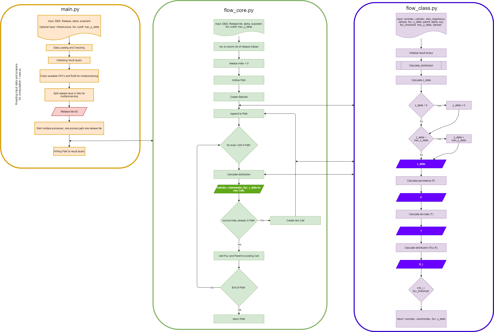

com4FlowPy theory
===================

.. Note::
  
  This section is currently under development/review!
  
  ... as such it might still contain some broken links, missing references, typos, etc. 

  For additional reference on the concepts and motivation behind :py:mod:`com4FlowPy` , we kindly refer to:
     - D’Amboise, C.J.L.; Neuhauser, M.; Teich, M.; Huber, A.; Kofler, A.; Perzl, F.; Fromm, R.; Kleemayr, K.; Fischer, J.-T.(2022). Flow-Py v1.0: a customizable, open-source simulation tool to estimate runout and intensity of gravitational mass flows. Geoscientific Model Development. 15, 2423–2439. (https://doi.org/10.5194/gmd-15-2423-2022)
  
  Initial information pertaining to the application of :py:mod:`com4FlowPy` with consideration of forest-effects can be found in:
     - D'Amboise, C.J.L; Teich, M.; Hormes, A.; Steger, S. and Berger, F. (2021). Modeling Protective Forests for Gravitational Natural Hazards and How It Relates to Risk-Based Decision Support Tools. in: *Protective forests as Ecosystem-based solution for Disaster Risk Reduction (ECO-DRR), Teich et al., 2021*. (https://www.intechopen.com/chapters/78979)
     - Huber, A.; Saxer, L.; Hesselbach, C.; Neuhauser, M.; D'Amboise, C.J.L. and Teich, M. (2024): Regional-scale avalanche modeling with com4FlowPy - potential and limitations for considering avalanche-forest interaction along the avalanche track. *Proceedings, International Snow Science Workshop, Tromso, Norway* (https://arc.lib.montana.edu/snow-science/item.php?id=3194)

Background and motivation
----------------------------

.. _fig-com4FlowPyMotivation:

    Definition of angles and geometric measures for the calculation of :math:`Z^{\delta}`, where s is the 
    projected distance along the path and :math:`z(s)` the corresponding altitude.

The model equations that determine the run out in three dimensional terrain are mainly motivated by simple, geometric, 
two dimensional concepts :cite:`He_1932, Ko_1980, Me_1998, JaLa_2011, HuFiKoKl_2016` in conjunction with existing algorithms for flow routing in three dimensional 
terrain :cite:`Ho_1994, HoJaRuZi_2013, Wi_2017`, controlling the main routing and final stopping of the flow. :numref:`fig-com4FlowPyMotivation`
summarizes the basic concept of a constant run out angle (:math:`\alpha`) with
the corresponding geometric relations in two dimensions along a possible process path.

.. math::
     \tan{\alpha} = \frac{z(s_0)-z(s_{\alpha})}{s_{\alpha}-s_0}
     :label: tan_alpha

The local travel angle gamma is defined by the altitude difference and projected distance along the path, from the 
release point to the current location.

.. math::
     \tan{\gamma} = \frac{z(s_0)-z(s)}{s-s_0}
     :label: tan_gamma

The angle delta is the difference between the local travel angle gamma and the runout angle alpha and is related to 
:math:`Z_{\delta}`, so when :math:`Z_{\delta}` equals zero or :math:`Z_{\gamma}` equals :math:`Z_{\alpha}`, the 
maximum runout distance is reached.

.. math::
     Z^{\alpha}=\tan{\alpha}\cdot(s-s_0)
     :label: z_alpha
   
:math:`Z_{\alpha}` can be interpreted as dissipation energy.

.. math::
     Z^{\gamma} = \tan{\gamma} \cdot (s-s_0) \simeq z(s_0) - z(s)
     :label: z_gamma
   
:math:`Z_{\gamma}` is the altitude difference between the starting point and the current calculation step at the 
projected distance :math:`s`.

:math:`Z_{\delta}` is the difference between :math:`Z_{\gamma}` and :math:`Z_{\alpha}`, so when :math:`Z_{\delta}` is 
lower or equal zero the stopping criterion is met and the flow stops. :math:`Z_{\delta}` is associated to the process 
magnitude and can be interpreted as the kinetic energy or velocity of the process.

.. math::
     Z^{\delta}=Z^{\gamma}-Z^{\alpha}
     :label: z_delta

The major drawback of implementing the geometric runout angle concepts is that they require a predefined flow path in 
two dimensional terrain. To allow for an enhanced routing in three dimensional terrain without prior knowledge of the 
flow path we combine these concepts :cite:`HuFiKoKl_2016` with extensions of existing algorithms :cite:`Ho_1994, HoJaRuZi_2013, Wi_2017` that are described in the 
following sections.

Spatial input and iterative calculation steps on the path:
---------------------------------------------------------------

In nature a GMF has one or more release areas that span over single or multiple release cells. Flow-Py computes the so 
called path, which is defined as the spatial extent of the routing from each release cell. Each release area (single 
raster cell in release area  layer) has it's own unique path (collection of raster cells), and a location on the terrain
(a single raster cell) can belong to many paths. Flow-Py identifies the path with spatial iterations starting with a 
release area raster cell and only iterating over cells which receive routing flux.  The corresponding functions are 
implemented in the code in the flow_class.calc_distribution() function.

To route on the surface of the three dimensional terrain, operating on a quadrilateral grid, we implement the geometric 
concepts that have been sketched in the model motivation utilizing the following cell definitions:

.. _fig-com4FlowPyNeighbors:

    
    Definition of parent, base, child and neighbors, as well as the indexing around the base.

Each path calculation starts with a release cell and operates on the raster, requiring the definition of parent, base, 
child and neighbor cells (see :numref:`fig-com4FlowPyNeighbors`). The base cell is the cell being calculated on 
the current spatial iteration step. The 8 raster cells surrounding the base cell are called neighbor cells (n, i) which 
have the potential to be parents (supplying flux to base cell), or a child (receive flux from the base cell). In 2d the 
base cell corresponds to the cell/location at the distance s along the path in :numref:`fig-com4FlowPyMotivation`.

Every base has at least one parent cell, except in the first calculation step from the release cell, where we start our 
calculation, this would be at :math:`s = s_0` in :numref:`fig-com4FlowPyMotivation`.

During an iteration step a raster cell from the iteration list is identified as the current base cell. The routing flux 
is calculated across the base cell from the parent cell to possible child cells. The goal is to keep the spatial 
iteration steps to a minimum, which is achieved by only adding neighbor cells to the iteration list that have flux 
routed to them from the base cell and do not meet either of the stopping conditions. These cells are called child cells. 
Child cells that are not already on the iteration list are added to the list and flow_class python object is created for
the raster cell. The child cells flow_class has the parent added to it as a source for routing flux. By being added to 
the iteration list the cell has been recognized as being part of the GMF path and will be the base cell for a future 
iteration step.

When the iteration list is empty and all potential children fulfill one of the stopping criteria:

- :math:`Z^{\delta}` has to be smaller than zero: :math:`Z^{\delta}<0`
- Routing Flux has to be smaller than the flux cut off: :math:`R_i < R_{Stop}`

the path calculation is finished. The required information is saved from the cell class to the summarizing output raster 
files. Then the calculation starts again for the next release cell and respective flow path. The spatial extent and 
magnitude for all release cells are summarized in the output raster files, which represent the overlay of all paths.

Every path is independent from the other, but depending on the information we want to extract, we save the highest 
values (e.g. :math:`Z_{\delta}`) or sums (e.g.Cell Counts) of different paths to the output raster file.

:math:`Z^{\delta}`
~~~~~~~~~~~~~~~~~~~~~

For each base cell in a path we solve the equations (:eq:`z_bn_alpha`, :eq:`z_bn_gamma`, :eq:`z_bn_delta`) for every neighbor n, if :math:`Z_{bn}^{\delta}` 
is higher than zero, this neighbor is defined as a potential child of this base, and routing  in this direction is 
possible.

.. math::
     Z^{\alpha}_{bn} = S_{bn}\cdot\tan(\alpha)
     :label: z_bn_alpha

.. math::
     Z^{\gamma}_{bn} = Z_b-Z_n
     :label: z_bn_gamma

.. math::
     Z_{bn}^{\delta} = Z_{bn}^{\gamma}-Z_{bn}^{\alpha}
     :label: z_bn_delta

Here :math:`S_{bn}` is the projected distance between the base and the neighbor.

As :math:`Z_{bn}^{\delta}` can be interpreted as process magnitude (and kinetic energy or velocity respectively) it is 
possible to limit this value to a maximum. In comparison to process based modeling approaches this would correspond to 
maximum velocity induced by a velocity dependent turbulent friction term.

.. math::
     Z^{\delta}_{i} = min\{Z^{\delta}_{0}+Z^{\gamma}_{i}-Z^{\alpha}_{i}, Z^{\delta}_{max}\}
     :label: zDeltaMax

The projected path lengths, or total travel distance to one of the neighbors (:math:`S_n`) equals the path length to 
the base (:math:`S_b`) plus the path from base to the neighbor (:math:`S_{bn}`), which reads:

.. math::
     S_{bn}=\frac{Z_b-Z_n-Z_{bn}^{\delta}}{\tan(\alpha)} \simeq \frac{Z_{bn}^{\alpha}}{\tan(\alpha)}
     :label: S_bn

As there are many possibilities for the path from the starting point to the actual cell or base, the shortest path is 
taken into account, corresponding to the highest :math:`Z^{\delta}` in the base. If :math:`Z^{\delta}_{max}` 
is set to infinity, or as in the code to 8848 m (= Mount Everest), we can calculate the shortest path from the starting 
point to the base and yields the total projected travel distance:

.. math::
     S_n = S_b + S_{bn}
     :label: S_n

This equations determine the routing and corresponding run out distance for the process, the next steps demonstrate how 
spreading is handled on the surface of the three dimensional terrain.

Persistence based routing:
~~~~~~~~~~~~~~~~~~~~~~~~~~~~~

The persistence contribution :math:`P_i` aims to capture inertia related effects, and takes the change in flow 
direction into account [3]. The direction contribution is scaled with the process magnitude :math:`Z^{\delta}_{parent}`,
such that the direction from a parent cell with higher process magnitude has more effect on the path routing and 
direction.

.. math::
     P_i = \sum_{p=1}^{N_p} \sum_{n=1}^{8} Z^{\delta}_{p} \cdot D_n
     :label: persistence

The direction contributions :math:`D_n` are defined by the cosine of the angle between parent, base and child/neighbor 
minus :math:`\pi`.

.. math::
     D_n = max\{0, \cos{(\angle_{pbn}-\pi)}\}
     :label: persistence_cos_funciton

Therefore the direction contribution limits the maximum number of potential children to three, getting input via the 
persistence function from one parent.

In the first calculation step, at the release or start cell no parent cells are defined and the persistence is set to 
one. So the first calculation step is solely determined by the terrain contribution.

Terrain based routing
~~~~~~~~~~~~~~~~~~~~~~~~~~~~~

The terrain based routing is solely dependent on the slope angle phi. The exponent exp allows to control the divergence 
of the spreading. The Holmgren (1994) algorithm :cite:`Ho_1994` is used in different kind of models and works well for avalanches 
but also rockfall or soil slides. For avalanches an exponent of 8 shows good results. To reach a single flow in step 
terrain (rockfall, soil slides, steepest descend), an exponent of 75 is considered.

.. math::
     T_i = \dfrac{\left(\tan \phi_i \right)^{exp}}{\sum^{8}_{n=1} \left(\tan \phi_n \right)^{exp}} \ \forall\ \begin{cases}
          -90^{\circ} < \phi_i < 90^{\circ} \\
          exp \in \left[1; +\infty \right]
          \end{cases}
     :label: flow_direction_Holmgren

To overcome the challenge of routing in flat or uphill terrain, we adapted the slope angle :math:`\Phi` for the normalized 
terrain contribution to:

.. math::
     \Phi_i = \dfrac{\psi_i + \frac{\pi}{2}}{2}
     :label: Phi_i

Routing flux: 
~~~~~~~~~~~~~~~~~~~

The routing flux summarizes the persistence and terrain contributions according to :eq:`routingFlux`:

.. math::
     R_i = \frac{T_i P_i}{\sum^{8}_{n=1} T_n P_n} \cdot R_b
     :label: routingFlux

where i is the direction and n are the neighbors from 1 to 8. :math:`R_i` is then the routing flux in direction :math:`i`.
:math:`R_b` is the flux in the base, for a release cell or starting cell the flux of the base equals one. The result 
of :eq:`routingFlux` is a 3 x 3 array with assigned flux values. A normalization stage is then required to bring the sum of the 
:math:`R_i`'s to the value of :math:`R_b`. This aims at avoiding loss of flux.

Flow chart / overview:
~~~~~~~~~~~~~~~~~~~~~~~~

In :numref:`fig-com4FlowPy_FlowChart` the algorithm of the computational implementation is sketched, including function and files names with respect
to the code in the repository.

The file main.py handles the input for the computation and splits the release layer in tiles and saves them in a release
list. Then the main.py starts one process per tile, which calls the flow_core.py and starts the calculation for one 
release cell and the corresponding path. The number of processes is depending on the hardware setting (CPU and RAM).
Whenever a new cell is created flow_core.py calls flow_class.py and makes a new instance of this class, which is saved
in the path. When the calculation in flow_core.py is finished it returns the path to main.py which saves the result
to the output rasters. 

.. _fig-com4FlowPy_FlowChart:

    Flow chart of the Flow-Py computational process and an overview of the files and what they manage.

Acknowledgments
------------------------------------------------------

This study was carried out in the framework of the GreenRisk4Alps project ASP635, funded by the European Regional 
Development Fund through the Interreg Alpine Space programme. Additional financial support from the AvaRange 
(www.AvaRange.org, international cooperation project “AvaRange - Particle Tracking in Snow Avalanches” supported by the 
German Research Foundation (DFG) and the Austrian Science Fund (FWF, project number I 4274-N29) and the AvaFrame 
(www.AvaFrame.org, AvaFrame - The open Avalanche Framework is a cooperation between the Austrian Research Centre for 
Forests (Bundesforschungszentrum für Wald; BFW) and Austrian Avalanche and Torrent Service (Wildbach- und 
Lawinenverbauung; WLV) in conjunction with the Federal Ministry Republic of Austria: Agriculture, Regions and Tourism 
(BMLRT)) projects are greatly acknowledged.

Citation
------------------------------------------------------
If you are using :py:mod:`com4FlowPy` in your work, we are happy if you include the following reference in any resulting
publications:

- D’Amboise, C.J.L.; Neuhauser, M.; Teich, M.; Huber, A.; Kofler, A.; Perzl, F.; Fromm, R.; Kleemayr, K.; Fischer, J.-T.
  (2022). Flow-Py v1.0: a customizable, open-source simulation tool to estimate runout and intensity of gravitational 
  mass flows. Geoscientific Model Development. 15, 2423–2439. (https://doi.org/10.5194/gmd-15-2423-2022)

com4FlowPy applications
------------------------------------------------------

:py:mod:`com4FlowPy` has been applied in different studies in recent years. Here are the ones we know about:

autoATES
~~~~~~~~~~~~~~~~~~~
- Toft, H.B.; Sykes, J.; Schauer, A.; Hendrikx, J. and Hetland, A. (2024). AutoATES v2.0: Automated Avalanche Terrain Exposure Scale mapping. *Nat. Hazards Earth Syst. Sci., 24*, 1779–1793 (https://doi.org/10.5194/nhess-24-1779-2024)
- Sykes, J.; Toft, H.B.; Haegeli, P. and Statham, G. (2024). Automated Avalanche Terrain Exposure Scale (ATES) mapping – local validation and optimization in western Canada. *Nat. Hazards Earth Syst. Sci., 24*, 947–971 (https://doi.org/10.5194/nhess-24-947-2024)
- Panayotov, M.; Markov, K.; Tsvetanov, N.; Huber, A.; Hesselbach, C. and Teich, M. (2024). Avalanche Hazard Mapping using the Avalanche Terrain Exposure Scale (ATES) in the high mountain ranges of Bulgaria. *Proceedings, International Snow Science Workshop, Tromso, Norway* (https://arc.lib.montana.edu/snow-science/item.php?id=3366)
- Spannring, P.; Hesselbach, C.; Mitterer, C. and Fischer, J.-T. (2024). Classification of avalanche terrain: a open-source model chain for the Avalanche Terrain Exposure Scale. *Proceedings Interpraevent 2024, Vienna, Austria* (https://www.interpraevent.at/en/proceeding/proceedings-ip-2024)
- Spannring, P. (2024). Comparison of two avalanche terrain classification approaches : Avalanche Terrain Exposure scale - Classified Avalanche Terrain. *Masters' Thesis*. University of Innsbruck. (https://ulb-dok.uibk.ac.at/urn/urn:nbn:at:at-ubi:1-155858)
- von Avis, C.D.; Sykes, J. and Tutt, B. (2023). Development of large scale automated Avalanche Terrain Exposure Scale (ATES) ratings in collaboration with local avalanche experts. *Proceedings, International Snow Science Workshop, Bend, OR, USA* (http://arc.lib.montana.edu/snow-science/item/2998)
- Huber, A.; Hesselbach, C.; Oesterle, F.; Neuhauser, M.; Adams, M.; Plörer, M.; Stephan, L.; Toft, H.B.; Sykes, J.; Mitterer, C. and Fischer, J.-T. (2023). AutoATES Austria - Testing and application of an automated model-chain for avalanche terrain classification in the Austrian Alps. *Proceedings, International Snow Science Workshop, Bend, OR, USA* (http://arc.lib.montana.edu/snow-science/item/2989)
- Hesselbach, C. (2023). Adaptaion and application of an automated Avalanche Terrain Classification in Austria. *Masters' Thesis*. University of Life Sciences (BOKU), Vienna (https://forschung.boku.ac.at/de/publications/175549)
- Schumacher, J.; Toft, H.B.; McLean, J.P.; Hauglin, M.; Astrup, R. and Breidenbach, J. (2022). The utility of forest attribute maps for automated Avalanche Terrain Exposure Scale (ATES) modelling. Scandinavian Journal of Forest Research, 37:4, 264-275 (https://doi.org/10.1080/02827581.2022.2096921)

other
~~~~~~~~~~~~~~~~~~~
- Huber, A.; Saxer, L.; Hesselbach, C.; Neuhauser, M.; D'Amboise, C.J.L. and Teich, M. (2024): Regional-scale avalanche modeling with com4FlowPy - potential and limitations for considering avalanche-forest interaction along the avalanche track. *Proceedings, International Snow Science Workshop, Tromso, Norway* (https://arc.lib.montana.edu/snow-science/item.php?id=3194)
- Perzl, F.; Huber, A.; Fromm, R. and Teich, M. (2024). Estimation of potential snow avalanche hazard probability in areas below protective forests in Austria. *Proceedings Interpraevent 2024, Vienna, Austria* (https://www.interpraevent.at/en/proceeding/proceedings-ip-2024)
- D'Amboise, C.J.L; Teich, M.; Hormes, A.; Steger, S. and Berger, F. (2021). Modeling Protective Forests for Gravitational Natural Hazards and How It Relates to Risk-Based Decision Support Tools. in: *Protective forests as Ecosystem-based solution for Disaster Risk Reduction (ECO-DRR), Teich et al., 2021*. (https://www.intechopen.com/chapters/78979)